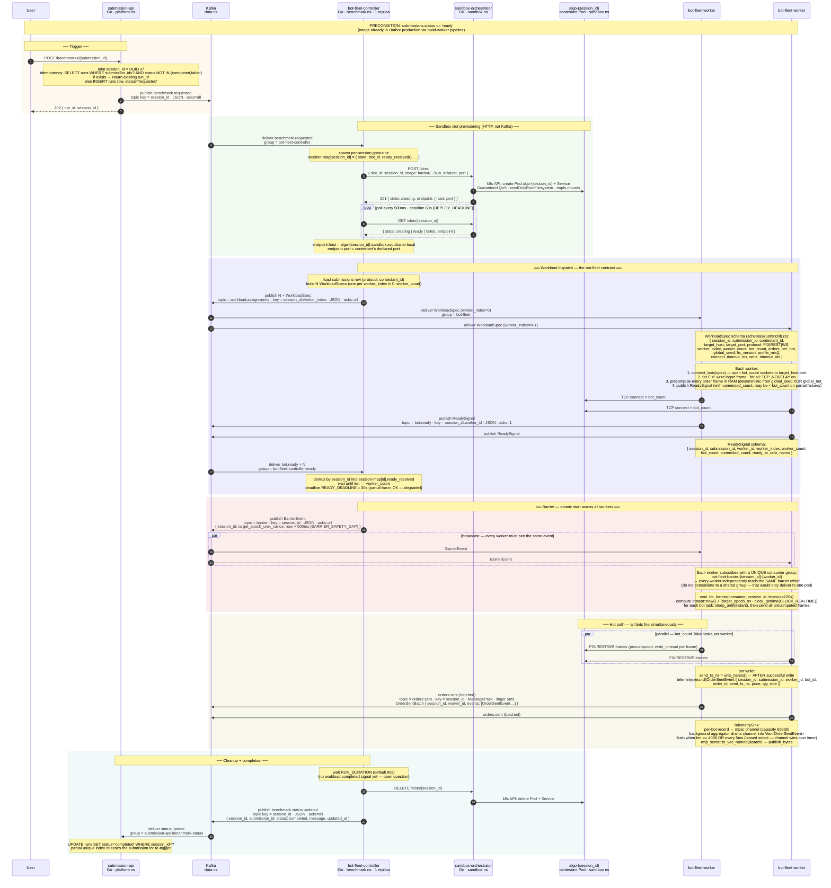

# iicpc

A competitive programming platform where contestants submit trading algorithm code.
The platform builds their container image, runs security scans, deploys it in an isolated pod,
sends synthetic orders to test latency and correctness, and scores the result.

---

## End-to-end flow

Five services + Kafka coordinate one benchmark run. The diagram below traces the
full path from a user click to a completed result, including the contract for
every Kafka message (key, encoding, acks).

For deeper detail see `MEASUREMENT_AND_FAIRNESS.md` (timestamps, eBPF hooks,
fairness controls, platform code invariants), `DEPLOYMENT.md` (install/upgrade),
`TESTING.md` (end-to-end verification), and `STATE.md` (what's built vs spec'd).



---

## Repo layout

```
iicpc/
│
├── schemas/                        # Shared data contracts across all services
│   ├── go/                         # Go — Kafka message types, status constants
│   └── rust/                       # Rust — (add when first Rust service needs shared types)
│
├── libs/                           # Shared infrastructure libraries (no business logic)
│   └── go/                         # Go — logging, health checks, common middleware
│
├── services/                       # One folder per microservice
│   ├── submission-api/             # Go — receives ZIP uploads, kicks off build, mints session_id, triggers benchmark
│   ├── build-worker/               # Go — builds, scans, and promotes contestant images
│   ├── sandbox-orchestrator/       # Go — manages one Pod+Service per benchmark run (lazy lifecycle)
│   ├── bot-fleet-controller/       # Go — single-replica orchestrator of benchmark runs (consumes benchmark.requested, fans out to workers, fires barrier)
│   └── bot-fleet/                  # Rust + Tokio — KEDA-scaled workers; precompute frames, wait for barrier, fire on schedule
│
├── k8s/                            # Kubernetes manifests — one folder per namespace
│   ├── data/                       # Stateful services: postgres, kafka, minio
│   ├── platform/                   # User-facing: submission-api
│   ├── build/                      # build-worker (spawner) + the Job pods it spawns (kaniko, trivy, syft)
│   ├── sandbox/                    # sandbox-orchestrator + the algo pods it spawns at runtime
│   └── benchmark/                  # bot-fleet-controller + bot-fleet workers (workers manifests still missing — see STATE.md)
│
├── docker-compose.yml              # Local dev only — spins up data services
├── go.work                         # Ties all Go modules together (schemas, libs, services)
└── .env.example                    # Source of truth for all environment variables
```

---

## Service structure

Every service follows the same layout regardless of language.

**Go service:**
```
services/<name>/
├── Dockerfile
├── go.mod                          # module github.com/iicpc/<name>
├── main.go                         # single binary
└── internal/
    ├── handler/                    # HTTP layer (if HTTP service)
    ├── consumer/                   # Kafka consumer (if event-driven)
    ├── publisher/                  # Kafka producer (if publishes events)
    ├── store/                      # postgres.go, minio.go
    └── <domain>/                   # service-specific logic
```

If a service has multiple binaries (e.g. build-worker has spawner + fetcher + worker):
```
services/<name>/
└── cmd/
    ├── <binary-1>/main.go
    └── <binary-2>/main.go
```

**Shared Go library (`libs/go`):**
```
libs/go/
├── go.mod                          # module github.com/iicpc/libs
└── <package>/                      # logger/, health/, etc.
    └── *.go
```
Add to a service: `require github.com/iicpc/libs v0.0.0` + `replace github.com/iicpc/libs => ../../libs/go` in its `go.mod`.

**Rust service:**
```
services/<name>/
├── Dockerfile
├── Cargo.toml                      # [package] name = "iicpc-<name>"
└── src/
    ├── main.rs
    ├── handler/                    # HTTP layer (if HTTP service)
    ├── consumer/                   # Kafka consumer (if event-driven)
    ├── publisher/                  # Kafka producer
    ├── store/                      # postgres.rs, minio.rs
    └── <domain>/                   # service-specific logic
```

---

## k8s namespace structure

Every namespace folder contains everything needed to deploy that tier.
`kubectl apply -f k8s/<namespace>/` brings up the whole tier.

```
k8s/<namespace>/
├── namespace.yaml
├── network-policy.yaml
└── <service>/
    ├── deployment.yaml             # or statefulset.yaml for stateful services
    ├── service.yaml
    └── secret.yaml                 # placeholder values only — never real credentials
```

---

## Naming conventions

| Thing | Convention | Example |
|---|---|---|
| Services | kebab-case | `bot-fleet`, `sandbox-orchestrator` |
| Go service modules | `github.com/iicpc/<name>` | `github.com/iicpc/build-worker` |
| Go shared modules | `github.com/iicpc/schemas`, `github.com/iicpc/libs` | fixed names, not per-service |
| Rust crates | `iicpc-<name>` | `iicpc-bot-fleet` |
| Go packages | single word, no underscores | `handler`, `consumer`, `store` |
| Rust modules | snake_case | `order_handler`, `latency_store` |
| Kafka topics | `<domain>.<entity>.<event>` | `submission.build.requested` |
| MinIO paths | `<entity>/<id>/<artifact>` | `submissions/{id}/build.log` |
| k8s resources | kebab-case, matches service name | `submission-api`, `build-spawner` |
| Docker images | `harbor.example.com/iicpc/<name>:<git-sha>` | tag is always a git SHA, never `latest` in prod |

---

## Rules

**One module per service.** Each service has its own `go.mod` or `Cargo.toml`.
Services never import each other directly.

**`internal/` for everything (Go) / private modules (Rust).** Nothing inside a service
is importable by another service. Code shared across services goes in `schemas/` or `libs/`.

**`schemas/` is for data contracts only.** Kafka message types and shared constants live
here. Go services import `github.com/iicpc/schemas`; Rust services import `schemas/rust`.
No infrastructure code (loggers, clients, middleware) belongs in `schemas/`.

**`libs/` is for shared infrastructure.** Reusable code with no business logic — logging,
health checks, common middleware — lives here. If you find yourself copying a file between
two services, it belongs in `libs/go` (or `libs/rust` when needed). Each language
subdirectory is its own module: `github.com/iicpc/libs`.

**Dockerfiles build from repo root.** The Go workspace and Rust workspace both need the
full repo context. All `docker build` commands run from `/` of the repo:
```bash
docker build -f services/<name>/Dockerfile .
```

**k8s manifests mirror the namespace.** All resources for a namespace live inside
`k8s/<namespace>/`. Applying a single folder deploys the entire tier.

**`docker-compose.yml` is for data services only.** Application services run with
`go run` or `cargo run` locally. Compose only provides the backing infrastructure
(postgres, minio, kafka).

**Secrets never in the repo.** `secret.yaml` files contain `changeme` placeholders
with a comment showing the `kubectl` command to generate real values.
Real credentials go in `.env` (gitignored) locally, or injected at deploy time in k8s.

**`.env.example` is the contract.** Every environment variable any service reads must
be documented there with a comment explaining what it does. Add your vars there first
before writing the code that reads them.

---

## Code conventions

The rules a new Go service must follow. Existing services may not yet conform on every
point — when in doubt, match what `submission-api` and `build-worker` already do.
**Platform-level invariants** (the `runs.status` rule, controller single-replica,
orchestrator lifecycle, Kafka acks, idempotency) live in
`MEASUREMENT_AND_FAIRNESS.md` Part 6.

### Logging

Use `github.com/iicpc/libs/logger`. Standard preamble in every `main`:

```go
logCfg := logger.DefaultConfig()
logCfg.ServiceName = "<service-name>"
log, lokiClient := logger.NewProductionLogger(logCfg)
slog.SetDefault(log)
if lokiClient != nil { defer lokiClient.Close() }
```

Pass `*slog.Logger` explicitly to constructors. Do not call package-level `slog.Info`
from library code; use the injected logger so per-request attributes flow through
`logger.WithAttrs(ctx, ...)`. Request-scoped attributes (request_id, submission_id,
session_id) ride on `context.Context` via `logger.WithAttrs` and are picked up by
`ContextHandler`. Always use the `*Context` variants (`log.InfoContext`,
`log.ErrorContext`) inside handlers.

### Configuration

Environment variables only. No config files, no flags. Two helpers in each service's `main.go`:

```go
envOr(key, default string) string   // optional, returns default if empty
mustEnv(key string) string          // required, log + exit if empty
```

Boolean envs use string compare: `os.Getenv("X_FOO") == "true"`. The dev/prod toggle
pattern (`BUILD_NODE_POOL`, `RUNTIME_CLASS`) is "empty value disables the feature,
non-empty enables it" — use this pattern for any new dev/prod-divergent k8s behavior.

### HTTP services

- Router: `github.com/go-chi/chi/v5`. Always wire middleware in this order:
  `RequestID`, `RealIP`, request logger (see `submission-api/main.go`), `Recoverer`.
  No exceptions.
- `http.Server` timeouts: `Read 30s, Write 60s, Idle 120s`. Override only with a
  justified comment.
- Graceful shutdown: signal-aware `context.NotifyContext`, then `srv.Shutdown` with
  a 10s timeout.
- Response helpers: `writeJSON(w, status, v)` and `writeError(w, status, msg)`.
  Define them per-service in the handler package; do not lift to a shared lib yet.
- Health endpoints: `/healthz` returns 200 unconditionally; `/readyz` returns 200
  only after all external clients (DB, Kafka, k8s) are initialised.

### PostgreSQL

- Library: `github.com/jackc/pgx/v5/pgxpool`.
- Each service that touches the DB ships its own `internal/store/postgres.go` with
  a `createTableSQL` constant containing `CREATE TABLE IF NOT EXISTS …` for every
  table it writes. The store's constructor `Exec`s it. No migration tool in v1.
- Unique violations are detected via `pgconn.PgError` code `23505`. Return a
  sentinel error from `internal/errors`; let handlers translate it to HTTP status.
- Time columns are `TIMESTAMPTZ`, default `now()`. Always store UTC in Go
  (`time.Now().UTC()`).
- IDs are UUID v7 (`uuid.NewV7()`), stored as `TEXT`.

### Kubernetes client

- Use `k8s.io/client-go` with `loadK8sConfig` from `build-worker`'s spawner:
  in-cluster first, kubeconfig fallback for local dev. Copy that function verbatim
  into any new service that needs the API; do not invent variations.
- Namespace is always an env var with a sensible default (`K8S_NAMESPACE` or
  service-specific).
- Per-resource lifecycle: create with explicit labels (`app=...`, plus a
  resource-typed identifier like `slot=<slot_id>`); delete by name; list by label
  selector. Delete Service + Pod together when the conceptual "slot" is released.

### Errors and comments

- Sentinel errors live in `internal/errors`; wrap with `%w` and a brief message
  at the boundary where context is added.
- No multi-paragraph docstrings on functions. One short line if the WHY is
  non-obvious; nothing if the name is self-explanatory.
- Do not comment what the code does. Comment the constraint or invariant that
  would surprise a future reader.

---

## Running locally

```bash
# 1. Start backing services
docker-compose up -d

# 2. Set up environment
cp .env.example .env
# edit .env with real values if needed

# 3. Run a service (Go)
go run ./services/submission-api

# 4. Run a service (Rust)
cargo run -p iicpc-bot-fleet

# 5. Submit a test ZIP
curl -X POST http://localhost:8080/submit \
  -F "file=@test.zip" \
  -F "language=go" \
  -F "protocol=tcp" \
  -F "port=8080" \
  -F "team_name=team1"
```

**Prerequisites:** Go 1.23+, Rust (latest stable), Docker, `kubectl`
