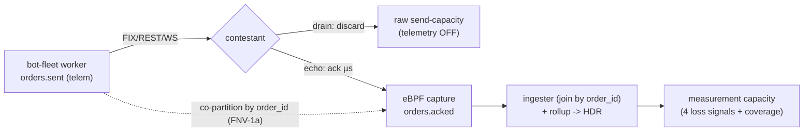

## Benchmarking, Bottleneck Hunt & Scope for Improvement

This section is the definitive record of *how the platform was measured*, *what it
actually generates and measures losslessly*, *every bottleneck found and removed*, and
*the open items* that remain. Every number traces to a data file, a benchmark
script, or a source line. The platform's own design goal is "we generate ~2M orders/s
and measure latency at the kernel without lying about the tail" — this section shows the
evidence behind that claim, the parts that are validated, and the parts that are still
unverified.

There are three distinct harnesses, each isolating a different question:

| Harness | Dir | Question it answers | Contestant | Telemetry / capture |
|---|---|---|---|---|
| **Generation capacity** | `deploy-bench/` | how many orders/s can the bot-fleet *emit*? | **drain** (read-and-discard, never replies) | OFF |
| **Measurement capacity** | `deploy-bench/measure-capacity-sweep.sh` | how much offered load can the pipeline *measure* before it loses samples? | **echo** (µs-fast acker) | ON + eBPF capture |
| **Correctness + latency e2e** | `e2e/` and `bench/` | does a real run stay lossless & correct end-to-end? | matching-engine (qualifies) or echo (throughput) | ON, full stack |

---

### 1. Benchmark methodology

**Why three contestant types isolate three different ceilings.** The platform has
several independent walls (send CPU, single-node networking, telemetry serialization,
Kafka ingest, ingester consume, contestant serve rate, validator memory). A single
mixed test cannot attribute a number to one of them. Each harness *removes every
confound but one*:

- **Drain sink (pure generation).** The contestant is replaced by a TCP read-and-discard
  engine that never replies, so it can never back-pressure the worker and there are no
  acks, no eBPF capture, and no validator. The only metric is the bot's own
  `iicpc_bot_orders_sent` rate (incremented on socket-write success at
  `services/bot-fleet/src/worker.rs:780` / `:1189`). This is the *cleanest* possible
  generation number: "how fast can we put orders on the wire," with telemetry also off
  (`BOT_DISABLE_TELEMETRY=1`); `deploy-bench/drain-scale-sweep.sh` implements this
  telemetry-off mode.

- **Echo contestant (measurement capacity).** A µs-fast acker that answers *every* order,
  so the contestant is never the bottleneck and eBPF always has a response to stamp. With
  capture + telemetry ON, `measure-capacity-sweep.sh` steps the offered rate up on a
  single worker / single sandbox node and watches **four loss signals** —
  `iicpc_ebpf_ringbuf_dropped_total` (kernel capture overrun),
  `iicpc_ebpf_acked_dropped_total` (publish queue drop),
  `iicpc_bot_telemetry_events_dropped_total` (send-side telemetry), and `coverage =
  flushed/sent` — declaring a step CLEAN only when all are ~0 and coverage ≥ COV_MIN
  (`deploy-bench/measure-capacity-sweep.sh:10-22`).

- **Matching-engine contestant (correctness).** A correct price-time-priority order book
  (port of the validator's reference engine) that *qualifies* (correctness ≥ 0.95). This
  is the only flow that produces real correctness verdicts + HDR latency; it is bounded
  by the validator's and book's memory, so its scenarios are sized to stay under the
  delivered ceiling.

**Telemetry ON vs OFF — and why both numbers exist.** Telemetry IS the measurement
record; you cannot score what you dropped. But telemetry has its own pipeline ceiling.
So generation is reported twice: telemetry-**off** (raw send capacity, the upper bound)
and telemetry-**on** (durable, the production ceiling). The gap between them is itself a
bottleneck signal — the discipline is to check `iicpc_bot_orders_sent` vs
`iicpc_bot_telemetry_events_flushed` *before* acting, because a telemetry cap presents as a "low TPS" symptom (see §3c).

**Why latency is kernel-stamped, not load-gen-timed.** Service time `t7−t3` is measured by
the eBPF capture at the contestant's veth (XDP ingress / tc egress), independent of the
load-gen's scheduling jitter and the contestant's userspace accounting. This is *the*
reason worker-side latency aggregation is explicitly not used for the scored metric.



---

### 2. The numbers

**A. Validated ceilings**:

| layer | ceiling | notes |
|---|---|---|
| generation, telemetry OFF (drain) | **~600–790k/s per botworker node** | scales ~linearly with nodes |
| telemetry ON (single worker → 1 broker) | **~445k/s** | lossless `record` backpressure |
| measurement pipeline (capture→Kafka→ingester) | **lossless ≥ ~144k samples/s**, ceiling not yet reached | with the capture-fidelity fix |
| single echo contestant pod (cross-node) | **~150k delivered/s** | one pod + one TCP conn/task; caps before the pipeline |
| kernel-stamped service-time p99 | **~98 µs healthy** | eBPF, independent of load-gen jitter |

**B. Single-node drain sweep** — one `c6i.xlarge`, 15 s buckets
(`deploy-bench/drain-raw-tps.tsv`):

| elapsed_s | 0 | 15 | 30 | 45 | 60 | 75 | 90 | 105 | 120 |
|---|---|---|---|---|---|---|---|---|---|
| sent/s | 0 | 64,983 | **747,911** | 709,571 | 678,401 | 640,374 | 628,931 | 550,374 | 0 |

Peak **~748k/s**, sustained **~600–710k/s** on a single 4-vCPU node. (The first/last
buckets are warm-up/drain.) `deploy-bench/drain-raw-tps.png` plots this run. A separate
60 s run measured **47,401,664 orders = ~790k/s** at 3.94/4 cores (93% user, 7% kernel),
consistent with this.

> **Note — node-scaling sweep.** The 1→2-node sweep data file
> (`deploy-bench/scale-sweep-off.tsv`) is not yet populated, so near-linear
> multi-node scaling is **expected from the architecture** — workers share no state
> and ride separate NICs — and is the next measurement to run (see §4), rather than
> an already-recorded number. The single-node generation figures above are measured.

**C. Measurement-capacity sweep** (echo, capture + telemetry ON, single worker / single
sandbox node — `deploy-bench/measure-capacity-sweep.tsv`):

| target_k | sent/s | decoded/s | flushed/s | coverage | drops (rbuf/acked/tel) | verdict |
|---|---|---|---|---|---|---|
| 50  | 50,005  | 50,000  | 50,000  | 0.9999 | 0/0/0 | **CLEAN** |
| 100 | 99,997  | 89,029  | 89,029  | 0.8903 | 0/0/0 | CLEAN* |
| 150 | 36,644  | 0       | 0       | 0.0000 | 0/0/0 | **STALL** |
| 200 | 150,006 | 140,992 | 140,992 | 0.9399 | 0/0/0 | **CLEAN** |
| 250 | 200,044 | 0       | 0       | 0.0000 | 0/0/0 | STALL |
| 300 | 252,700 | 273     | 273     | 0.0011 | 0/0/0 | STALL |
| 400 | 299,421 | 0       | 0       | 0.0000 | 0/0/0 | STALL |
| 500 | 364,159 | 0       | 0       | 0.0000 | 0/0/0 | STALL |

**Reading this table:** the verdicts are
**non-monotonic** — 200k passes CLEAN while 150k STALLs, and 50k/100k pass but 250k+
fail. That pattern is the signature of **a single-pod / single-node ceiling around the
low-100s-of-k delivered, plus run-to-run variance**, not a clean "this rate works, above
it doesn't" cliff. The decisive evidence: at the STALL steps the loss counters are all
**zero** while `decoded/flushed` collapse to 0 — i.e. nothing is being *dropped*; the
echo contestant simply isn't *delivering* acks at that offered rate (the run stalled, no
responses to stamp). This is exactly the **~150k single-pod-contestant ceiling** showing up as run-to-run
jitter at the boundary. The lossless number to trust from this harness is **≥ ~144k
samples/s with zero drops** (matches the 200k row's 140,992 flushed). The measurement
pipeline's *own* ceiling is **not yet reached** — to find it you must stop bottlenecking
on one echo pod (more responder pods / more cores).

> The `*` on the 100k row: it is marked CLEAN by the script's verdict but its coverage is
> 0.89 (< the 0.99 COV_MIN gate). Treat it as a borderline/variance result, not a clean
> pass — the same single-pod jitter.

**D. Latency HDR percentiles** — local k3s, kernel-stamped service_time (µs), decoded
from the Rust V2-deflate HDR blobs by an independent Python `hdrh` cross-check
(`deploy-local/plot-hdr.py:5-11`, `deploy-local/plots/*.hgrm`):

| scenario | p50 | p99 | p99.9 | p99.99 (tail) |
|---|---|---|---|---|
| constant | 126 | 378 | 669 | 907 |
| spike    | 130 | 399 | 837 | 1240 |
| ramp     | 136 | 447 | 921 | 1750 |

The tail rises with load shape (ramp's climbing waves > spike's burst > constant's flat),
exactly as expected. These are small-n local runs (n≈20–60 per scenario in the `.hgrm`
files) — directional, not the EKS production tail (~98–120 µs p99 healthy).

**E. The 2M/s tier target** (`bench/bench.tfvars`,
`bench/kafka-bench.sh`):

| knob | e2e | **bench (2M/s tier)** |
|---|---|---|
| botworker nodes | 2 | **3** (`c6i.xlarge` → ~800k/s each ≈ ~2.4M/s, `bench.tfvars:43-46`) |
| Kafka | 1 broker, gp3-250 | **2-broker KRaft**, dedicated pool, gp3-500 (`kafka-bench.sh:12`, default `KBROKERS=2`) |
| topics | 24 part | **96 part, RF=1** (`kafka-bench.sh:76-80`, transient bench data) |
| ingesters | 2 | **8** (`kafka-bench.sh:88`) |
| nodes / vCPU | 5 / 32 | **8 / 44** (needs a vCPU quota bump) |

This is a **documented target, not a validated run**: the two open verifications are
eBPF capture throughput at 2M/s (one capture producing ~2M acks/s) and echo capacity at
2M/s, both UNVERIFIED. The drain variant
(send + telemetry + ingester capacity) is the first thing to validate now that Kafka is
multi-broker.

---

### 3. The bottleneck hunt narrative

Each wall was found by measurement, attributed to a root cause, fixed at the root, and
re-verified with a number. They are presented in the order they were hit.

#### (a) Per-task tokio-timer ~1000/s pacer cap → catch-up pacing (65–75×)

- **Symptom.** Each load-gen task pinned near ~1k orders/s *regardless of `target_rps`*,
  with the host CPU sitting >85% idle. Proof: a single task targeting 1,000,000/s emitted
  **53,868 orders in 60 s = ~898/s**.
- **Root cause.** The pacer called `tokio::time::sleep_until` before *every* order;
  tokio's timer wheel has a ~1 ms minimum granularity, so even a 20 µs interval — or a
  deadline already in the past — cost ~1 ms. Tasks were parked on timers, not working.
- **Fix.** Catch-up pacing, now the unconditional default in both write loops
  (`services/bot-fleet/src/worker.rs:786` FIX-batch loop, `:1210` REST/WS loop): only
  park on the timer when *ahead* of schedule; if the deadline already passed, send
  immediately and re-arm to the next slot.
- **Result.** A single task sustains **~58–68k/s (≈65–75×)**.
  Verified in code; the FNV/CO contract is unchanged (§3d).

This is the single most load-bearing line in the load generator — caption below:

```rust
let target_send_ts_ns = next_send_ns;          // captured BEFORE any sleep (CO-correct)
if next_send_ns > unix_nanos() {               // ahead of schedule -> park
    tokio::select! {
        _ = time::sleep_until(instant_from_unix_nanos(next_send_ns)) => {}
        _ = cancel.cancelled() => break,       // behind -> fall through, send now
    }
}
```
*`services/bot-fleet/src/worker.rs:1209-1216` — the one branch that removed the ~898/s
floor; "behind" deadlines skip the timer wheel entirely.*

#### (a′) Two follow-on send-path fixes the timer fix exposed

Removing the timer cap surfaced the *real* CPU hogs, both confirmed in code and the
flamegraph (`docs/bot-worker-flamegraph.svg`):

- **`push_resting` O(n) memmove (87% of CPU).** The resting-order ledger was a `Vec`
  doing `Vec::remove(0)` on every order once full. Fixed to a `VecDeque` with O(1)
  `pop_front`/`swap_remove_back` (`services/bot-fleet/src/content.rs:113, 228-242`).
  Per-order CPU ~42 µs → ~5 µs.
- **One unbuffered `write` syscall per order (27% kernel CPU).** Added `BOT_WRITE_BATCH`
  (default 64) coalescing of *already-due* backlog orders into one `write_all`
  (`services/bot-fleet/src/worker.rs:717-811`; the batch only ever coalesces the catch-up
  backlog, so the schedule is never distorted). Kernel syscall share ~27% → ~2%. Combined, these took a single node to
  the ~790k/s in §2B.

#### (b) The single-node veth/loopback wall (local only — gone on EKS)

- **Symptom.** With the code cap removed, throughput *decreased* as connections increased
  (1 task 58–67k > 4 tasks 37.5k > 8 tasks ~30k) while the host stayed >85% idle and both
  the worker (<1 core) and engine (<2 cores) were idle.
- **Root cause.** On a single laptop node, every order and its TCP signalling traverse one
  shared **veth pair + kernel CNI datapath** (~15–17 µs/op), which has limited parallelism;
  adding flows adds latency, not throughput. This is not a code-level issue: `TCP_NODELAY` is set
  (`worker.rs:1594/1610/1620`), the runtime
  is multi-thread at the CPU count, and a drain sink (no acks) didn't beat the ack engine —
  the wall is upstream of the engine entirely.
- **Fix.** None in code — this is a **hardware/environment artifact**, deliberately *not*
  "fixed." The EKS topology removes it: the bot fleet and the contestant are pinned to
  *separate* tainted node pools (`botworker` vs `sandbox`), so traffic rides a real
  cross-node NIC with multi-queue RSS + offloads instead of one shared veth. It is documented as S2 in the serialization
  audit specifically so it is never re-investigated as a code bug.
- **Result.** The wall does not appear on EKS; per-node generation reaches the ~600–790k/s
  in §2A/B. (The cross-node behavior — "more connections compound" — is argued from the
  NIC/RSS mechanism, not yet swept; see §4.)

#### (c) Telemetry serialization audit → msgpack + batching + split producers

- **Symptom.** Lossless (telemetry-persisted) send capped at **~5.7k orders/s** on EKS
  while raw send hit ~60k/s, with **~90–97% of telemetry events dropped** and a `warn!`
  log storm (~57k logs/s) burning CPU.
- **Root cause.** The per-worker aggregator was a *single* task that **awaited Kafka
  delivery inside each flush** (24-partition `join_all`); while flushing it did not drain
  the channel, so a ~175 ms flush let the channel fill and the old `try_send` dropped ~90%.
  Net drain ≈ 1000 events / 175 ms ≈ 5.7k/s. The producer config itself was already fast —
  the limiter was the *await-delivery-per-flush, single-task* design.
- **Fix.** Rewrote `services/bot-fleet/src/telemetry.rs`:
  1. **No inline delivery await** — a `select!` loop interleaves channel-drain and
     chunk-enqueue; deliveries are accounted asynchronously via
     `FuturesUnordered<AckFuture>` (`telemetry.rs:16, 156, 226`).
  2. **Batched drain** — `rx.recv_many(&mut buf, RECV_BATCH)` pulls a *slice* per wake
     instead of one event per iteration, amortizing wake overhead (`telemetry.rs:168`).
  3. **msgpack, not text** — payloads are serialized with `rmp_serde::to_vec_named` of an
     `OrderSentBatchRef` (`telemetry.rs:229`), and orders are sharded into per-partition
     batches via a unit-tested `PartitionBatcher` (`telemetry.rs:155`) keyed by
     `partition_for(order_id, N)` (`telemetry.rs:298`) — the same FNV-1a co-partition
     contract the ingester relies on.
  4. **Lossless backpressure, not drops** — `record` now `tx.send(event).await` blocks on
     a full 65536-deep channel rather than dropping (`telemetry.rs:87-90` and the LOSSLESS
     comment; producer queue is a hard 1 GiB that blocks, not grows).
- **Result.** Drops → **~0%**; the durable ceiling rose to the **~445k/s single-broker**
  number. The
  remaining named lever is the **single aggregator drain** — the audit's T1 "shard the
  aggregator across M tasks" is identified but **not yet done**, and on the ingester side, `auto.offset.reset`
  is `latest` (a correctness gotcha that reads as loss if the ingester starts late —).

#### (d) Coordinated-omission correctness (t0 before sleep)

- **Symptom.** Risk: catch-up pacing could be mistaken for "fixing" latency by hiding
  offered-vs-capacity overshoot — the classic coordinated-omission error.
- **Root cause / fix.** Each order's `target_send_ts_ns` is the *fixed schedule slot*,
  captured **before** the pacer sleeps and pushed into the batch's `targets` regardless of
  when the order actually goes out (`services/bot-fleet/src/worker.rs:1209` for REST/WS;
  the FIX loop pushes `next_send_ns` into `targets` at `:809` while stepping the schedule at
  `:811`). So `schedule_slip = real_send − target` measures *true* lateness; when offered
  load exceeds capacity, slip grows unbounded — the correct CO signal.
- **Result.** Pacing does **not** distort the measurement. The *scored* latency is `t7−t3`
  (kernel-stamped, independent of pacing entirely), so even the schedule-slip subtlety only
  affects the secondary `response_time`, never the gated metric.

#### (e) Ingester drops / backpressure → distributed co-partition + 2-stage rollup

- **Symptom.** A single ingester replica couldn't be scaled out: two naïve replicas would
  split a window's HDR histogram across pods, corrupting percentiles; under load a single
  replica dropped telemetry and back-pressured the worker (the audit's T2/T3 coupling).
- **Root cause.** No co-partitioning meant an order's `sent` and `acked` events could land
  on different consumers, so a replica couldn't join locally; and HDR percentiles aren't
  averageable across shards.
- **Fix (4 parts,, verified in code):**
  1. **Co-partition the `sent ⋈ acked` join by `order_id`** with a shared FNV-1a
     `partition_for(order_id, N)` (`schemas/rust/src/lib.rs:26-38`); both producers publish
     each sub-batch to the explicit matching partition — bot-fleet `orders.sent`
     (`telemetry.rs:298, 242`) and ebpf-latency `orders.acked`
     (`services/ebpf-latency/src/main.rs:288, 313`). Matching pairs always co-locate on one
     consumer.
  2. **Deterministic wave bucketing** via `barrier_epoch_ns` so every worker buckets a wave
     identically.
  3. **Two-stage native HDR rollup** — ingester replicas write per-shard PARTIAL rows; a
     separate `telemetry-rollup` binary merges per `(session, wave, 1s-bucket)` natively
     (HDR V2-deflate decode → add → re-encode) and upserts the final `metrics` table, with
     `floor_to_second` alignment + LOCF carry-forward, both unit-tested.
  4. **Scale-out** to `replicas: 2` + a rollup deployment.
- **Result.** Smoke (local): **144,024 orders → 2 shards summing to exactly 144,024 (zero
  drops)** → merged → valid HDR
  (≥144k lossless in §2A). Max useful
  ingester replicas = partition count (24 e2e / 96 bench); the bench tier runs 8
  (`kafka-bench.sh:88`). Consumer group `telemetry-ingester`
  (`services/telemetry-ingester/src/config.rs:30`).

#### (f) EKS jumbo-frame GSO/TSO/GRO truncation capping match-rate at ~2% → ~99.9%

- **Symptom.** On EKS, latency runs "succeeded" but `service_time` was near-empty and
  `unmatched_responses` was in the millions — **~98% of latency samples silently lost**;
  the capture logged `truncated oversized captures (check GSO/TSO off)`.
- **Root cause.** EKS VPC-CNI nodes default to **MTU 9001 (jumbo) with segmentation
  offloads on**. The eBPF capture copies at most `CAPTURE_CAP = 1536 B` per frame
  (`services/ebpf-latency/src/ebpf.rs:37`), so any GSO/TSO/GRO super-frame is **truncated** →
  FIX framing corrupts → request↔response reassembly resets → responses never match.
- **Fix (two config-level changes, no capture code change).** The capture *already* clamps
  its own veth (offloads off + MTU 1500 inside the algo netns at attach) — but that
  only covers the receive netns; the EKS *cross-node*
  coalescing happens on the host ENI/in the sender before the capture sees it. Two
  additions close it:
  1. **Sender:** the worker's `net-tune` initContainer sets `eth0` MTU 1500 + `ethtool -K
     eth0 gso off tso off gro off lro off` (`k8s/benchmark/bot-fleet/deployment.yaml:40-52`).
  2. **Receiver host:** `k8s/sandbox/gro-disable-daemonset.yaml` disables GRO on the
     **sandbox nodes' host interfaces** so cross-node request segments aren't re-coalesced
     before the generic-mode XDP capture sees them (`gro-disable-daemonset.yaml:1-9`).
  `02-bootstrap.sh` applies both.
- **Result.** Match rate **~2% → ~99.9%**, `iicpc_ebpf_ringbuf_dropped` ~0. Note that the in-pod offload/MTU clamp at capture
  attach is not enough on its own for EKS cross-node traffic: a *sender* initContainer
  and a *host-level* GRO DaemonSet are also required, because GRO re-coalesces on the
  host ENI before the capture's netns sees the packet. All three layers are in the
  shipped manifests.

#### (g) Telemetry tail-censoring (service p99 ≤ response p99)

- **Symptom.** Risk of a nonsensical metric: a client-timed-out order's *late* ack could
  inflate `service_time` past the client-observed `response_time`, producing `service p99 >
  response p99`.
- **Root cause.** An order the client abandoned (timed out) can still get a late ack whose
  `pod_service_time` is enormous; counting it pollutes the service-time histogram.
- **Fix.** The ingester excludes timed-out orders' acks from `service_time`/`fill_latency`:
  `TIMED_OUT_IDLE_NS = 15s` (`services/telemetry-ingester/src/aggregate.rs:27`); on a
  timed-out sent event it marks the order (`aggregate.rs:198-203`) and a later matching ack
  is dropped from the latency histograms (`aggregate.rs:226-251`). The timed-out map is
  idle-evicted at 15 s to bound memory.
- **Result.** `service p99 ≤ response p99` always holds; the gated
  latency metric can't be gamed by, or polluted by, abandoned orders.

---

### 4. Scope for improvement

These are the *real* gaps, each tied to a file:

1. **The 2M/s tier is a target, not a validated run.** Two items remain
   UNVERIFIED: (a) **eBPF capture throughput at 2M/s** (one capture producing ~2M
   acks/s) and (b) **echo contestant capacity at 2M/s**. Only the drain variant (send +
   telemetry + ingester) is ready to validate first.

2. **The 1→2 node linear-scaling claim is not yet measured.**
   `deploy-bench/scale-sweep-off.tsv` has only zero rows; "scales ~linearly / 2 nodes ≈
   1.9×" is argued from architecture (independent workers, separate NICs), not data. Run
   `deploy-bench/drain-scale-sweep.sh "1 2"` to populate it.

3. **Single-pod contestant ceiling ~150k delivered/s.** One echo pod with one TCP
   connection per task caps before the measurement pipeline does. This is exactly what makes
   the measure-capacity-sweep non-monotonic (§2C). To find the pipeline's *own* ceiling you
   must add responder pods / cores; until then the measurement ceiling (>144k) is a *floor*,
   not the true limit.

4. **Telemetry-on per-worker ceiling (~445k) < telemetry-off (~600–790k).** The single
   broker caps durable telemetry at ~445k/s, and the
   audit's **T1 aggregator-shard** fix is identified but **not implemented** —
   `record` still drains through one task per worker. The 2-broker split + aggregator sharding are
   the named levers to close the gap.

5. **Single-replica / non-sharded components.**
   - **correctness-validator does NOT shard** — it matches every order against a reference
     book, so memory + wall-clock scale with *total order volume*; it's "the least-scalable
     component" and OOMs/timeouts if a run overshoots the delivered ceiling. Its concurrent partition drain
     (`drainPartitionConcurrency = 12`,
     `services/correctness-validator/internal/source/drain.go:133`) fixed the 240 s→18 s
     *startup* cost but not the volume bound.
   - **telemetry-rollup is a single deployment** (the 2-stage merge), by design, but is the
     serialization point for final percentiles.

6. **eBPF `cpuset` pinning is disabled.** `enable_sandbox_cpuset=false` pending a NodeConfig
   conflict (`reservedSystemCPUs` is mutually exclusive with EKS auto kube/system-reserved,
   so the kubelet won't start); the contestant still gets 2 vCPU via Guaranteed QoS, but
   the capture shares the sandbox node's other 2 vCPU and can be starved if the contestant
   is given all cores.

7. **Run-to-run benchmark variance.** The measure-capacity-sweep verdicts are
   non-monotonic (200k CLEAN, 150k STALL) and the 100k row's coverage (0.89) misses the
   0.99 gate (`deploy-bench/measure-capacity-sweep.tsv`). Single-pod/single-node runs need
   repetition + averaging before any boundary number is trusted.

8. **Auth is disabled for the benchmark flow.** The frontend runs with sign-in removed — fine for a benchmark harness, a gap for a multi-tenant
   contest. Production multi-tenant scheduling + supply-chain attestation are the
   headline future work.

9. **Ingester `auto.offset.reset=latest` + auto-commit** means a late-starting ingester
   skips the backlog and *reads as* telemetry loss when it isn't. An operational footgun to pin before
   re-measuring loss.

10. **Local HDR latency numbers are small-n / directional.** The `.hgrm` percentiles
    (§2D) come from n≈20–60 local k3s samples; the EKS healthy p99 is ~98–120 µs. The local plots demonstrate the pipeline, not the production tail.

---
