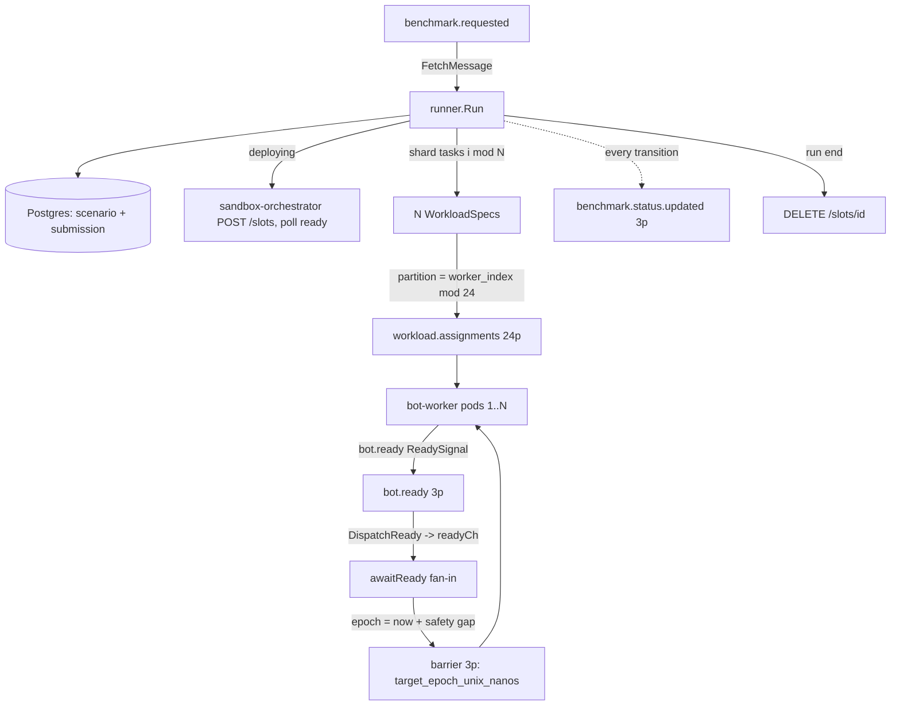

## Bot-Fleet Controller (Go)

> **Why Go:** the controller is coordination, not computation — consume an event, shard a task list, fan in readiness, call the orchestrator over HTTP, drive a state machine. Goroutines + channels model the `bot.ready` fan-in cleanly, and it lives entirely on the control plane (one run at a time), so GC has no bearing on the measurement.

### Role

The bot-fleet-controller is the **orchestration brain of a single benchmark run**. It consumes one `benchmark.requested` event, materialises the contestant's sandbox, deterministically shards the scenario's task list across a fleet of bot-worker pods, fans in their readiness, computes a fresh synchronization barrier, lets the waves fire, then tears the slot down — emitting a `benchmark.status.updated` event at every state transition so the rest of the platform (frontend, validator, scoring) can follow along.

It is a small service (~1.7k LOC of non-test code) organised as `main.go` plus an `internal/` tree: `controller/` (the runner, consumer, producer, session manager, startup recovery), `store/` (Postgres reads/writes), `orchestrator/` (HTTP client to sandbox-orchestrator), and `handler/` (health/readiness).

### Responsibilities

1. Consume `benchmark.requested` (one session per message) and idempotently start a run (`consumer.go:67-99`, `runner.go:63`).
2. Load the `Scenario` + its full `TaskSpec` list from Postgres (`store.LoadScenario`, `postgres.go:172`).
3. Resolve the submission's built image and listen port (`store.GetSubmission`, `postgres.go:56`).
4. Allocate a sandbox slot via the sandbox-orchestrator HTTP API and poll it to `ready` (`orchestrator/client.go:73,117`).
5. **Shard** the task list across N worker pods and publish one `WorkloadSpec` per worker to `workload.assignments` (`runner.go:338-372`, `producer.go:121`).
6. Fan in `bot.ready` `ReadySignal`s until all N workers report, or the ready deadline expires (`runner.go:303-334`).
7. Compute the barrier epoch **after** fan-in (fresh go-time) and publish a `BarrierEvent` (`runner.go:196-204`).
8. Wait out the scenario duration, release the slot, and mark the run completed (`runner.go:208-224`).
9. Drive the run-status state machine and emit `benchmark.status.updated` on every transition (`runner.go:240-259`).
10. On startup, fail-out any runs left mid-flight by a previous crash (`recovery.go:21`).

### State ownership & concurrency model

In-memory run state lives in a `SessionManager` — a `map[string]*Session` guarded by an `sync.RWMutex` (`session.go:36-47`). Each `Session` holds the worker count, a `ReadyReceived map[uint32]ReadySignal`, a buffered `readyCh chan ReadySignal`, and a per-session `context.CancelFunc` (`session.go:20-34`).

Two goroutines drive Kafka I/O, started from `main`:

- `StartBenchmarkRequested` — the **run-driver loop**. It fetches one `benchmark.requested`, calls `runner.Run(...)` **synchronously**, and only then commits the offset (`consumer.go:67-98`). Because `Run` blocks for the entire run lifecycle (slot deploy → fan-in → barrier → full scenario duration → teardown), this loop processes **one run at a time per partition** and the offset is committed only after the run finishes.
- `StartBotReady` — the **fan-in pump**. It decodes each `ReadySignal` and hands it to `SessionManager.DispatchReady`, which looks up the target session and non-blockingly pushes the signal onto that session's `readyCh` (`consumer.go:103-142`, `session.go:95-108`). The runner goroutine drains `readyCh` in `awaitReady`. This cleanly decouples the no-loss control-plane consumer from the per-run fan-in logic.

`DispatchReady` uses a `select { case ch <- sig: ... default: return false }` so a full channel never blocks the bot.ready consumer; the channel is sized `workerCount*2+1` (`runner.go:100`) to absorb duplicate redeliveries. Ready signals for unknown sessions are counted and dropped (`consumer.go:125-132`).

### The run state machine

Statuses are the `RunStatus*` constants in `schemas/go/topics/topics.go:51-59`. Each transition mutates the in-memory `Session` and publishes a `BenchmarkStatusUpdated`:

```
requested        (set by submission-api; controller's precheck guard)
   → deploying      "allocating sandbox slot"        runner.go:149
   → waiting_ready  "fanning in ready signals"       runner.go:185
   → barrier_fired  "barrier published"              runner.go:205
   → running        "bots firing"                    runner.go:206
   → completed | failed   (terminal)                 runner.go:223 / fail()
```

Two idempotency guards bracket the happy path: a **terminal-status precheck** that skips redelivered `benchmark.requested` for already-completed/failed runs (`runner.go:71-76`), and a **duplicate-session guard** — `SessionManager.Add` returns `existed=true` if the session is already tracked, so a redelivery during an active run is ignored rather than double-run (`runner.go:108-111`, `session.go:51-61`).

### Sharding: scenario tasks → workers → partitions → pods

This is the controller's most load-bearing logic. Given `total_tasks` and `MAX_TASKS_PER_WORKER` (default 1000, `runner.go:20`), the worker count is a ceiling-divide:

```go
// runner.go:229 — worker_count = ceil(total_tasks / MAX_TASKS_PER_WORKER), floored at 1.
func computeWorkerCount(totalTasks, maxTasksPerWorker int) uint32 {
	if totalTasks <= 0 { return 1 }
	if maxTasksPerWorker <= 0 { maxTasksPerWorker = DefaultMaxTasksPerWorker }
	count := (totalTasks + maxTasksPerWorker - 1) / maxTasksPerWorker
	return uint32(count)
}
```

Tasks are then **round-robin sharded** by index into per-worker buckets (`shard = i % workerCount`, `runner.go:348-351`), and one `WorkloadSpec` is built per worker carrying its `WorkerIndex`, the total `WorkerCount`, the resolved target host/port, and that worker's task slice (`runner.go:353-371`). The `GlobalSeed` is identical across all specs so every contestant gets the same logical workload.

#### The 1 WorkloadSpec → 1 partition → 1 worker pod mapping

`workload.assignments` has **24 partitions** (`ops/kafka/create-topics.sh:39`, `topic-init-job.yaml:52`). The controller pins each spec to a specific partition rather than letting Kafka hash it. It uses a custom `workerIndexBalancer` that reads the spec's `WorkerIndex` (stashed in `kafka.Message.WriterData`) and computes `partition = worker_index % numPartitions` (`producer.go:71-86`, `buildWorkloadMessages` at `producer.go:155-171`). The message key is `session_id:worker_index` for traceability, but the partition is decided by `WriterData`, not the key hash.

The reason: librdkafka's default `range,roundrobin` assignor (range wins) would hand one consumer pod a **contiguous block** of partitions, so multiple specs would land on one pod and run **serially** — the extra specs would miss the barrier and the run would be collision-degraded. By pinning spec `i` to partition `i` and having the workers consume with the **roundrobin** assignment strategy (`schemas/rust .../kafka.rs`, per), each spec reaches a **distinct pod**, provided the bot-fleet has `replicas ≥ worker_count`. That is exactly the KEDA pre-scale caveat the producer logs (`producer.go:142-146`).

A hard guard enforces the invariant: before publishing, the controller reads the live partition count from Kafka metadata (cached after first read, `producer.go:175-195`) and rejects the run if `worker_count > partitions`, with a precise error explaining that two specs would otherwise share a partition (`validateWorkerCapacity`, `producer.go:88-101`). In practice this caps a single run at **24 workers**.

This partitioning is what drives the worker fan-out and how the bot fleet scales horizontally: the unit of horizontal scale is the partition. Adding worker pods (up to 24) lets distinct WorkloadSpecs execute in parallel; the bot-fleet *workers* (not the controller) are KEDA-autoscaled 2→50 on `workload.assignments` lag, bounded to ≤24 effective by this layout.

### Barrier-after-fan-in / fresh go-time

The controller does **not** embed the barrier epoch in the WorkloadSpec. It waits for all ready signals first (`awaitReady`), then computes:

```go
// runner.go:196 — epoch computed AFTER fan-in so go-time stays fresh.
barrierEpochNs := uint64(time.Now().Add(r.runConfig.BarrierSafetyGap).UnixNano())
```

and publishes a `BarrierEvent{SessionID, TargetEpochUnixNanos}` to the `barrier` topic (`producer.go:199`). The rationale: fan-in can take up to the 30s `ReadyDeadline`; an epoch stamped *before* fan-in would be stale by barrier time, causing workers to fire immediately and destroying synchronization. Computing it after fan-in with a 500ms `BarrierSafetyGap` (configurable) means the only residual variance is Kafka delivery (~ms), and connections are already pre-warmed (worker side). The total run wait is `scenario.DurationNs + BarrierSafetyGap` (`runner.go:208`).

### Fan-in (waiting_ready) details

`awaitReady` loops until `len(ReadyReceived) == WorkerCount`, draining `readyCh` and indexing signals by `WorkerIndex` so duplicates collapse (`runner.go:303-334`). It is governed by a single `ReadyDeadline` timer (default 30s):

- **Full fan-in** → proceed to barrier (`ready_signals_total{result=full}`).
- **Deadline with zero signals** → hard error `"no ready signals before deadline"`, run fails (`ready_none_total`).
- **Deadline with partial fan-in** → log a warning, count `ready_partial_total`, and **proceed anyway** with whatever workers reported. This is a deliberate degrade-don't-stall choice, but it means a run can fire with fewer-than-intended workers and still be scored.
- **Context cancelled** → return `ctx.Err`.

### `benchmark.status.updated` emission

Every `transition` builds a `BenchmarkStatusUpdated{SessionID, SubmissionID, RunGroupID, Status, Message, UpdatedAt}` and publishes it keyed by `session_id` (`runner.go:242-259`, `producer.go:225-244`). `RunGroupID` is carried on every event so the frontend/SSE and the score rollup can correlate sibling sessions of the same run-group. The terminal `completed` status on the happy path is what triggers the downstream correctness validator.

### Failure handling & cleanup

Every failure path routes through `fail` → `transition(RunStatusFailed, ...)`, and crucially calls `releaseSlot` to DELETE the orchestrator slot so a failed run never leaks a sandbox pod (`runner.go:170-172,181,191,201`). Two notable design choices:

- `fail`, `publishFailure`, and `releaseSlot` all create a **fresh 10s `context.Background`** rather than reusing the run's (possibly already-cancelled) context, so cleanup and the failure status still get published even when the run was torn down by shutdown (`runner.go:263-299`).
- On `ctx.Done` *during the run wait*, the controller releases the slot and marks the run failed with `"controller shutdown during run"` (`runner.go:210-218`).
- An **early failure** before a `Session` exists (e.g. scenario load failure, zero-task scenario) uses `publishFailure` to still emit a `failed` status (`runner.go:79-87,270-286`).

#### Startup recovery (crash safety for a singleton)

Because the controller is a singleton holding all run state in memory, a crash mid-run would otherwise leave Postgres `runs` stuck in a non-terminal status forever. `RecoverInFlightRuns` runs **before** the consumers start: it lists every `runs` row not in `(completed, failed)`, marks each (and its parent `run_group`, de-duplicated) failed with `"controller restart — re-trigger benchmark"`, and publishes a `failed` status for each (`recovery.go:21-65`, `store.ListInFlightRuns/MarkRunFailed/MarkRunGroupFailed`). If recovery itself fails, `main` exits non-zero rather than start dirty (`main.go:72-75`).

#### `workload.failed` — declared but not consumed

The `workload.failed` topic exists (3 partitions, `create-topics.sh:42`, `topics.go:18`, Rust `TOPIC_WORKLOAD_FAILED`), but the bot-fleet-controller **does not consume it** — its only readers are `benchmark.requested` and `bot.ready` (`consumer.go:34-51`). A worker that aborts its WorkloadSpec therefore cannot proactively fail the run; the controller learns of trouble via missing `bot.ready` signals (caught by `ReadyDeadline`) or by the run timing out. Wiring up a `workload.failed` consumer so active worker-side failures fail the run fast is a clear future enhancement.

### Kafka topic contract

| Topic | Dir | Partitions | Partition key (and why) | Consumer group |
|---|---|---|---|---|
| `benchmark.requested` | consume | 3 | producer-side hash on `session_id` | `bot-fleet-controller` (env `KAFKA_BENCHMARK_GROUP`) |
| `bot.ready` | consume | 3 | key `session_id:worker_id` (worker side) | `bot-fleet-controller-ready` (env `KAFKA_BOT_READY_GROUP`) |
| `workload.assignments` | produce | **24** | **explicit partition = `worker_index % 24`** via `workerIndexBalancer` — gives the 1 spec → 1 partition → 1 pod mapping (§4.7) | — |
| `barrier` | produce | 3 | `kafka.Hash` on key = `session_id` — all of a session's consumers see the same barrier deterministically | — |
| `benchmark.status.updated` | produce | 3 | `kafka.Hash` on key = `session_id` — keeps a session's status events ordered on one partition | — |

Note: `benchmark.requested` and `bot.ready` use FetchMessage + manual commit with `CommitInterval: 0` (commit explicitly after processing), giving at-least-once delivery (`consumer.go:34-51`). The producer uses `RequiredAcks: RequireAll`, `Async: false`, `AllowAutoTopicCreation: false` for all three writers (`producer.go:44-53`) — the control plane is durability-first.

The `workload.assignments` partitioning is the lever for horizontal worker fan-out: each `WorkloadSpec` deterministically lands on its own partition, so adding bot-worker replicas (KEDA-scaled on this topic's lag) lets distinct specs run in true parallel up to the 24-partition ceiling.

### Scaling model

The **controller itself is a singleton**: `replicas: 1`, `strategy: Recreate` (`k8s/benchmark/bot-fleet-controller/deployment.yaml:14-16`), PDB `maxUnavailable: 1` (`pdb.yaml:14`). It is **not** KEDA-autoscaled (there is no ScaledObject for it; the only bot-fleet ScaledObject targets the workers). This is intentional and correct: all run state is in-process memory (`SessionManager`), the run-driver loop is single-threaded, and `Recreate` plus startup recovery guarantees no two controller instances ever fan-in the same session concurrently.

The thing that scales is the **bot-fleet of workers**, fanned out by the 24-partition `workload.assignments` topic (workers KEDA-scaled 2→50, effective ≤24 per run). The controller is the fixed orchestration point that drives them.

**Bottlenecks / limits:**

- **Single-threaded run throughput.** `StartBenchmarkRequested` runs `runner.Run` synchronously and commits only after the *entire* run (including the full scenario wall-clock), so a single controller serialises concurrent benchmark requests on a partition. With 3 `benchmark.requested` partitions and one consumer instance, at most 3 partitions' worth of work is interleaved, but each is blocked end-to-end on `runner.Run`. This is the dominant throughput ceiling for *number of concurrent runs*.
- **24-worker hard cap per run** from `validateWorkerCapacity` (`producer.go:88-101`), driven by the fixed 24-partition layout. Larger scenarios cannot exceed this without repartitioning the topic or raising `MAX_TASKS_PER_WORKER` (which packs more tasks per worker instead).
- **Pre-scale dependency.** The 1:1 spec→pod mapping only holds when bot-fleet `replicas ≥ worker_count` *before* fan-in; the controller logs this but cannot enforce it (`producer.go:142-146`). If under-scaled, multiple specs share a pod's consumer and serialise, missing the barrier.
- **No `workload.failed` handling** (above) — active worker failures are not surfaced.
- **Partial fan-in fires anyway** (`awaitReady`, `runner.go:317-327`) — a degraded run is not failed.
- **Hardcoded timeouts** as fallbacks: `DeployDeadline` 60s, `ReadyDeadline` 30s, `BarrierSafetyGap` 500ms (all env-overridable, `runner.go:149-151` / `main.go:142-155`); writer/HTTP timeouts of 5s and 15s (`producer.go:21`, `client.go:58`).

### Data flow



---
