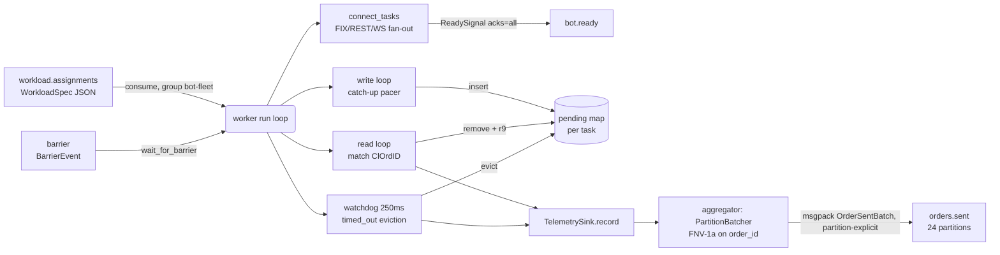

## Bot-Fleet Load Generator (Rust)

> **Why Rust:** this is the load generator's whole reason to be a systems language. It must hold an open-loop schedule at hundreds of thousands of orders/sec while *itself* being the timing reference — a single GC pause would inject jitter straight into the send timestamps it records. Rust gives zero-GC execution, explicit control over allocation (pre-rendered wire frames, reused per-task buffers), and Tokio for the per-connection task fan-out, yielding the predictable tail behavior a garbage-collected runtime cannot guarantee.

`services/bot-fleet` is the platform's **open-loop load generator** — the single most performance-critical service (~5,300 LOC of Rust/Tokio). One pod is one Kafka partition's worth of work: it consumes a `WorkloadSpec` from `workload.assignments`, opens N connections (FIX / REST / WS) to a contestant's sandbox, fires deterministically-generated orders at a fixed paced schedule, captures the contestant's response, and streams every offered order to `orders.sent` for downstream HDR latency analysis. Its design goal is to push the genuine raw send ceiling of a node at a contestant while never *hiding* the latency it induces (coordinated-omission correctness).

### Responsibilities and module layout

| Module | Role |
|---|---|
| `src/main.rs` | Boot: Loki guard, Prometheus server on `:9090`, then `worker::run(Config::from_env())`. |
| `src/config.rs` | Env-driven `Config`; topic names from the shared schema crate; `validate` invariants. |
| `src/worker.rs` (68 KB, the core) | Consume loop, spec validation, connect fan-out, barrier wait, the three protocol task runners, the **pacer**, the pending-map + watchdog. |
| `src/content.rs` | `TaskGenerator` — seeded, deterministic order stream (limit/market/cancel/replace) with a bounded resting-order ledger. |
| `src/fix.rs` | Pre-rendered wire frames (`OrderFrame` holding `fix`/`rest`/`ws_bytes`); O(1) in-place FIX `SendingTime` patch. |
| `src/telemetry.rs` | `TelemetrySink` → background aggregator → pipelined, size-bounded, co-partitioned `orders.sent` batches. |
| `src/kafka.rs` | Producers (split control vs telemetry), consumer config, partition-explicit enqueue, barrier wait. |
| `src/metrics.rs` | Hand-rolled Prometheus registry + `/metrics` HTTP server. |
| `src/time.rs` | `unix_nanos()` and an allocation-free FIX timestamp formatter. |

### Control flow: assignment → barrier → fire

`run()` (`worker.rs:105`) ensures topics, builds a **control producer** and a **telemetry producer**, reads the live partition count of `orders.sent` from broker metadata (overriding `ORDERS_PARTITIONS` so the telemetry co-partition hash always matches reality, `worker.rs:119-128`), then loops on `workload.assignments` with manual offset commit. A spawned task watches SIGINT/SIGTERM and trips a `watch`-channel `CancelToken` for graceful drain (`worker.rs:142-160`). Each `WorkloadSpec` is handled by `run_workload()`:

1. **Validate** (`validate_spec`, `worker.rs:288`): non-empty tasks, `task_count ≤ max_bots_per_worker`, `target_rps>0`, `duration_ns>0`, valid `worker_index < worker_count`, wire-safe identifiers, and — critically — that **worst-case wall time** (barrier wait + max(`start_offset_ns`+`duration_ns`) + 5 s drain) is below `max.poll.interval.ms`. The assignment offset commits only *after* the run, so a run that outlives the poll ceiling would trigger a Kafka rebalance and **re-deliver mid-run** (duplicate execution) — this guard rejects such specs up front (`worker.rs:324-334`).
2. **Connect fan-out** (`connect_tasks`, `worker.rs:381`): resolve the target once, then a `JoinSet` connects every task concurrently. **Nagle is disabled on every connection** — `set_nodelay(true)` is set on the FIX, REST, and plain-WS sockets at connect (`worker.rs:1594`, `:1610`, `:1620`) so a small order frame is put on the wire immediately rather than held by Nagle's algorithm; FIX additionally sends a logon frame, REST keeps the socket alive, WS dials `ws://host:port/`. Failed connects are dropped and counted, not fatal — connections are **pre-warmed before the barrier** so connect latency never contaminates the measured spike.
3. **Publish `ReadySignal`** to `bot.ready` (acks=all), keyed `session_id:worker_id`, reporting `connected_count` for the controller's fan-in.
4. **Barrier wait** (`kafka::wait_for_barrier`, `kafka.rs:307`): a *per-worker* consumer group (`{group}-barrier-{worker_id}`, deliberately **not** per-session so it is stable across runs, `worker.rs:343`) reads `barrier` until a `BarrierEvent` matching this `session_id` arrives, yielding `target_epoch_unix_nanos` — a fresh, post-fan-in go-time. Hard timeout `BARRIER_WAIT = 120 s`.
5. **Fire** (`fire_workload`): one Tokio task per connected task, each running the protocol-appropriate loop set; the shared `TelemetrySink` is then `close()`d to drain remaining telemetry.

### The open-loop pacer with catch-up (the throughput fix)

This is the load-bearing performance work. The original per-task pacer slept `interval_ns` between each individual send; a single Tokio timer task tops out around **~1,000 wakeups/s**, so any task asked for >1k orders/s simply couldn't keep schedule and aggregate load collapsed far below the node's real capacity. The fix is **catch-up pacing plus write coalescing**: the loop parks *only* when genuinely ahead of the next due order, then drains *every* order that is already due into one buffer and issues a **single `write_all`** — so under load one syscall + one reactor round-trip amortizes across up to `BOT_WRITE_BATCH` (default 64) orders, the dominant per-order cost found by profiling.

```rust
// services/bot-fleet/src/fix.rs path — worker.rs:786-815 (catch-up + coalesce)
if next_send_ns > unix_nanos() {                       // park ONLY if ahead of schedule
    tokio::select! {
        _ = time::sleep_until(instant_from_unix_nanos(next_send_ns)) => {}
        _ = cancel.cancelled() => break,
    }
}
frames.clear(); targets.clear(); batch_buf.clear();
let now_ns = unix_nanos();
while frames.len() < batch_max && next_send_ns <= now_ns {   // drain every DUE order
    let action = generator.next();
    let mut frame = render_frame(&fix_version, &session_id, &target_host,
                                 u64::from(task.task_id), &action);
    frame.patch_timestamp(unix_nanos());                       // O(1) in-place SendingTime
    batch_buf.extend_from_slice(&frame.fix);
    targets.push(next_send_ns);                                // t0 captured BEFORE the write
    frames.push(frame);
    next_send_ns = next_send_ns.saturating_add(interval_ns);   // fixed step, no jitter
}
```

*Caption (`worker.rs:786-815`):* the `while next_send_ns <= now_ns` loop is the catch-up — a task that fell behind emits a batch larger than one to re-converge on schedule, instead of being timer-rate-limited; a task under the ceiling still paces normally and writes batches of one. Pacing semantics are unchanged: `interval_ns = 1e9 / target_rps` (`worker.rs:750`) advances by a fixed step regardless of how fast the contestant answers.

**Coordinated-omission correctness.** The intended fire time `target_send_ts_ns` is pushed to `targets` **before** the sleep and before the write. A slow contestant whose backed-up TCP window stalls `write_all` therefore produces a monotonically growing `send_ts_ns − target_send_ts_ns` gap — the CO signal — captured per order as `schedule_slip` (`worker.rs:867-868`). It does *not* let the generator silently slow down its own schedule; `next_send_ns` keeps advancing on the ideal clock.

**Backpressure, not death.** The FIX writer deliberately does **not** impose a per-write timeout (`_write_timeout` is unused, `worker.rs:710-712`). When the contestant can't drain, its receive window fills and `write_all` blocks; TCP flow control then paces *this* task down to the contestant's honest service rate, so aggregate load plateaus at the sink's capacity instead of overshooting. A short timeout did the opposite — `write_all` isn't cancel-safe, so a timeout left a partial frame and forced the task to exit; under sustained backpressure *every* loaded task exited at once and offered load collapsed to zero. A genuinely dead peer still surfaces as a write error and exits the writer. (REST/WS still use a per-write timeout via `time::timeout(write_timeout, …)`, `worker.rs:1247`, since they are not the headline-throughput path.)

**In-flight cap (closed-loop safety valve).** A per-task `MAX_INFLIGHT` (`BOT_MAX_INFLIGHT_PER_TASK`, default 10,000, `worker.rs:741`) bounds the pending map: at the cap the writer backpressures (1 ms parks) instead of issuing more, so a slow contestant or stalled telemetry path can't grow memory unbounded and OOM the worker. A healthy contestant sits at `rate × RTT`, orders of magnitude under the cap, so it never false-throttles.

### Pre-rendered, zero-GC wire frames

`OrderFrame` (`fix.rs:31`) holds **pre-built bytes for all three protocols** — `fix: Vec<u8>`, `rest: Vec<u8>` (a full HTTP request), `ws_bytes: Vec<u8>` — plus the parsed `order_id`/`price`/`qty`/`side`/`payload_type`/`ord_type`. The only hot-path mutation is `patch_timestamp` (`fix.rs:48`): it overwrites the 21-byte FIX `SendingTime` (tag 52) in place and repairs the checksum with **O(1) delta arithmetic** (sum the byte deltas, adjust mod 256) rather than re-rendering or re-summing the whole frame. A GC pause or per-message heap allocation during a wave would inject jitter into the measured schedule; Rust + reused buffers (`frames`/`targets`/`batch_buf` are allocated once per task and `clear`ed each iteration, `worker.rs:763-765`) keeps the pacer's hot path to: clock read → buffer copy → one TCP write.

### Deterministic content generation

`TaskGenerator` (`content.rs:102`) is seeded with `global_seed ^ task_id`, so a fast and a slow algo receive the **byte-identical** stream — cross-contestant fairness. The RNG draw order is a fixed determinism contract. Order kind is chosen from the per-task `market/cancel/replace` mix; cancel/replace targets are drawn from the bot's *own* bounded `VecDeque` ledger of recently-rested orders (never from observed fills, so the stream can't diverge on contestant behavior). The ledger uses `VecDeque` with `pop_front`/`swap_remove_back` (both O(1)) — a prior `Vec::remove(0)` memmove dominated CPU (~87% in profiling) at high rates with `cancel_pct=0` (`content.rs:109-113`).

### Three-loop send/recv capture across protocols

Every protocol runs the same **three concurrent loops** in a `JoinSet`, sharing one `pending: Arc<Mutex<HashMap<order_id, PendingOrder>>>`:

- **write loop** — the pacer above; inserts each order into `pending` (with `send_ts_ns=0`), writes, then patches `send_ts_ns` on success.
- **read loop** — drains responses and matches them to `pending` by client order id: FIX matches tag-11 `ClOrdID` on ExecutionReports (`MsgType=8`, `fix_read_loop` `worker.rs:895`); REST frames responses by `Content-Length` *or* chunked transfer-encoding and pulls `cl_ord_id` from JSON (`rest_read_loop` + `next_http_response`, handling pipelined responses); WS reads each frame's JSON `cl_ord_id`. On a match it removes the entry (first-response-wins) and records an `OrderSentEvent` with `recv_done_ts_ns` (r9) and `timed_out=false`.
- **watchdog loop** (`worker.rs:985`) — every 250 ms evicts orders older than `RESPONSE_TIMEOUT_NS = 5 s`, recording them as `timed_out=true` (`recv_done_ts_ns=0`); on the **final tick** it evicts *everything* still pending — including writes still in flight (`send_ts_ns==0`) — so **every offered order is accounted** as either matched or timed-out. No phantom drops, which the coordinated-omission and coverage scoring gates depend on.

All three loops run until `drain_end_ns = task_end_ns + RESPONSE_TIMEOUT_NS`, giving a 5 s post-send drain window for late responses.



### Telemetry flush path: pipelined, size-bounded, co-partitioned

`TelemetrySink::record` (`telemetry.rs:93`) sends each `OrderSentEvent` over a bounded mpsc channel (`telemetry_channel_capacity`, default 65,536). It is **lossless by backpressure**: a full channel makes `record` `.await` rather than drop, so the generator self-paces to the sustainable telemetry rate (a dropped event would mean a permanent hole in the HDR histogram). The only counted drop is the channel being closed at shutdown.

A single background `run_aggregator` (`telemetry.rs:144`) drives a `biased` `select!` over three arms: (1) account completed deliveries from a `FuturesUnordered` `inflight` set first (keeps it bounded), (2) `recv_many` up to 4,096 events per wake into a `PartitionBatcher`, (3) a flush ticker (default 5 ms) that drains partial batches. The `PartitionBatcher` (`telemetry.rs:283`) buckets events by `partition_for(order_id, num_partitions)` and emits a chunk the instant a partition reaches `MAX_EVENTS_PER_BATCH = 1000` (~360 KB, safely under the 1 MiB `max.message.bytes`). Each chunk is msgpack-encoded as `OrderSentBatch` (`rmp_serde::to_vec_named`) and **enqueued without awaiting delivery** via `enqueue_to_partition` (`send_result`), letting rdkafka pipeline and batch in the background — this decouples drain rate from per-batch broker RTT, which is the core fix (the old await-per-flush loop serialized one round-trip per batch → ~5.7k/s ceiling and ~90% drops). A full producer queue surfaces as `Ok(None)`; the aggregator polls + retries (lossless backpressure) rather than dropping.

`BOT_DISABLE_TELEMETRY=1` makes `record` a no-op and skips the aggregator entirely — used to measure *raw send capacity* against a drain contestant, where there's no validation and a single-broker Kafka can't absorb one event per order.

### Kafka topics

| Topic | Dir | Partitions | Key / partition decider | Group | Why |
|---|---|---|---|---|---|
| `workload.assignments` | consume | **24** | controller sets partition `worker_index % N`; consumed with `partition.assignment.strategy=roundrobin` | `bot-fleet` | 1:1 spec→partition→pod; roundrobin (vs librdkafka's range default) gives each spec a distinct pod when replicas ≥ worker_count. Horizontal scale unit = **one worker per partition** (`worker_count ≤ 24`). |
| `barrier` | consume | 3 | n/a (scans all for matching `session_id`) | `{group}-barrier-{worker_id}` (per-worker, ephemeral) | Low-volume control signal; per-worker group so every worker independently sees the go-time. |
| `bot.ready` | produce | 3 | key `session_id:worker_id` | — | Control-plane fan-in to the controller; `acks=all`, `linger.ms=0` for durability. |
| `orders.sent` | produce | **24** | **explicit partition = FNV-1a(order_id) % 24** (`partition_for`, `schemas/rust/src/lib.rs:26`) | — | **Co-partitioned with `orders.acked`**: the same `order_id` lands on the same partition number in both topics (ebpf-latency, also Rust, uses the identical `partition_for`), so the telemetry ingester can join sent↔acked partition-locally — no cross-partition shuffle. 24 partitions let the ingester scale to 24 parallel consumers; the bot writes the partition itself (bypassing producer-side hashing) to guarantee the contract. |

`partition_for` is FNV-1a 64-bit (`offset basis 0xcbf29ce484222325`, prime `0x100000001b3`) mod partition count. Both `orders.*` producers are Rust (`bot-fleet` and `ebpf-latency`) and call this same function, so they compute byte-identical partitions for a given `order_id`. There is **no Go reimplementation** — the only Go consumer of these topics (the correctness-validator) never recomputes the partition; it simply reads every partition directly.

### Metrics & watchdog accounting

The hand-rolled Prometheus registry (`metrics.rs`) exposes, among others: `iicpc_bot_orders_sent` (the headline send counter, incremented per coalesced batch via `orders_sent_by`), `iicpc_bot_telemetry_events_dropped` (the backpressure/loss probe — lossless operation keeps this at 0), `iicpc_bot_telemetry_events_flushed`/`_batches`, `iicpc_bot_write_seconds` (wall time inside `write_all` — the direct drain-backpressure signal), `iicpc_bot_schedule_slip_seconds` (the CO signal `send_ts − target_send_ts`), and `iicpc_bot_write_batch_size` (how effectively catch-up batching amortizes the syscall). Together with the watchdog's every-order accounting, these make both throughput and induced latency observable.

### Scaling model

**Stateless, partition-sharded, KEDA-autoscaled.** Each worker holds no durable state; its only "ownership" is the set of `workload.assignments` partitions Kafka assigns it. The `ScaledObject` (`k8s/benchmark/bot-fleet/scaledobject.yaml`) scales on a **Kafka consumer-lag trigger**: topic `workload.assignments`, group `bot-fleet`, `lagThreshold "1"`, `offsetResetPolicy: earliest`, **min 2 / max 50** replicas, 5 s polling. `earliest` is required so an unconsumed backlog registers as lag (with `latest` a fresh group reads zero lag and never scales up). The unit of horizontal scale is **one worker per partition**, bounding effective parallelism to the 24-partition layout (`worker_count ≤ 24`); the controller pins each spec to `worker_index % N` so distinct specs reach distinct pods. Deterministic large runs should pre-scale rather than wait on lag. The deployment pins workers to a tainted `botworker` node pool so load generation doesn't crowd the measurement plane.

**Per-pod ceiling.** A single pod's raw generation ceiling is exercised by the per-pod generation-ceiling ramp: three *serial* constant-RPS scenarios at 20k / 60k / 150k aggregate RPS over a **fixed 256-connection fan**, pure new-limit orders (Market/Cancel/Replace = 0), 120 s each — produced by `services/submission-api/cmd/loadgen-seed/main.go` (`buildLean` spreads `target/conns` rps per task with a +1 remainder). bot-fleet honors this purely through `target_rps` pacing and `start_offset_ns` staggering in the `TaskSpec`s; there is no ramp logic *inside* the worker. Resource limits are `cpu: 3` / `memory: 6Gi` (the 6 Gi sized to the worst-case in-flight cap: ≤1000 tasks × 10k in-flight × ~350 B ≈ 3.5 GiB pending + 1 GiB Kafka queue + runtime). An init container clamps `eth0` MTU to 1500 and disables segmentation offload so eBPF latency capture (1536 B cap) doesn't truncate FIX frames.

**Bottleneck.** Per the project's benchmark findings, the residual single-node ceiling after the catch-up fix is the host's veth/network path (CPU is no longer the limit once writes are coalesced); horizontal scale across the 24 partitions on separate nodes is how the platform exceeds a single node's ~tens-of-k orders/s. Telemetry — single aggregator per worker, single-broker Kafka in the smoke cluster — is the other practical ceiling (hence `BOT_DISABLE_TELEMETRY` for raw-capacity runs).

### Limitations / scope for improvement

- **`worker_count ≤ 24`** is a hard structural cap from the 24-partition `workload.assignments`/`orders.sent` layout; scaling past 24 generators per session requires re-partitioning both topics in lockstep (the co-partition contract couples them).
- **One telemetry aggregator task per worker** (`telemetry.rs:62-72`) — the per-pod telemetry drain is a single Tokio task; it has been hardened (recv_many, pipelined enqueue) but is still the serial point if a single pod must emit far above its in-flight ceiling.
- **REST/WS retain a per-write timeout** (`worker.rs:1247`) that the FIX path deliberately abandoned; under backpressure a REST/WS task exits the writer on timeout rather than self-pacing, so those transports don't get the same graceful load-plateau behavior as FIX.
- **Single FIX session per connection** with a hardcoded logon (`98=0/108=30`, `SenderCompID=IICPC-BOT`, `fix.rs:82`); no FIX heartbeat/resend handling — fine for a measurement harness but not a conformant FIX engine.
- **`max_bots_per_worker` default 1000** (config + `MAX_BOTS_PER_WORKER` env) caps tasks per spec; combined with the in-flight cap this is what sizes the 6 Gi memory limit — raising either requires re-deriving the OOM headroom comment.
- **Read buffers reset on overflow** (FIX/REST drop the buffer at 1 MiB, `worker.rs:973`/`1460`) — a pathological non-framing contestant loses in-flight matches (they then surface as `timed_out`), correct for accounting but lossy for latency samples.

---
