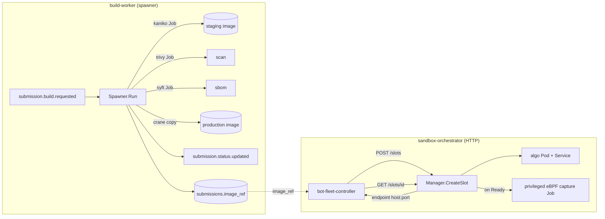

## Build Pipeline & Sandbox Orchestrator (Go)

> **Why Go:** both are pure Kubernetes control-plane orchestration — minting and watching build Jobs, contestant Pods, Services, and capture Jobs — and Go is the native language of that ecosystem (`client-go`), so the work is idiomatic and fully supported. Neither sits on the measured path, so a GC'd runtime is a non-issue.

These two Go services bridge a contestant's *source code* and a *running, measurable target*. The **build-worker** turns an uploaded source bundle into a hardened OCI image in a registry; the **sandbox-orchestrator** later mints exactly one isolated, CPU-pinned pod from that image plus its co-located privileged eBPF capture job, and reports the pod's reachable endpoint so the controller can fire load at it. They are decoupled — build-worker is Kafka-driven and asynchronous; sandbox-orchestrator is a synchronous HTTP control plane the `bot-fleet-controller` calls per session.



### (a) build-worker — source → scanned/SBOM'd registry image

**Role.** Consumes one build request, deterministically produces a Dockerfile, builds the contestant artifact with **Kaniko** inside an ephemeral k8s Job, scans it (Trivy) and generates an SBOM (Syft) in parallel, promotes it to a production registry ref, persists that ref to Postgres, and emits status transitions throughout.

**Two deployment shapes (one consumer, two handlers).** The service ships two `main`s that share `internal/consumer`, `internal/publisher`, `internal/store`:
- `cmd/spawner` (production): `Spawner.Run` spawns Kubernetes **Jobs** (build/scan/sbom) and never builds in-process (`services/build-worker/internal/k8s/spawner.go:182`). This is the EKS/k3s path.
- `cmd/worker` (dev): a `pipeline.LocalRunner` builds via the local Docker daemon in-process (`services/build-worker/cmd/worker/main.go:86`, `internal/pipeline/local_runner.go:44`). Out of scope for the cluster.

The rest of this subsection describes the spawner path.

**Pipeline (`spawner.go:182-377`), phase by phase:**
1. **precheck** — download `artifact.zip` from MinIO at `msg.ArtifactPath`, run a zip-slip guard that rejects any entry escaping the extraction root (`internal/precheck/zipslip.go:18`).
2. **dockerfile** — `dockerfile.Generate(language, buildType, buildTarget, port)` renders one of three hardcoded multi-stage templates (cpp/rust/go) and validates `buildTarget` against `^[A-Za-z0-9_.-]{1,64}$` so build metadata cannot become a Dockerfile-injection vector (`internal/dockerfile/generate.go:17,76`). The rendered file is base64-encoded and passed to the build Job via env.
3. **build** — ensure the registry repo exists (ECR `CreateRepository`, no-op for Harbor), refresh the ECR docker-config Secret if in ECR mode, then create the kaniko Job and block on it. Status → `building`. Metric `build_jobs_created_total{mode="build"}`; on failure `build_jobs_failed_total{mode="build"}`.
4. **scan + sbom (parallel)** — two Jobs created and awaited concurrently via a `sync.WaitGroup` + channels; Trivy report and Syft SPDX SBOM are uploaded to MinIO. On success the statuses `scanned` then `sbom_ready` are published (`spawner.go:276-329`). Metrics tagged `mode="scan"` / `mode="sbom"`.
5. **promote** — **Harbor only**: `crane.Copy(stagingRef → productionRef)` between the two distinct registries. **ECR is a single registry**, so the kaniko-built staging image *is* the final image and promote is skipped entirely (`spawner.go:331-364`) — an elegant avoidance of a redundant same-ref copy.
6. **persist + ready** — `UpdateImageRef` writes the final `image_ref` into `submissions` (DB op `update_submission_image_ref`, `internal/store/postgres.go:105`), then status → `ready`.

Each status transition is *dual-written*: published to Kafka **and** written to Postgres with a monotonic rank guard so a later out-of-order message can't regress a submission's status, and `failed` is terminal (`postgres.go:55-101`). The `image_ref` column is auto-migrated on startup with `ADD COLUMN IF NOT EXISTS` (`postgres.go:18`).

**The k8s Job/spawner model.** The spawner is a long-lived Deployment (`replicas: 1`, `k8s/build/spawner/deployment.ecr.yaml:15`) that acts purely as a *controller* for short-lived Jobs. Every Job is created with `BackoffLimit=0` (no retries — a build either works or fails cleanly), an `ActiveDeadlineSeconds` (build 600s, scan 900s for Trivy's cold DB pull, sbom 600s), and `TTLSecondsAfterFinished=300` so finished Jobs self-garbage-collect after logs are read (`spawner.go:36-43,461-554`). `waitForJob` polls Job conditions every 5s rather than watching. The build Job uses an **init container** (`fetcher`, the spawner's own image) to pull+extract the artifact and write the Dockerfile into a shared `emptyDir` workspace, then the kaniko container builds from it (`spawner.go:525-549`, `cmd/fetcher/main.go`).

**Security posture of build Jobs.** Build/scan/sbom pods are `RunAsNonRoot`, drop `ALL` caps, read-only rootfs, `RunAsUser=65532` for fetcher/trivy/syft. Kaniko is the deliberate exception — it needs uid 0 and a writable rootfs to assemble layers, but still runs `AllowPrivilegeEscalation=false` (`spawner.go:869-900`). A NetworkPolicy (`k8s/build/network-policy.yaml`) locks `app=build-job` pods to MinIO (9000), DNS, the registry, and 80/443 *to the internet only* (RFC1918 carved out) for package mirrors.

**Registry auth.** Two providers behind `REGISTRY_PROVIDER`: `""` → Harbor (basic-auth creds written into kaniko's `config.json` by the fetcher; staging→production crane copy); `"ecr"` → AWS ECR via **IRSA**. In ECR mode the spawner mints a fresh `GetAuthorizationToken` and stores it in an Opaque Secret `build-ecr-dockercfg` (`spawner.go:100-123`, `internal/k8s/ecr_aws.go:37`), refreshed *per build* (token lasts ~12h), which kaniko/trivy/syft mount read-only for registry auth. This is why the build-spawner Role needs `secrets: create/get/update/patch` (`k8s/build/rbac.yaml:31-33`) on top of `jobs` and `pods/log`.

**Kafka.**
- **Consumes** `submission.build.requested` — **3 partitions**, consumer group **`build-worker-spawner`** (`cmd/spawner/main.go:52`; `consumer/kafka.go:40`). Partition key is the producer's choice (submission-api); within build-worker the message is processed *serially* — `consumer.Start` calls `handler.Run` synchronously and commits the offset only after the entire multi-minute pipeline returns (`consumer/kafka.go:75-83`). Horizontal scale: more spawner replicas in the same group split the 3 partitions, so up to 3 concurrent builds; beyond that the topic's partition count is the cap.
- **Produces** `submission.status.updated` — **3 partitions**, **partition key = `submission_id`** (`publisher/kafka.go:80`). Keying by submission keeps all status transitions for one submission in a single partition so consumers observe them in order; the writer uses `RequireOne` acks, synchronous.

**Metrics.** `build_jobs_created_total{mode}`, `build_jobs_failed_total{mode}`, `build_phase_total/_duration_seconds{phase,result}`, `build_request_duration_seconds`, `harbor_promote_total`, plus Kafka/DB families.

**Limitations / scope-for-improvement:**
- **Strictly serial per replica + at-most-3-parallel cluster-wide** — the consumer blocks on each ~minutes-long build before committing/fetching the next; throughput is bounded by the 3 partitions of `submission.build.requested`, not by node capacity.
- **No retries on transient Job failure** — `BackoffLimit=0` means a flaky kaniko/registry blip fails the whole submission as `failed` (terminal in the DB rank guard).
- **Only 3 languages** are buildable (cpp/rust/go) and the Dockerfile templates are hardcoded (`generate.go:26-71`); `BuildType`/`Protocol` from the request are not used to select build logic.
- **Logs are polled, not watched**, and `waitForJob` reads only the *first* matching pod's logs (`spawner.go:443`), so a retried pod's logs could be missed (mitigated by `BackoffLimit=0`).
- **ECR `image_ref` is `:latest`** per submission id, so re-running a build for the same id overwrites the prior image rather than versioning by digest.

### (b) sandbox-orchestrator — one pinned algo pod + co-located eBPF capture

**Role.** A small HTTP control plane (chi router, `replicas: 1`) that allocates/refreshes/releases sandbox **slots**. A slot = one algo `Pod` + a `Service` (and, when capture is enabled, one privileged eBPF capture `Job`). It hands the algo's stable Service FQDN and port back to the caller so load can be fired at it. It is **not** a Kafka consumer or producer — its only Kafka touch is injecting `KAFKA_BROKERS` into the *capture* Job's env so the capture binary can publish `orders.acked`.

**API surface (`main.go:104-106`).**
- `POST /slots {slot_id, contestant_id, image, port}` → `Manager.CreateSlot`
- `GET /slots/{slot_id}` → `Refresh` (re-derives live state, lazily spawns capture once Ready)
- `DELETE /slots/{slot_id}` → tears down pod + service + capture job
- `/healthz`, `/readyz`, `/metrics`

**State ownership.** Slot metadata lives in an in-memory `SlotStore` (a mutex-guarded `map[string]*Slot`, copy-in/copy-out, `internal/store/slot.go:43`). **Kubernetes is the source of truth, not the map** — on startup `ListExisting` rebuilds the map from cluster pods labelled `app=algo,app.kubernetes.io/managed-by=sandbox-orchestrator` (`internal/k8s/slot.go:238`), and `Refresh` always re-reads the live pod and calls `deriveState` (`slot.go:219,620`). Slot state is one of `creating | ready | failed | terminating`, derived from pod phase, terminal waiting reasons (ImagePullBackOff, CrashLoopBackOff, etc.), and the `PodReady` condition (`slot.go:620-660`). `PodSucceeded` is treated as `failed` because the algo is supposed to stay running.

**The algo pod — Guaranteed QoS with integer-core cpuset pinning.** This is the load-bearing detail. `containerResources` sets **request == limit** for both CPU and memory, which is the only way to qualify for Guaranteed QoS:

```go
// internal/k8s/slot.go:607 — request==limit (Guaranteed QoS) is what unlocks
// the kubelet static CPU manager's *exclusive* cpuset pinning for the algo.
func (m *Manager) containerResources() corev1.ResourceRequirements {
	list := corev1.ResourceList{}
	if m.cpu != "" { list[corev1.ResourceCPU] = resource.MustParse(m.cpu) }
	if m.memory != "" { list[corev1.ResourceMemory] = resource.MustParse(m.memory) }
	return corev1.ResourceRequirements{Requests: list.DeepCopy(), Limits: list.DeepCopy()}
}
```

Crucially, `validateConfig` **rejects non-integer CPU** at startup (`strconv.Atoi(cfg.CPU)` and `cpu.MilliValue%1000 != 0`, `slot.go:122`). A millicpu value like `"2000m"` is still Guaranteed yet the CPU manager *silently skips* exclusive pinning, dropping the algo into CFS bandwidth throttling and a tail-latency cliff — so the integer-core gate is what actually makes pinning engage. Prod default `ALGO_CPU=2`, `ALGO_MEMORY=1Gi` (`deployment.yaml:46-49`).

**Algo pod hardening.** `RestartPolicy=Never`, `ActiveDeadlineSeconds=3600` (auto-reap leaked pods), `AutomountServiceAccountToken=false`, read-only rootfs with four tmpfs `emptyDir{Medium:Memory}` mounts for `/tmp,/var/tmp,/var/log,/var/run`, drop `ALL` caps, `AllowPrivilegeEscalation=false`, `RuntimeDefault` seccomp (`slot.go:336-376`). Optional CNI bandwidth throttling via `kubernetes.io/{egress,ingress}-bandwidth` annotations (prod `100M`). A TCP-socket readiness probe on the algo port (1s period, 30 failures) drives the `ready` transition (`slot.go:358`). `RuntimeClassName` (gVisor) is set only if `RUNTIME_CLASS` is non-empty — prod ships `RUNTIME_CLASS=""` (gVisor optional), so isolation then leans on the hardened context + default-deny netpol.

**Node taints / pinning.** When `SANDBOX_NODE_POOL` is set, the pod gets `nodeSelector pool=<value>` plus a toleration for taint **`sandbox=true:NoSchedule`** (`slot.go:389-397`), keeping platform workloads off contestant nodes and letting integer-core sizing fill the node (one algo per node by design). Empty pool disables this for dev k3s.

**The privileged eBPF capture Job.** Spawned lazily by `ensureCapture` the first time a slot is observed `Ready` (`slot.go:228,462`). It is deliberately **co-located on the algo's exact node** (`NodeName = pod.Spec.NodeName`), runs `HostPID=true`, `Privileged=true` with caps `BPF,NET_ADMIN,SYS_ADMIN`, mounts the host `/sys/fs/bpf` bpffs, and is told the algo's pod UID + container ID + interface so it can attach at the algo's veth. It is **Burstable on purpose** (request 200m < limit 4 CPU, `captureResources` at `slot.go:588`) so the static CPU manager never hands it an exclusive cpuset — measuring must not steal the algo's pinned cores. It carries an `ownerReference` to the algo pod so it's GC'd with it, and `reapOrphanCaptureJobs` cleans up captures whose slot no longer exists on restart (`slot.go:285`). The capture Job env includes `KAFKA_BROKERS` so it publishes `orders.acked` itself.

**How TargetHost/TargetPort reach the controller.** The endpoint is the **stable Service FQDN**, not the ephemeral pod IP: `ServiceFQDN(slotID, ns) = algo-<slot_id>.<ns>.svc.cluster.local` (`slot.go:312`), returned in the `slotResponse.endpoint{host,port}` JSON (`internal/handler/slot.go:106,195`). The `bot-fleet-controller` flow (`services/bot-fleet-controller/internal/controller/runner.go`): transition session → `RunStatusDeploying` (149) → `orch.CreateSlot` (152, keyed by `sess.SessionID` as slot id) → `orch.WaitForReady` polling `GET /slots/{id}` until `ready`/`failed` (161) → store `slot.Endpoint` on the session (174) → pack it into the `WorkloadSpec` published to `workload.assignments` as `TargetHost = sess.Endpoint.Host`, `TargetPort = uint16(sess.Endpoint.Port)` (359-360). On any failure or completion the controller `DeleteSlot`s. Note: the slot id used by the controller is the **session id**, so a slot is per-benchmark-session, not per-submission.

**RBAC (`k8s/sandbox/sandbox-orchestrator/rbac.yaml`).** Namespaced `Role` `slot-manager` granting `create/get/list/watch/delete` on `pods`, `services`, and `batch/jobs` (jobs for the capture). Bound to the `sandbox-orchestrator` ServiceAccount in the `sandbox` namespace. It notably does **not** grant `secrets` (no registry-minting role like build-worker) and is strictly namespace-scoped, not cluster-wide.

**Concurrency model.** Each HTTP request runs in its own goroutine; the only shared mutable state is the mutex-guarded `SlotStore`. `CreateSlot` is idempotent: a repeat with the same image triggers a `Refresh` instead of recreate, and a mismatched image returns `409 Conflict` (`handler/slot.go:62-96`). Pod/service create paths tolerate `AlreadyExists` races (`slot.go:160-191`).

**Scaling model.** Effectively a **singleton** (`replicas: 1`). It is not KEDA-autoscaled; the unit of horizontal scale is *sandbox nodes* (one Guaranteed-pinned algo pod fills a node), not orchestrator replicas. The orchestrator itself is light (mints pods, polls state) and would only contend if many sessions started simultaneously. Because cluster state is the source of truth and the in-memory map is rebuilt on boot, the singleton can restart safely — but two replicas would race on the same slot id without external coordination, and the in-memory map isn't shared.

**Limitations / scope-for-improvement:**
- **Single replica, in-memory slot map** — horizontal scale would need leader election or a shared store; the map is purely a cache rebuilt from k8s on restart.
- **Capture is restricted to `ports {8080, 9898}`** when enabled (`capturablePorts`, `slot.go:43,141`) — any other algo port is rejected with `ErrInvalidRequest`, a hardcoded cap tied to the eBPF program's expectations.
- **Polling, not watching** — controller readiness is discovered by `WaitForReady` polling every 500ms against `GET /slots`, and capture spawn happens only when a `Refresh` observes `Ready` (so capture attaches *after* the algo is already serving, a small race window for the earliest packets).
- **gVisor optional in prod** (`RUNTIME_CLASS=""`) — when unset, isolation depends entirely on the hardened security context + NetworkPolicy rather than a user-space kernel.
- **Leak handling is time-based** — `ActiveDeadlineSeconds=3600` on both algo pod and capture Job is the backstop for slots the controller never deletes (e.g. controller crash mid-session).

---
