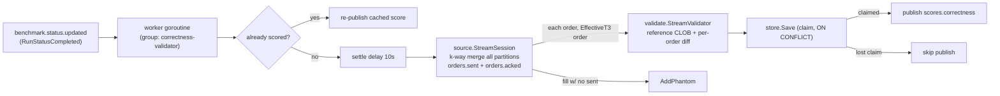

## Correctness Validator (Go)

> **Why Go (even though it's CPU-heavy):** unlike the load generator and the capture, the validator runs **offline, after the run completes** — correctness, not latency, is the goal, so a GC'd language is perfectly fine. Its bounded-memory single-pass design plus Go's `btree` ecosystem make the reference order-book replay and the six-violation diff productive to write and maintain; the platform never measures the validator's own speed, only its verdict.

### Role

The correctness-validator is the platform's **correctness oracle**. For each finished benchmark session it replays that session's entire `orders.sent` stream through an internal, ground-truth central-limit order book (CLOB) with true price-time priority, then diffs what a *correct* engine would have done against what the contestant's engine *actually did* (its fills, reported on `orders.acked`). The output is a single `scores.correctness` event per session — `valid_fills / total_fills` plus a per-violation taxonomy — persisted to Postgres and emitted to Kafka for the score-computer/leaderboard.

It is a Go service of ~2.6k LOC under `services/correctness-validator`, structured as a thin `main.go` driver around six internal packages: `book` (the reference CLOB), `replay` (canonical event ordering), `model`/`pipeline` (event→order assembly), `source` (bounded Kafka drain + reorder), `validate` (the diff engine), `publisher` + `store` (Kafka out + Postgres idempotency).

### Trigger and control flow

The validator does **not** stream-consume order events continuously. It is **event-triggered per session**: `concurrency` worker goroutines (default 4, `VALIDATOR_CONCURRENCY`) each run a `benchmark.status.updated` consumer in the consumer group `correctness-validator` (`main.go:90-92`, `main.go:310-320`). When a `RunStatusCompleted` message arrives, the worker:

1. **Idempotency check** — `store.SummaryStatus(sessionID)`. If already `scored`, it re-loads and re-publishes the cached score and skips re-validation (`main.go:175-193`). If a `timed_out` placeholder exists, it re-runs (`main.go:194-196`).
2. **Settle delay** — waits `SETTLE_DELAY_MS` (default 10s) so in-flight `orders.acked` writes land before draining (`main.go:198-202`).
3. **Drain + validate** — `source.StreamSession(...)` walks the session's order events (see *Bounded drain*), feeding each assembled order into a `validate.StreamValidator` and each unmatched fill in as a phantom (`main.go:204-217`).
4. **Persist + publish** — atomically `store.Save` (claim) the summary + violations, then `publisher.Publish` the `CorrectnessScoreEvent` (`main.go:223-261`).
5. **Commit** the `benchmark.status.updated` offset only on success; on error it does *not* commit, so the message redelivers and the session is retried (`main.go:360-367`).

Validation runs inside a `VALIDATION_TIMEOUT_MS` (default 60s) context. `checkTimeoutConfig` enforces `timeout > settle` at startup (`main.go:373-381`).



### Kafka topics

| Direction | Topic | Partitions | Key / partitioning | Consumer group |
|---|---|---|---|---|
| Consume (trigger) | `benchmark.status.updated` | 3 | n/a (read via group) | `correctness-validator` |
| Consume (data) | `orders.sent` | 24 | **order_id → FNV-1a → partition** | none (direct per-partition offset reads) |
| Consume (data) | `orders.acked` | 24 | **order_id → FNV-1a → partition** | none (direct per-partition offset reads) |
| Produce | `scores.correctness` | 3 | `session_id` | — |

Partition counts: `ops/kafka/create-topics.sh:38,43-45` and `k8s/data/kafka/topic-init-job.yaml:51,56-58`.

**The co-partition contract is the keystone.** `orders.sent` and `orders.acked` are both partitioned by hashing the `order_id` with FNV-1a 64-bit (`schemas/rust/src/lib.rs:26-37`, `partition_for`). Because both producers use the *same* hash on the *same* key, every event about a given order — its send and all its acks/fills — lands on the *same* partition index in both topics. The validator's drain exploits this: a single order's complete lifecycle is contained within one (sent-partition, acked-partition) pair, so the two streams can be joined without a global shuffle. This is what makes per-partition (and ultimately per-session, see *Scaling*) sharding possible.

The trigger topic is consumed with a real consumer group (`KAFKA_STATUS_GROUP`, default `correctness-validator`, `main.go:311-320`), so the N worker goroutines (and any future replicas) split the 3 status partitions among themselves — each session is owned by exactly one worker. The two **data** topics are *not* consumed via a consumer group at all: `source.streamPartition` opens a partition-scoped `kafka.NewReader` and seeks to an explicit offset window (`stream.go:255-258`), reading every partition of the session. Producing to `scores.correctness` is keyed by `session_id` (`publisher/kafka.go:54`, `RequireAll` acks), so all scores for a session co-locate on one partition for ordered downstream consumption.

### The reference order book (ground truth)

`internal/book` is a textbook price-time-priority CLOB. Two `btree.BTreeG[*priceLevel]` trees hold the book — asks ascending, bids descending (so the best price of either side is `Min`, `book.go:73-75,94-95`). Each price level keeps a FIFO slice of `*restingOrder`; the front of the slice is the oldest = highest time priority (`book.go:66-69`). A monotonic `seq` stamps arrival rank as orders rest (`book.go:245-246`), and `seqByOrder` records it for later queue-jump reasoning.

`Process` dispatches on order kind (`book.go:181-192`): `NewLimit`/`NewMarket` → `matchAndRest`; `Cancel` → `remove`; `Replace` → `replace`. `matchAndRest` walks the opposite tree, crossing the aggressor against resting makers at each level front-first, emitting paired `Fill`s and a `Trade{MakerOrderID, TakerOrderID}` per match, evicting fully-consumed makers, and (for limits) resting the residual (`book.go:196-240`). `replace` models the subtle rule: a same-price down-size keeps queue position (mutate in place), but a **price change** removes and re-inserts at the tail *and* flags the order as `repriced` — the data needed to detect lost time priority on a REPLACE (`book.go:302-326`).

```go
// book.go:209-231 — the price-time-priority matching core (FIFO front-first per level)
for len(level.orders) > 0 && remaining > 0 {
    maker := level.orders[0]                       // front = oldest = time priority
    traded := min(remaining, maker.remaining)
    e.fills = append(e.fills, Fill{OrderID: o.OrderID, ...}, Fill{OrderID: maker.orderID, ...})
    e.trades = append(e.trades, Trade{MakerOrderID: maker.orderID, TakerOrderID: o.OrderID, ...})
    maker.remaining -= traded
    remaining -= traded
    if maker.remaining == 0 {
        level.orders = level.orders[1:]            // pop the filled maker off the front
        delete(e.index, maker.orderID)
        e.evicted = append(e.evicted, maker.orderID)
        e.closeAvail(maker, o.EffectiveT3)         // stamp liquidity exit at aggressor's t3
    }
}
```

Notably the engine **infers maker/taker rather than trusting the contestant**: the `Trade.MakerOrderID`/`TakerOrderID` roles are assigned by *which side was resting* in the reference book at match time, never read from the ack. This is what lets the validator catch self-trades and queue jumps the contestant might mislabel.

### The six violation classes

`validate` defines exactly six (`validate.go:18-25`), and the per-order diff in `StreamValidator.scoreOrder` (`stream.go:123-171`) classifies every reported fill into one:

1. **Phantom** — a fill reported for an `order_id` that was never sent (`stream.go:94-98`).
2. **Overfill** — cumulative reported qty exceeds the order's own qty (`stream.go:134-137`).
3. **Price** — the reference produced no fill, or no fill at that price, or the cumulative reported qty exceeds the reference's fill qty *and* no queue-jump explains it (`stream.go:144-165`).
4. **Time** — the order filled ahead of an earlier same-price order that should have had time priority (a queue jump that was *not* a reprice).
5. **CancelReplaceLoss** — the *same* queue-jump situation, but the jumping order was `repriced`: a price-changing REPLACE forfeited its queue position, so its fill ahead of an order already resting at the new level is the violation (`validate.go:219-228`, `flagJump`).
6. **SelfTrade** — the reference match for this fill has the *same participant* (bot_id, parsed by `model.ParticipantOf` from the order_id) on both sides (`stream.go:139-142`).

**Queue-jump auto-split.** `flagJump` is the single entry point for both Time and CancelReplaceLoss; it consults `engine.Repriced(orderID)` to decide which to record (`validate.go:219-228`). The jumper itself is found by `queueJump` (`stream.go:175-201`): among orders *still resting* ahead of the filled order at the same price/side with a *lower* seq (and not a cross-flow tie), pick the earliest. The streaming rewrite deliberately checks only the **real queue** (orders actually resting) rather than every order that ever existed at that price (`stream.go:11-12`).

Under/short-reporting is never penalized — the diff only ever flags *excess* or *wrong* fills, so an engine that simply does less than optimal is not punished as incorrect.

### Canonical replay ordering (effective_t3, cross-flow tie)

A live in-sandbox engine sees orders in *socket-readable* order; the reference must replay them in the order TCP userspace would have delivered. `replay.Order`/`replay.Less` (`replay/order.go`) impose this:

- **TCP head-of-line promotion.** Within each flow (`SrcIP:SrcPort`), sort by wraparound-safe `tcp_seq`, then promote each order's `EffectiveT3` to the running-max of T3 (`order.go:27-37`). A packet reordered on the wire is buffered by TCP until its predecessor arrives, so its *effective* delivery time is its predecessor's — the contestant is never accountable for kernel/wire reordering it could not observe.
- **Global order** — stable sort by `(EffectiveT3, Flow, TCPSeq)` (`order.go:42-51`).
- **100ns cross-flow tie tolerance.** `CrossFlowTie` returns true only for orders on *different* flows whose `EffectiveT3` differ by `< TieToleranceNs` (100, `order.go:14,71-76`). Below the eBPF timestamp jitter floor the platform cannot prove which arrived first, so time-priority/queue-jump violations between such pairs are suppressed (`stream.go:193`, `validate.go:269`). Within a single flow the byte stream is unambiguous, so the check stays strict.

### Aggressive-fill tolerance

Market/IOC fills depend entirely on which liquidity rested at the *instant* the order was processed, and a live engine cannot observe `effective_t3`. To avoid penalizing a correct market-filling engine for an interleaving it could not see, the engine records each resting order's **availability window** `[enter_t3, exit_t3]` — enter = its `EffectiveT3`, exit = the `EffectiveT3` of whatever consumed/cancelled it, or `+∞` if still resting (`book.go:54-62,247-251,266-270`). When `AGGRESSIVE_FILL_TOLERANCE_US > 0` (default **0 = strict**, `main.go:60`), a reported fill the reference didn't produce is *accepted* if non-self opposite liquidity at that price was genuinely resting within `±tolerance` of the aggressor's `EffectiveT3` (`validate.go:116-137`, `windowsOverlap` at `validate.go:306-313`). Overfill and self-trade are *never* tolerated. (This tolerance path is currently implemented in the **batch** `validate.Run`; the streaming `scoreOrder` reproduces the default strict path exactly — see *Limitations*.)

### Price-scale reconciliation

`orders.sent.price` is a raw FIX tag-44 integer; `orders.acked.fill_price` is fixed-point ×1e9 from the kernel parser. Without rescaling, every fill would be a phantom price violation. `pipeline.AssembleOrder` lifts the reference order price into the eBPF domain by multiplying by `topics.TelemetryPriceScale` (= `1_000_000_000`) at assembly time (`pipeline.go:36`, `schemas/go/topics/topics.go:23`), so reference and reported prices are compared in the same units.

### Bounded, UUIDv7-anchored Kafka drain

`source.StreamSession` is the data-plane heart. It discovers every partition of both topics, launches one bounded-channel reader goroutine per `(topic, partition)`, primes each reader's head, then does a **k-way merge by event time** (sent → `SendTSNS`, ack → `T3XDPIngressNS`; the bot and eBPF nodes are NTP-synced within a few ms) (`stream.go:65-225`). A single consumer walks the merged stream, joining each order to its acks in a `pendingOrder` map and flushing orders into the `Reorderer` once the watermark passes their send time + a bounded `JoinWindow` (500ms) (`stream.go:137-173`). Memory is **O(live book + join window + reorder window)**, never O(session).

The **start offset is bounded by the session's UUIDv7 timestamp**, not a full-topic scan: `sessionStartFromID` decodes the 48-bit millisecond timestamp embedded in the v7 UUID (validating version nibble `raw[6]>>4 == 7`), and the reader seeks to `(session_start − 60s startMargin)` via Kafka time-offset lookup (`drain.go:23,267-299`, `stream.go:248`). This avoids re-reading the whole retention window for every session.

**The `-1` / `resolveStart` drain bug it fixes:** Kafka's `ReadOffset(time)` returns the special sentinel `-1` when the requested time is *after* the last message in the partition (i.e. the session produced nothing to that partition). A naive `SetOffset(-1)` would be interpreted as "seek to latest" and silently read forward forever / produce garbage. `partitionOffsets` guards this: `resolveStart(seek, last)` maps a negative seek to `last`, so `start >= last` and the partition is correctly skipped (`drain.go:204,255,258-265`). Without this, empty partitions for a session would corrupt the drain.

### At-least-once acked dedup and recoverable timeout

`orders.acked` is at-least-once. In the legacy batch drain (`drain.go`), `ackedCollector` dedups on the composite key `{order_id, exec_type, t7_egress_ns}` (`drain.go:54-99`) — the egress timestamp distinguishes genuine multiple responses from redeliveries. The dedup count is exported as `validator_events_drained_total{topic="orders_acked_duplicates"}`. (In the streaming path acks are accumulated per `pendingOrder` and the per-order diff is naturally idempotent over identical responses.)

If validation exceeds `VALIDATION_TIMEOUT_MS`, the worker writes a **`timed_out` placeholder** record with a zero `validate.Report{}` (`main.go:194-196,272-282`, `recordValidationTimeout` at `main.go:286-306`) and treats the message as handled (committing the offset) — but because a future `benchmark.status.updated` redelivery will find status `timed_out` and re-run, the timeout is **recoverable, not terminal**. The score-computer treats a 0/0 placeholder as ungateable rather than as a real zero score.

### Idempotency / exactly-once-ish publish

`store.Save` is the claim mechanism. Its `INSERT ... ON CONFLICT (session_id) DO UPDATE ... WHERE correctness_summary.status = 'timed_out' AND EXCLUDED.status = 'scored'` (`postgres.go:138-158`) means the *first* worker to finish a `scored` result claims the row (RowsAffected > 0 → `claimed=true`), and a concurrent loser sees `RowsAffected == 0` and **skips publishing** (`main.go:239-243`). Violations are bulk-loaded via `COPY` in the same transaction (`postgres.go:173-188`). An already-`scored` session re-publishes the cached `CorrectnessScoreEvent` from `LoadScore` instead of re-validating (`main.go:175-193`).

### Metrics

- `validator_events_drained_total{topic}` — sent / acked / `orders_acked_duplicates` events drained (`main.go:219-220`, `drain.go:125`).
- `validator_scores_published_total` — scores emitted to `scores.correctness` (`main.go:189,260`).
- `validator_session_events_buffered` — histogram of the bounded in-flight order window per session (`stream.go:236-237`).
- `validator_validation_errors_total{stage}`, `validator_sessions_validated_total{result}`, `validator_violations_total{type}`, `validator_inflight_sessions`, `validator_drain_duration_seconds` (`main.go:139-157,164-168,218`).
- `submission_validation_failures_total{reason}` is *declared* in `libs/go/metrics/metrics.go:328` but **not emitted by this service** — validation failures here surface as `validator_validation_errors_total` / `validator_sessions_validated_total{result="error"}`.

### Scaling model

The validator is **stateless** (all durable state is in Postgres) and scales along two independent axes:

- **Within a replica:** `VALIDATOR_CONCURRENCY` worker goroutines (default 4) sharing one `benchmark.status.updated` consumer group, each validating a different session concurrently. The 3 status partitions cap a single replica's session-level parallelism at 3 in-flight sessions across the group.
- **Across replicas (latent):** the consumer group + Postgres claim make horizontal replicas safe — sessions partition across the group; double-validation is impossible because of the `ON CONFLICT` claim. **The unit of horizontal scale is the session** (one session = one drain = one reference replay).

Per-session **memory is bounded** by the streaming design: O(live reference book + 500ms join buffer + reorder window), independent of session length. The reorder window default is `1<<20` orders (`stream.go:30`).

**Bottleneck:** within a session, work is serial — a single goroutine k-way-merges all 24×2 partitions and feeds one engine, so a single huge session cannot be parallelized internally; its drain (network) + replay (CPU) latency is the floor, with `VALIDATION_TIMEOUT_MS` (60s) the hard cap before the recoverable timeout placeholder.

### Limitations / scope for improvement

- **Deployed as a single replica, no KEDA.** `k8s/benchmark/correctness-validator/deployment.yaml` sets `replicas: 1`; there is no `ScaledObject` for this service. The code is replica-safe (claim + group), but the autoscaling story is unrealized — scaling is currently only the in-process `VALIDATOR_CONCURRENCY`.
- **Two parallel diff implementations.** The codebase carries both the legacy **batch** path (`validate.Run` + `pipeline.Run` + `source.DrainSession`, which buffers the whole session) and the newer **streaming, bounded-memory single-pass** path (`validate.StreamValidator` + `source.StreamSession`). `main.go` wires only the streaming path; the batch path is documented as "being retired" (`book.go:84-87`) but is still present (and still backs the aggressive-fill tolerance feature). Confirmed: the streaming rewrite is recent and is asserted score-identical to batch for the default strict path (`stream.go:1-13`, validated in `v2_test.go`/`stream_test.go`).
- **Aggressive-fill tolerance is currently strict-only.** `StreamValidator.scoreOrder` implements the strict (`AggressiveFillToleranceNs == 0`) path (`stream.go:9-10`). Since `main.go` always wires the streaming validator, a non-zero `AGGRESSIVE_FILL_TOLERANCE_US` is read (`main.go:60`) but currently has no effect — the tolerated-fill branch lives in the batch `validate.Run` (`validate.go:116-137`), which `main.go` no longer calls. Porting the tolerance into the streaming path is a future enhancement.
- **Single-broker partition discovery.** `StreamSession`/`drainTopic` dial `brokers[0]` for partition + offset metadata (`stream.go:82`, `drain.go:141`, `partitionOffsets` `drain.go:234`). A down first broker fails discovery even if others are up.
- **Participant inference is order_id-format-coupled.** `model.ParticipantOf` parses the bot_id as the 3rd-from-last `_`-delimited field (`participant.go:12-18`); a malformed order_id silently returns the whole id, weakening self-trade detection.
- **Settle delay is a fixed wait, not completeness-driven.** The 10s `SETTLE_DELAY_MS` is a heuristic for "all acks landed"; a slow telemetry write past 10s + 500ms join window could under-count fills (surfaced via `sent/acked/matched` counts on the score event, which downstream coverage-gates).

---
