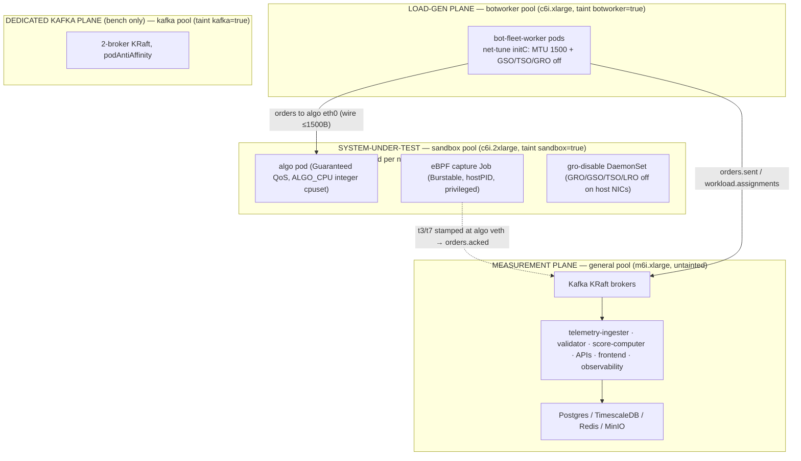
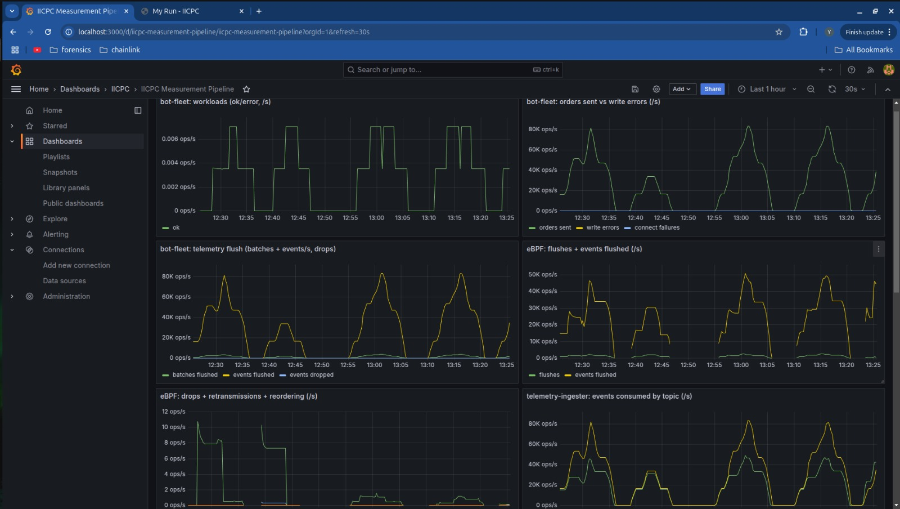
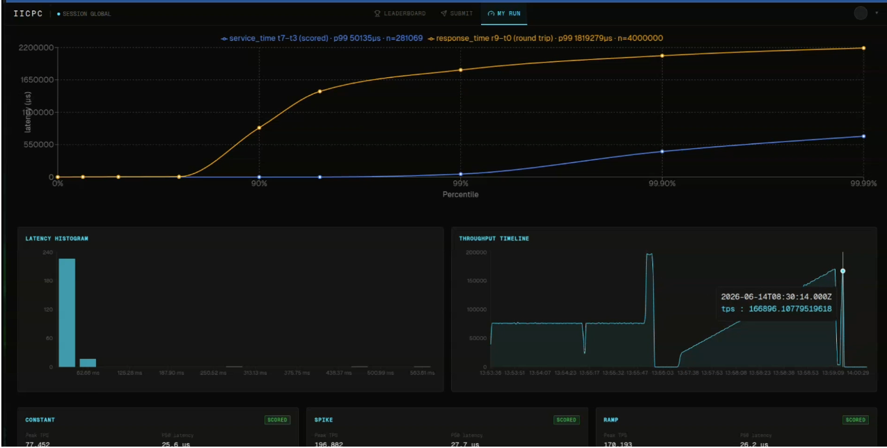

## Deployment, Isolation & Observability

This section describes how the IICPC "match-bench" platform is physically deployed, how it
enforces measurement fairness and tenant isolation, how it preserves eBPF capture fidelity
on EKS, and how it is observed and presented to contestants. The infrastructure layer exists
to serve one contract: a benchmark is a *scientific measurement*, so the instrument
(measurement plane), the thing being measured (contestant), and the stimulus (load
generator) must live on physically separate hardware and never contend for the same cores,
cache, page-cache, or NIC.

---

### 1. Cluster topology — three (four) physically-isolated planes

The cluster is provisioned by a single Terraform module (`infra/terraform/main.tf`) that
stands up a VPC, an EKS control plane (Kubernetes `1.32`, `infra/terraform/variables.tf:23`),
and **five distinctly-purposed EKS managed node groups**, all on the `AL2023_x86_64_STANDARD`
AMI. Each non-general group is **tainted** so that nothing schedules onto it unless it
explicitly tolerates the taint — a taint, not a mere label, because a label-only
`nodeSelector` keeps *your* pods off a node but does not stop EKS system pods or future
workloads from landing there. The taint flips the default to
"nothing lands here unless invited," which is the correct posture for an isolation boundary.

| Node group | Label / taint | Default type | Role / plane | desired (e2e / bench) |
|---|---|---|---|---|
| `general` | `role=general` (untainted) | `m6i.xlarge` (4 vCPU/16 GiB) | **Measurement plane** — Kafka, Postgres, TimescaleDB, Redis, MinIO, telemetry-ingester(+rollup), correctness-validator, score-computer, controllers, all APIs, build-spawner, observability, frontend | 3 / 2 |
| `sandbox` | `pool=sandbox`, taint `sandbox=true:NoSchedule` | `c6i.2xlarge` (8 vCPU/16 GiB) | **System-under-test** — exactly one contestant algo pod + its co-located privileged eBPF capture Job | 1 / 1 |
| `botworker` | `pool=botworker`, taint `botworker=true:NoSchedule` | `c6i.xlarge` (4 vCPU) | **Load generator** — bot-fleet workers; the horizontal-scale unit of the throughput sweep | 1 / 3 |
| `kafka` | `pool=kafka`, taint `kafka=true:NoSchedule` | `m6i.xlarge` (4 vCPU/16 GiB) | **Dedicated broker pool** — only for the 2M/s bench (I/O-isolated brokers) | 0 / 2 |
| (system) | — | — | EKS-managed `aws-node`, `kube-proxy`, `coredns`, EBS-CSI, KEDA, ALB controller | — |

Two validated topologies are committed as `*.tfvars`, both pointing at the same module
(the active `infra/terraform/terraform.tfvars` auto-loads on a bare `terraform apply`):

- **e2e — 5 nodes** (`e2e/e2e.tfvars`): `3× m6i.xlarge general + 1× c6i.2xlarge sandbox +
  1× c6i.xlarge botworker`, `kafka_desired_size=0` (Kafka runs **on** the general pool).
  The general pool was deliberately bumped 2→3 because at 2 nodes pod CPU *requests* hit
  ~95% and the telemetry-ingester (req cpu 1) went `Pending` and starved
  (`e2e/e2e.tfvars:9-11`, `infra/terraform/terraform.tfvars:19-23`). The sandbox node is
  8 vCPU so a responding contestant (`ALGO_CPU=4`) **and** its ~3-core capture both fit
  without CFS-throttling, which on the old 4-vCPU node capped delivery at ~150–168k
  (`e2e/e2e.tfvars:12-15`).
- **bench — 8 nodes, 44 vCPU** (`bench/bench.tfvars`): `2× m6i.2xlarge general + 2×
  m6i.xlarge kafka (dedicated) + 1× c6i.2xlarge sandbox + 3× c6i.xlarge botworker`. Here a
  **fourth plane** appears: the dedicated 2-broker Kafka pool (`kafka_desired_size=2`,
  `podAntiAffinity` one-per-node) I/O-isolated from the measurement plane to carry ~700 MB/s
  of telemetry at 2M orders/s, while 3 load-gen nodes (~800k/s each) provide ~2.4M/s of
  generation headroom over the target (`bench/bench.tfvars:3-14`). The tfvars warns that
  44 vCPU exceeds the default 32-vCPU on-demand quota and must be raised first
  (`bench/bench.tfvars:18-20`).

> Terraform ignores `desired_size` on **updates** (so it doesn't fight autoscalers); it is
> honored only on first create. Re-scaling an existing node group is done via the AWS CLI,
> not Terraform (`e2e/e2e.tfvars:21-23`).



---

### 2. Namespaces and the data tier

Workloads are partitioned into six namespaces, each carrying a `name=<ns>` label
(`k8s/*/namespace.yaml`) — that label is the selector every cross-namespace NetworkPolicy
keys on, so the partition is also the security boundary:

- **`data`** — the stateful tier: Kafka, Postgres, TimescaleDB, Redis, MinIO.
- **`platform`** — public-facing tier: `auth-api`, `submission-api`, `leaderboard-api`,
  `frontend`.
- **`build`** — `build-spawner` (mints build/scan/SBOM Jobs).
- **`sandbox`** — the contestant algo pods + eBPF capture Jobs + `sandbox-orchestrator`.
- **`benchmark`** — `bot-fleet-controller`, `bot-fleet-worker`, `telemetry-ingester`,
  `correctness-validator`, `score-computer`.
- **`observability`** — Prometheus, Grafana, Loki.

**Data-tier StatefulSets** (all in `data`, all `automountServiceAccountToken: false`, all
hardened with `runAsNonRoot`, dropped capabilities, `readOnlyRootFilesystem` where the image
allows, and an EBS gp3 `volumeClaimTemplate`):

- **Kafka** (`k8s/data/kafka/statefulset.yaml`) — `apache/kafka:3.7.1`, **KRaft** mode
  (`broker,controller`, no ZooKeeper), `replicas: 3`, `podManagementPolicy: Parallel`,
  `podAntiAffinity` (one broker per host, `topologyKey: kubernetes.io/hostname`) so a node
  loss can't take out two brokers or make them contend for the same page-cache/NIC. Node id
  is derived from the ordinal (`KAFKA_NODE_ID="${HOSTNAME##*-}"`). Two hard-won bootstrap
  fixes are baked in: topic data lives on the **PVC subdirectory** `/opt/kafka/data/logs`
  rather than the emptyDir default `/tmp/kafka-logs` (a resource-bump restart once wiped
  every topic), and on a *subdirectory* not the PVC root so Kafka's log loader doesn't try
  to parse ext4's `lost+found` as a topic-partition and crash. Memory limit is 8Gi (real
  page cache — the 2Gi default forced every produce to disk and backed up the telemetry
  producer); CPU request trimmed to 1 so the general pool's requests fit. A
  `kafka-exporter` sidecar exposes `:9308` for Prometheus.
- **TimescaleDB** (`timescaledb/statefulset.yaml`) — `timescale/timescaledb:2.17.2-pg16`,
  single replica, DB `metrics`, with a `postgres-exporter` sidecar on `:9187`. Stores the
  HDR latency/throughput timeseries from the telemetry-ingester.
- **Postgres** (`postgres/statefulset.yaml`) — `postgres:16-alpine`, single replica, DB
  `iicpc` (submissions, run-groups, scores). Exporter on `:9187`.
- **Redis** (`redis/statefulset.yaml`) — `redis:7-alpine`, single replica, **persistence
  off** (`--save "" --appendonly no`) — it is a leaderboard/telemetry cache, not a source of
  truth. Exporter on `:9121`.
- **MinIO** (`minio/statefulset.yaml`) — single replica, S3-compatible artifact store
  (50Gi PVC), Prometheus metrics public on `:9000`.

All data services except Kafka are **single-replica StatefulSets** — see Limitations.

---

### 3. Fairness & isolation — how the measurement stays fair

The platform's fairness guarantees are enforced not in prose but in
`services/sandbox-orchestrator/internal/k8s/slot.go`, which programmatically constructs every
untrusted contestant pod. Verified against the manifests:

1. **Guaranteed-QoS, integer-core algo pod.** The orchestrator validates at startup that
   `ALGO_CPU` is a whole core count, then sets request == limit for both CPU and memory so
   Kubernetes assigns the pod **Guaranteed** QoS — the precondition for the static CPU
   manager to hand it an exclusive cpuset. The integer-core check is the load-bearing line:

   ```go
   // services/sandbox-orchestrator/internal/k8s/slot.go:117-124
   if cfg.CPU != "" {
       cpu, err := resource.ParseQuantity(cfg.CPU)
       if err != nil { return fmt.Errorf("invalid CPU resource %q: %w", cfg.CPU, err) }
       if _, err := strconv.Atoi(cfg.CPU); err != nil || cpu.MilliValue()%1000 != 0 {
           return fmt.Errorf("CPU must be an integer core count for cpuset pinning, got %q", cfg.CPU)
       }
   }
   ```
   *Notable: it rejects fractional cores up front — a `500m` algo can never get a pinned
   cpuset, so the platform fails fast rather than silently producing an unfair measurement.*
   `containerResources` (slot.go:607) then deep-copies the same `ResourceList` into both
   Requests and Limits, guaranteeing QoS.

2. **Zero-disk-I/O untrusted pod.** The algo pod has **no PVC**. Its writable paths
   (`/tmp`, `/var/tmp`, `/var/log`, `/var/run`) are RAM-backed `emptyDir{ medium: Memory }`
   tmpfs (`writableVolumes`/`writableMounts`, slot.go:404-430) so a contestant can't
   perturb the measurement via disk contention and leaves no on-disk residue.

3. **Hardened untrusted-pod spec** (`podSpec`, slot.go:318-399): `RestartPolicyNever`,
   `ActiveDeadlineSeconds=3600` (a wedged algo self-terminates), `AutomountServiceAccountToken:
   false` (no API credentials), and a per-container `SecurityContext` with
   `ReadOnlyRootFilesystem`, `AllowPrivilegeEscalation:false`, `Capabilities.Drop:[ALL]`, and
   `SeccompProfile: RuntimeDefault`.

4. **gVisor as a pure config toggle.** `RUNTIME_CLASS` is read into `Manager.runtimeClass`;
   `runtimeClassName` is set **only when it is non-empty** (slot.go:384-387). The deployed
   value is `RUNTIME_CLASS=""` (`k8s/sandbox/sandbox-orchestrator/deployment.yaml:44-45`), so
   the pod spec is byte-identical across dev/prod and only the env value differs — gVisor can
   be switched on later by installing `runsc` and flipping the var, with **no code-path
   divergence**. Terraform can register the `gvisor` RuntimeClass (`enable_gvisor`,
   `infra/terraform/addons.tf:76-107`) but it defaults off.

5. **Default-deny networking + additive, label-scoped policies.** Each namespace ships a
   `podSelector: {}` policy with both `Ingress` and `Egress` policy types, i.e. a default-deny
   floor, then adds back exactly what is needed. The sandbox is the tightest
   (`k8s/sandbox/network-policy.yaml`): ingress **only** from the `benchmark` namespace
   (the load generator), and egress to the public internet **except** all RFC-1918 ranges
   (`10/8`, `172.16/12`, `192.168/16`) plus DNS to kube-system — so a contestant algorithm
   can reach the internet but **cannot reach Postgres, Kafka, MinIO, or another contestant**.
   A second policy (`ebpf-capture-egress`) scopes the capture pod (`app: ebpf-capture`) to
   exactly Kafka `:9092`, Loki `:3100`, and DNS. The data tier
   (`k8s/data/network-policy.yaml`) admits the sandbox **only** on Kafka `:9092`.

6. **Per-pod NIC bandwidth caps.** When `ALGO_*_BANDWIDTH` is set the orchestrator adds the
   CNI bandwidth-plugin annotations `kubernetes.io/{egress,ingress}-bandwidth` (slot.go:326-331);
   the deployment sets both to `100M` (deployment.yaml:52-55), throttling a contestant's NIC.

7. **One-pod-per-node pinning.** The sandbox node group is autoscaled and the design relies
   on exactly one algo pod per sandbox node so every packet processed on that node belongs to
   that contestant (no cross-tenant softirq leakage on a shared veth). The orchestrator pins
   the pod with the `sandbox=true` toleration + `pool` nodeSelector when `SANDBOX_NODE_POOL`
   is set (slot.go:389-397); `max_concurrent contestants = sandbox node count`
   (`variables.tf:99-103`).

8. **Least-privilege RBAC.** `sandbox-orchestrator` holds a namespaced `Role`
   (`k8s/sandbox/sandbox-orchestrator/rbac.yaml`) limited to `pods`, `services`, and `jobs`
   in `sandbox` only — no cluster-wide rights, no secrets, no node access. `build-spawner`
   is similarly scoped to `batch/jobs`, `pods`, `pods/log`, and `secrets` in `build`
   (`k8s/build/rbac.yaml`). The orchestrator itself runs hardened (read-only root, drop ALL,
   `runAsNonRoot`, uid 65532).

9. **Capturable-port fast-fail.** When capture is enabled, `CreateSlot` rejects any slot
   whose port is not in the eBPF-capture allowlist `{8080, 9898}` *before* creating the pod
   (slot.go:43, 140-144) — a slot on an un-instrumentable port fails immediately rather than
   running and silently producing no latency data.

10. **The instrument never steals the measured cores.** The capture Job
    (`captureJobSpec`/`captureResources`, slot.go:491-603, and
    `k8s/benchmark/ebpf-latency/job-template.yaml`) requests only `200m` CPU but is allowed
    to burst to `4` — i.e. **Burstable** QoS (request < limit). Because the algo pod is
    Guaranteed with a pinned cpuset, the bursty capture physically cannot run on the
    contestant's reserved cores; it lives on the remaining shared cores. The capture limit
    was raised 2→4 because at >150k delivered the userspace drain/parse/publish wants ~3
    cores and a 2-core cap CFS-throttled it into ring-buffer drops (job-template.yaml:52-55).
    The capture is a **Job, not a DaemonSet** (it carries per-slot identity and watches one
    algo pod), is pinned to the algo pod's node by `nodeName`, runs `hostPID: true` +
    `privileged` with `add: [BPF, NET_ADMIN, SYS_ADMIN]`, mounts `/sys/fs/bpf`, and is
    garbage-collected via `OwnerReference` on the algo pod + a reaper for orphans
    (`reapOrphanCaptureJobs`, slot.go:285-302).

---

### 4. eBPF capture-fidelity fixes — the two EKS jumbo-frame defenses

The measurement contract requires **one packet = one order/response**: the capture buffer is
a single MTU (`CAPTURE_CAP = 1536 B`), so any frame larger than that truncates, forces a lossy
flow reset in the reassembler, and the order is never matched. EKS's VPC CNI defaults to a
**jumbo MTU (9001) with all offloads on**, which on a stock cluster destroyed ~98% of latency
samples. Two complementary fixes are required because the request traverses two hosts:

- **Sender side — bot-fleet `net-tune` initContainer** (`k8s/benchmark/bot-fleet/deployment.yaml:43-56`).
  A privileged init container runs `ip link set dev eth0 mtu 1500` and
  `ethtool -K eth0 gso off tso off gro off lro off` before the worker starts, so the load
  generator emits ≤1500 B wire frames in the first place.

- **Receiver side — `gro-disable` DaemonSet** (`k8s/sandbox/gro-disable-daemonset.yaml`).
  The capture's XDP ingress hook attaches in **generic mode** on the veth (native/driver
  attach fails there), so it runs *after* GRO. For **cross-node** traffic (load gen on a
  botworker node → contestant on a sandbox node) the incoming segments are GRO-coalesced on
  the sandbox node's ENS/ENI **before the capture sees them**, producing super-frames > 1536 B.
  A `hostNetwork: true`, privileged DaemonSet pinned to the sandbox pool keeps GRO/GSO/TSO/LRO
  off on every host interface, re-applying every 2 s because the VPC CNI keeps attaching new
  ENIs / pod veths over time.

Both are needed because the sender fix only clamps frames leaving the load generator, while
the receiver fix prevents the sandbox host from re-coalescing them on arrival. The capture
image itself *also* runs `ethtool … off` inside the algo netns at attach time
— that handles the veth, while the DaemonSet handles the host NIC.
With offloads off, live runs saw `TRUNCATED_CAPTURES` fall from thousands to ~13–24 and
`DROPPED_EVENTS` stay zero.

---

### 5. Observability — Prometheus, Grafana, Loki

All three observability components live in the `observability` namespace, behind their own
default-deny policy, single-replica.

- **Prometheus** (`k8s/observability/prometheus/configmap.yaml`) scrapes via
  `kubernetes_sd_configs role: pod` and keeps only pods annotated
  `prometheus.io/scrape: "true"` — every workload manifest carries that annotation + a
  `prometheus.io/port`, so instrumentation is opt-in per pod. It relabels `namespace`, `pod`,
  `app`, `node` and drops non-Running pods. It loads `iicpc-alerts.yml` with four alerts:
  score-computer scoring errors / no-successful-scores, leaderboard-API dropped SSE clients,
  and leaderboard cache (Redis) errors.
- **Grafana** ships two provisioned dashboards (`grafana/dashboards-configmap.yaml`) wired to
  Prometheus + Loki datasources (`datasources.yaml`):
  - **IICPC Platform Overview** — per-service HTTP req/s, 5xx rate and ratio, p95/p99 latency
    (`histogram_quantile` over `iicpc_http_request_duration_seconds_bucket`), and a Loki
    `ERROR|WARN` log panel.
  - **IICPC Measurement Pipeline** — the heart of the measurement: bot-fleet orders sent vs
    write errors / connect failures, telemetry-flush drops, **eBPF** flushes / ring-buffer
    drops / retransmissions / reordering / decode errors, telemetry-ingester events-consumed
    by topic, records finalized vs evicted, join-buffer size, TimescaleDB/Redis write p95,
    and validator sessions / violations / in-flight / drain p95. These are the dashboards that
    prove capture fidelity (drops ≈ 0) at a glance.
- **Loki** (`k8s/observability/loki/deployment.yaml`) — `grafana/loki:3.1.1`, single replica,
  `Recreate` strategy, PVC-backed. Services push structured JSON logs directly to
  `http://loki.observability.svc.cluster.local:3100/loki/api/v1/push` via the shared logger
  libs (`libs/go/logger/loki.go`, `libs/rust/logger/src/loki.rs`) — every workload sets
  `LOKI_URL`, and the Go handler batches entries (`batchSize`/`batchWait`) before flushing.
  There is no node-level agent (no Promtail/Fluent Bit); shipping is in-process.

Key metric families: `iicpc_http_*` (APIs), `iicpc_bot_*` (load gen), `iicpc_ebpf_*`
(capture), `iicpc_telemetry_*` (ingester), `iicpc_validator_*`, `iicpc_scorer_*`,
`iicpc_leaderboard_api_*`.



*The Measurement Pipeline dashboard during a run — bot-fleet orders-sent vs write errors, telemetry flush/drops, eBPF flushes/drops/reordering, and ingester consume-by-topic; capture drops stay at ~0.*

---

### 6. Frontend — Next.js, SSE, build timeline, auth removed



The frontend (`frontend/`) is a **Next.js 14** app (React 18, TanStack Query, Recharts,
framer-motion, `hdr-histogram-js`) served by nginx — the deployment
(`k8s/platform/frontend/deployment.yaml`) runs **2 replicas**, fully hardened (read-only root,
drop ALL, non-root uid 101, `RuntimeDefault` seccomp, no SA token, emptyDir scratch). It is a
static/proxy tier: it carries no secret and reaches the APIs by service name
(`LEADERBOARD_API_HOST`, `SUBMISSION_API_HOST`, `AUTH_API_HOST`). Its NetworkPolicy admits
ingress only from `ingress-nginx` and egress only to the three API pods + DNS
(`frontend/network-policy.yaml`).

- **Live leaderboard via SSE.** `useSSE` (`frontend/src/hooks/useSSE.ts`) opens an
  `EventSource`, handles named `snapshot` / `update` events, and reconnects with capped
  exponential backoff (`min(1000·2^attempt, 30_000)`). `useLeaderboard`
  (`frontend/src/hooks/useLeaderboard.ts`) seeds the table from a REST query, then layers the
  SSE stream on top: a `snapshot` replaces the cached `LeaderboardResponse`; an `update` is
  merged into the matching `(run_group_id, contestant_id)` row via `applyLeaderboardUpdate`
  and flashes the row for 400 ms. SSE is enabled only once the initial query has data.
- **Run detail via polling** (not SSE). `useRunDetail` (`frontend/src/hooks/useRunDetail.ts`)
  polls `getRunDetail` every 2.5 s and **stops as soon as every session is terminal**
  (`completed`/`failed`) regardless of whether a score exists — a deliberate fix so a finished
  but unscored run doesn't poll an ~8 MB payload forever. Client-side it derives a latency
  histogram (p50/p99/max from per-point `p99_ns`), throughput windows, and per-scenario HDR
  data.
- **Build timeline** (`frontend/src/components/submit/BuildTimeline.tsx`) renders the
  submission lifecycle `queued → building → scanning → promoting → ready` (or `failed`),
  with last-20-lines build-log tail on failure and a "still queued >90 s — is the build-worker
  running?" hint.
- **Auth removed.** `authDisabled` is **hardcoded `true`** (`frontend/src/config/platform.ts:44`)
  — explicitly *not* a build arg, so it cannot silently fall back to the OAuth path if an arg
  is omitted at build time. `AuthProvider` (`frontend/src/auth/AuthProvider.tsx`) branches on
  it to a `DisabledAuthProvider` that supplies a fixed "always-authenticated" context with a
  synthetic **unsigned** JWT whose `sub` is the default contestant; the backend runs
  `AUTH_REQUIRED=false` and trusts (does not verify) that claim. The visitor is always the
  default contestant (`defaultContestantId`, must match the submission-api's
  `DEFAULT_CONTESTANT_ID`). The Google-OAuth `auth-api` + `RealAuthProvider` code remain in
  the tree but are dead paths in this benchmark build.

---

### 7. Scaling model & Kafka partitioning

Most services in this section are **stateless and horizontally scalable**; the data tier is
**stateful** (Kafka sharded by partition, the rest single-replica singletons).

The **bot-fleet load generator is the headline horizontal-scale unit** and is the only
KEDA-autoscaled workload (`k8s/benchmark/bot-fleet/scaledobject.yaml`):

- KEDA scales `bot-fleet-worker` on **Kafka consumer-group lag** on topic
  `workload.assignments`, group `bot-fleet`, `lagThreshold: "1"`, between
  `minReplicaCount: 2` and `maxReplicaCount: 50`. (KEDA is installed via Helm,
  `infra/terraform/addons.tf:65-74`.)

**Kafka topics relevant to this plane** (declared in `ops/kafka/create-topics.sh` and the
in-cluster `k8s/data/kafka/topic-init-job.yaml`; `KAFKA_AUTO_CREATE_TOPICS_ENABLE=false`,
so the init Job is the single source of topic truth):

| Topic | Partitions | Partition key & why | Consumer group (this plane) | How it scales |
|---|---|---|---|---|
| `workload.assignments` | **24** | keyed so each worker task maps to a partition; KEDA reads this topic's lag | `bot-fleet` (the workers) | up to 24 workers consume disjoint partitions in parallel → linear load-gen scale-out, capped by partition count |
| `orders.sent` | **24** | **co-partitioned by `order_id`** via FNV-1a `partition_for` (`schemas/rust/src/lib.rs`; Rust-only, no Go twin) | telemetry-ingester (`telemetry-ingester`) | `orders.sent` and `orders.acked` use the **same** key/partition count so a given order's sent + acked land in the **same partition**, letting an ingester replica own a partition and join the two streams locally without a network shuffle |
| `orders.acked` | **24** | same FNV-1a `order_id` hash; **produced by the eBPF capture** | telemetry-ingester | co-partition join (above); 24 partitions = up to 24 ingester replicas |

Control topics (`submission.build.requested`, `benchmark.requested`, `barrier`, `bot.ready`,
`scores.correctness`, `leaderboard.updates`, etc.) are **3 partitions** — low-volume
coordination, not throughput, so they don't need the 24-way fan-out.

The **scaling bottleneck** today is the **dedicated Kafka I/O plane**: telemetry at 2M/s is
~700 MB/s; the bench splits it over 2 brokers on gp3-PVCs to stay under per-broker EBS/network
limits (`bench/bench.tfvars:6-9`). Sandbox capacity scales linearly with sandbox node count
(one contestant per node); load-gen scales with botworker node count × ~600–800k/s per node.

---

### 8. Config-only environment parity & the EKS Free-plan caveat

The design goal is that **local k3s and EKS differ only by config, never code**. The same
manifests apply to both; the toggles that switch environment (`RUNTIME_CLASS`,
`SANDBOX_NODE_POOL`, `BUILD_NODE_POOL`, ECR-vs-local registry, `enable_*` Terraform flags) are
all empty-string / boolean env values, not code branches. Image tag mutability is `IMMUTABLE`
by default so two contestants can never be scored against different platform binaries under
the same tag (`variables.tf:257-266`).

- **Local k3s (dev/demo)** — single node, flannel + built-in NetworkPolicy enforcement,
  `local-path` storage, local registry mirror with `imagePullPolicy: Never`, `RUNTIME_CLASS=""`,
  no cpuset pinning (single shared node), port-forward instead of an ALB.
- **EKS (prod)** — managed control plane + ≥2 tainted node groups, VPC CNI with
  `enableNetworkPolicy=true` **and `ENABLE_PREFIX_DELEGATION=true`** (`main.tf:97-107`), gp3 via
  EBS-CSI as default StorageClass (`addons.tf:8-27`), ECR immutable tags
  (`imagePullPolicy: IfNotPresent`), AWS Load Balancer Controller for the public frontend, KEDA
  for autoscaling.

**The most dangerous EKS divergence** is that the VPC CNI **does not enforce NetworkPolicy by
default** — every isolation policy is a silent no-op until `enableNetworkPolicy` is on. The
manifests will all show present (`kubectl get netpol`) while a contestant can in fact reach
Postgres/Kafka/MinIO/other contestants. `infra/scripts/netpol-deny-test.sh` is the hard gate:
it launches a probe pod in `sandbox`, asserts Postgres is **unreachable** (egress denied) and
public egress **works**, and refuses the deploy otherwise.

**The minimal-cost smoke profile** is `2× m6i.xlarge general + 1× c6i.2xlarge sandbox` (~$22/day), with scenarios reseeded small; the sandbox group **floors at one
c6i.2xlarge** because going smaller breaks the integer-core cpuset the measurement depends on.

**EKS Free-plan 2-vCPU caveat.** `infra/terraform/terraform.tfvars:1-4` warns that AWS accounts on the **new Free plan**
(mid-2025+) can only launch free-tier instance types — the largest being `m7i-flex.large` at
**2 vCPU / 8 GB** — and any other type fails the node-group Auto Scaling launch with *"The
specified instance type is not eligible for Free Tier."* The platform **cannot run correctly on
2-vCPU nodes**: the data tier alone needs ~5 vCPU of requests, and the exclusive-core cpuset
needs ≥4 vCPU (2 system + 2 algo), so `cpuManagerPolicy=static` + `full-pcpus-only` would
reject the algo pod. The documented remedy is to upgrade the account to a paid plan; otherwise
run the **local k3s harness** (which has none of these caps) for a no-cost demo. This matches
the project memory: EKS was attempted and torn down under the Free-plan vCPU cap, the demo runs
local k3s, and the repo ships the proper paid-account cluster config.

---

### 9. Limitations & scope for improvement

- **Single-replica data tier.** Postgres, TimescaleDB, Redis, MinIO, Loki, Prometheus, and
  Grafana are all `replicas: 1` — no HA, and each is a single point of failure. EBS is
  AZ-bound, so each stateful pod is pinned to its volume's AZ. Acceptable for a re-runnable
  benchmark but not for production durability.
- **Kafka StatefulSet hardcodes `replicas: 3`** (`statefulset.yaml:15`) with a fixed 3-voter
  KRaft quorum, **independent of the `kafka_desired_size` node-pool variable**. Running fewer
  brokers requires editing the StatefulSet itself (not just the tfvars), and with
  `requiredDuringScheduling` anti-affinity the 3rd broker stays `Pending` unless 3 distinct
  nodes are available to host one each.
- **gVisor and exclusive cpusets are both OFF by default.** `enable_gvisor=false` and
  `enable_sandbox_cpuset=false` in every committed tfvars. With cpuset off, the contestant gets
  its 2/4 vCPU via Guaranteed-QoS *quota* but **not exclusively-pinned cores**
  (`terraform.tfvars` comment near `enable_sandbox_cpuset`). The cpuset NodeConfig is disabled
  because `reservedSystemCPUs` conflicts with EKS's default kube/system-reserved CPU and the
  kubelet refuses to start, so the node never registers (`main.tf:174-198`,
  `variables.tf:206-217`). Until that conflict is resolved, the headline "exclusive-core
  fairness" guarantee is **quota-only**, not true core isolation. This is the single biggest
  open item for measurement fidelity.
- **Capturable-port allowlist is hardcoded** to `{8080, 9898}` (`slot.go:43`) — adding a new
  contestant entry-point requires a code change + re-deploy.
- **In-process Loki shipping, single Loki replica.** No node agent and a single Loki Deployment
  with a PVC mean log loss on Loki restart and a per-service hard dependency on `LOKI_URL`
  reachability.
- **gro-disable / net-tune are privileged best-effort loops.** The DaemonSet re-applies
  `ethtool` every 2 s forever (no convergence signal); a window between a new ENI attaching and
  the next loop can still let a coalesced frame through. Driver-mode XDP would remove the need,
  but the veth forces generic mode.

---
