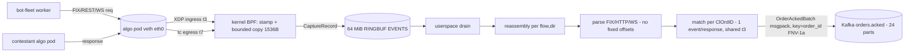

## eBPF Latency Capture (Rust)

> **Why Rust:** the [aya] toolchain lets the in-kernel BPF program *and* the userspace loader/parser/publisher be written in one language with no C/libbpf split, and Rust's allocation-explicit, verifier-friendly style maps directly onto BPF's constraints (bounded copies, no heap in-kernel). The userspace drain is zero-GC, so it keeps pace with a 64 MiB ring buffer at line rate without pauses that would drop captured packets — which, on the scoring instrument, would be lost latency samples.

`services/ebpf-latency` (Rust + [aya], ~4490 LOC) is the platform's **scoring instrument**. It measures every contestant's wire-to-wire pod service time, `service_time = t7 − t3`, by stamping two timestamps **in the kernel, on the wire, outside the contestant's process**: `t3` at XDP ingress (the request packet enters the algo pod's veth) and `t7` at tc egress (the response packet leaves it). The contestant's userspace code never touches the clock, so the only way to lower the measured number is to genuinely respond faster on the wire. The captured bytes are reassembled, framed, and matched per `ClOrdID` (the FIX order id) entirely in userspace, then published to Kafka as `orders.acked`.

The component is split into a deliberately **dumb kernel program and a smart userspace binary**. This split is the heart of the design: the in-kernel BPF program does the absolute minimum (parse eth/ip/tcp headers, stamp a timestamp, copy the TCP payload to a ring buffer), which keeps the BPF verifier surface tiny and — critically — keeps the captured bytes opaque, so a contestant's protocol layout (FIX field order, HTTP header order, WS masking) cannot break the capture.

### Why this measurement is un-gameable

- **Kernel-stamped, outside the sandbox.** Both stamps come from `bpf_ktime_get_ns` (helper id 5) called from `try_xdp_ingress` and `try_tc_egress`; the single stamp site is `ebpf.rs:276` (`ptr::addr_of_mut!((*rec).timestamp_ns).write(bpf_ktime_get_ns())`). XDP is chosen for ingress because it fires *before* the kernel network stack, giving the most faithful "order entered the pod" point; tc egress is the only hook available for the response leg.
- **Skew-invariant.** Both stamps are `CLOCK_MONOTONIC` from the *same node*, and the scored subtraction `t7 − t3` is computed in the monotonic domain at `matcher.rs:118` (`let pod_service_time_ns = t7_ns.saturating_sub(inflight.t3_ns)`). Userspace samples a `realtime − monotonic` offset *once* at startup (`pipeline.rs:146` `realtime_minus_monotonic_ns`) and adds the **same** `clock_offset_ns` to both stamps (`pipeline.rs:42` `to_realtime`) purely to align with the bot fleet's realtime `t0/t1/r9` for diagnostics. Because the offset is added to both, it cancels exactly in the difference — the scored metric needs no PTP/NTP and is immune to NTP steps and inter-node drift.
- **Syscall-model-agnostic (io_uring-proof).** Stamping at the *packet* boundary (veth), not the *syscall* boundary, means the measurement is identical for `recv`/`recvmsg`/`recvmmsg`/io_uring. A tracepoint-on-syscall approach would emit zero events for an io_uring contestant and silently bias scoring by I/O model; the wire-boundary capture has no such blind spot.

### Kernel program (`src/ebpf.rs`, capture-only)

Compiled to a separate `cdylib` for `target_arch = "bpf"` (`Cargo.toml:23-30`, feature `ebpf`); the same file compiles to a no-op `host_placeholder` on the host so the workspace builds without a BPF toolchain. Two programs:

- `#[xdp] iicpc_xdp_ingress` (`ebpf.rs:198`) — RX path; always returns `XDP_PASS` (capture-only, never drops/mangles a packet).
- `iicpc_tc_egress` (`ebpf.rs:208`, `#[link_section = "classifier"]`) — TX path; always returns `TC_ACT_PIPE`.

Both resolve the TCP payload bounds, stamp `bpf_ktime_get_ns`, and copy the payload into a per-CPU `SCRATCH` `CaptureRecord`, which is then `EVENTS.output()`-ed to a **64 MiB `BPF_MAP_TYPE_RINGBUF`** (`ebpf.rs:135`). Direction is decided by **server port**, which is also the request/response discriminator: ingress matches `dest ∈ {9898 FIX, 8080 HTTP/WS}` → `DIR_REQUEST`; egress matches `source ∈ {9898, 8080}` → `DIR_RESPONSE` (`ebpf.rs:325`, `ebpf.rs:391`).

**Payload length from the IP header, not the frame.** `xdp_payload_bounds` / `parse_skb_ip_tcp_at` compute `ip_total = u16::from_be(ip.tot_len)`, derive `ip_end`, and set `payload_len = ip_end − payload_offset` (`ebpf.rs:338`, `ebpf.rs:406`). This is the *true on-wire* payload length even when the verifier-bounded copy captures fewer bytes — which is exactly how userspace later detects truncation.

**Verifier-safe bounded variable-length copy (`CAPTURE_CAP = 1536`).** This is the program's most load-bearing and non-obvious code. The length argument to `bpf_xdp_load_bytes`/`bpf_skb_load_bytes` is `ARG_CONST_SIZE`, which the kernel 6.1 verifier (EKS AL2023) only accepts if the length register carries `umin ≥ 1` and `umax ≤ value_size − payload_off`. Two verifier facts shape `capture_len`:

```rust
// services/ebpf-latency/src/ebpf.rs:180 — verifier-safe clamp to [2, 1536].
fn capture_len(bounds: &PacketBounds) -> Option<usize> {
    let len = unsafe { ptr::read_volatile(&bounds.payload_len) }; // (1) opaque to LLVM
    if len < MIN_CAPTURE_LEN { return None; }                     // (2) JLT raises umin≥2
    if len > COPY_CAP {                                           //     JGT lowers umax≤1536
        if let Some(c) = TRUNCATED_CAPTURES.get_ptr_mut(0) {
            unsafe { ptr::write(c, ptr::read(c).saturating_add(1)) };
        }
        return Some(COPY_CAP);                                   // CLAMP (const) — not skip/mask
    }
    Some(len)
}
```

The `read_volatile` stops LLVM from rewriting the compare on `payload_len` (`= pkt_end − payload_off`) into a compare on the pointer operands, which would refine the *pointers* but leave the *length* register unbounded at the call. The bounds are established with **relational** comparisons (`< 2` lowers to `JLT`, `> 1536` to `JGT`): only relational compares tighten `umin`/`umax`, whereas an equality (`== 0`) does not, and an AND-mask would reset `umin` to 0. Oversized payloads are **clamped to the constant `COPY_CAP`, never skipped** — the tc egress hook runs before GSO segmentation, so it can see a large coalesced skb; skipping would drop every response in a coalesced packet, while clamping captures the leading 1536 B and lets the userspace parser recover whatever complete FIX messages fit (a sampled, acceptable loss for a latency distribution). Returning the *constant* keeps the length verifier-trivial (`umin = umax = 1536`). Layout: `CAPTURE_HEADER_LEN (28) + COPY_CAP (1536) = 1564 ≤ 1568` value_size.

Three per-CPU counters back the metrics: `DROPPED_EVENTS` (ringbuf full, `ebpf.rs:288`) and `TRUNCATED_CAPTURES` (oversized clamp, `ebpf.rs:186`). Records are **variable-length**: only `CAPTURE_HEADER_LEN + captured_len` bytes are emitted (`ebpf.rs:274`), not the full 1536-byte buffer, so small FIX messages cost ~28 + ~150 B on the ring, not 1.5 KiB.

### Userspace pipeline (`src/main.rs` + modules)

A single multi-threaded Tokio runtime drives one `select!` loop (`main.rs:183`):

1. **`capture.rs`** decodes the ring-buffer ABI: a fixed little-endian 28-byte header + `captured_len` payload bytes, validating `captured_len ≤ available ≤ CAPTURE_CAP`. It derives `Transport::Fix` (port 9898) vs `Transport::HttpWs` (8080) and the `FlowKey {client_ip, client_port}`.
2. **`reassembly.rs`** keeps one `Reassembler` per `(FlowKey, Direction)`. It performs wrap-safe 32-bit TCP sequence reassembly: in-order append, out-of-order hold (`BTreeMap` by seq, capped at 64 segments), overlap/retransmit detection, and gap-fill. `marks: Vec<(abs_offset, ts, seq)>` records the byte offset where each segment landed so that **`timestamp_at(offset)` attributes a message's `t3`/`t7` to the segment carrying its *first* byte** — the correct stamp when one message straddles two segments or several messages coalesce into one (`reassembly.rs:285`, `:270`). `reset_for_truncation` re-anchors the stream after a truncated capture.
3. **`parse.rs`** is fully **layout-agnostic** — no fixed offsets. FIX is framed by `9=BodyLength` then field-scanned for tags `35/11/41/150/39/32/31`; HTTP by `Content-Length` or chunked terminator; WebSocket by frame length + mask bit (rejecting wrong-direction masking). It returns `Frame::Message(n) | Incomplete | Resync(skip)`, where `Resync` lets the parser recover after a corrupt/truncated stream instead of stalling.
4. **`matcher.rs`** holds an `inflight: HashMap<ClOrdID, Inflight>`. `on_request` records `t3` once (a duplicate request bumps `retransmission_count` but keeps the first `t3`); `on_response` does `get_mut` (not remove), so **every** ExecutionReport for an order — ACK, each partial fill — emits its own `MatchedEvent`, all sharing the request's single `t3`. Matching is **per-`ClOrdID`, not FIFO**, so pipelined orders that complete out of order still get the right `t3` (`matcher.rs:166`, `:189`). Idle inflight entries are evicted after 5 s; a hard cap of 1M entries evicts the oldest.
5. **`pipeline.rs`** ties it together and owns the monotonic→realtime offset. On each capture it detects truncation as `cap.payload_len > cap.payload.len` and, if so, `reset_for_truncation` instead of feeding corrupt bytes.

#### Truncation re-anchor (the MTU/GSO safety valve)

```rust
// services/ebpf-latency/src/pipeline.rs:59 — on-wire len > captured len ⇒ truncated.
let truncated = cap.payload_len as usize > cap.payload.len();
if truncated {
    re.reset_for_truncation();   // drop the corrupt stream, re-sync on the next clean segment
} else {
    let reordered = re.push(cap.tcp_seq, ts, cap.payload).reordered;
    // ... frame + parse loop ...
}
```

Because the kernel records the *true* IP-derived `payload_len` but copies at most 1536 B, userspace can tell exactly when a frame was clipped (super-MTU GSO/TSO/GRO segment) and refuses to corrupt the reassembly buffer with it; it discards and re-anchors on the next clean segment rather than stalling the flow. This is what makes the 1536-byte cap safe rather than a silent latency-loss bug — *provided* on-wire frames are kept ≤ MTU (see deployment).

#### Losslessness on shutdown and under broker pressure

- **SIGTERM/SIGINT (retain-on-failure).** Kubernetes stops the per-slot Job with SIGTERM; both signals flush the buffered `orders.acked` tail and `return Ok(())` → exit 0, so teardown loses no events and the Job completes `Succeeded` (`main.rs:185`, `ShutdownSignal` `main.rs:218`).
- **Non-blocking drain.** `drain_ringbuf` is synchronous and never `.await`s on Kafka; `flush` enqueues via `send_result` (`enqueue_to_partition`), polls+retries once on `QueueFull`, then **drops the batch** (`main.rs:309`). `orders.acked` is loss-tolerant, and graceful latency-coverage loss is far better than stalling the drain and overflowing the 64 MiB ring (the prior blocking `send.await` froze the capture at ~107k/s).

### Kafka

**Produces:** `orders.acked` — msgpack-encoded `OrderAckedBatchRef` (`rmp_serde::to_vec_named`), one batch per partition per flush.

- **Topic / partitions:** `orders.acked`, **24 partitions** (`ops/kafka/create-topics.sh:44`, `k8s/data/kafka/topic-init-job.yaml:57`). The runtime partition count is auto-detected from broker metadata at startup (`main.rs:142`, `topic_partition_count`).
- **Partition key:** the **order id (`ClOrdID`)**, hashed with **FNV-1a 64-bit** via `partition_for(order_id, n)` (`schemas/rust/src/lib.rs:26`, seed `0xcbf29ce484222325`, prime `0x100000001b3`). The producer enqueues to an *explicit* partition (`batch_by_partition` → `enqueue_to_partition`, `main.rs:281`/`:351`).
- **Why this key:** it **co-partitions `orders.acked` with `orders.sent`.** The bot fleet (also Rust) publishes `orders.sent` keyed by the same `order_id` through the identical FNV-1a `partition_for`, so every order's *sent* and *acked* records land on the **same partition number**. (Both order producers are Rust; there is no Go reimplementation of `partition_for`.) This lets the downstream telemetry-ingester join the two streams per order *within a single partition*, with no cross-partition shuffle.
- **Consumer group:** none — this component is a pure producer (it consumes only from the kernel ring buffer, not Kafka).
- **Horizontal-scale link:** co-partitioning by `order_id` means the ingester can scale to N consumers, each owning a slice of the 24 partitions, and still see both legs of every order locally.

### Placement & scaling model — NOT horizontally pooled

This is a **per-contestant, privileged, singleton capture pod**, scheduled 1:1 with the algo pod (`k8s/benchmark/ebpf-latency/job-template.yaml`, `app=ebpf-capture`, one `Job` per `<SLOT_ID>`). It is **not** stateless, not sharded, not KEDA-autoscaled, and cannot be pooled — for a fundamental reason: **each instance attaches XDP+tc to one specific NIC (the algo pod's `eth0` veth) inside one specific network namespace.** A capture only sees the packets crossing *that* veth, so there must be exactly one capture per contestant.

Concretely:
- The Job pins to the algo pod's node (`nodeName: <ALGO_POD_NODE>`), runs `hostPID: true` and `privileged` with `BPF, NET_ADMIN, SYS_ADMIN`, and resolves the algo pod's netns from its pod UID by scanning `/proc/*/cgroup` (`netns.rs`, `resolve_netns_path`). It then `setns(CLONE_NEWNET)` into that namespace and attaches there (`with_network_namespace`, `main.rs:456`), restoring the original netns afterward.
- XDP attaches **DRV mode first, SKB-mode fallback** (`main.rs:500`).
- The Job is `restartPolicy: Never`, `backoffLimit: 0`, `ttlSecondsAfterFinished: 300` — lifecycle is tied to the slot, not a Deployment.
- **The unit of horizontal scale is the contestant/slot**: more contestants → more capture Jobs, each on the node of its algo pod. There is no fan-out within one capture.
- **Bottleneck:** the single userspace drain+parse+publish loop. The pod requests up to **4 vCPU** (raised from 2 because at >150k delivered/s a 2-core cap CFS-throttled the loop and caused ring-buffer drops). The pipeline is validated **lossless at ≥ ~144k samples/s**; beyond that the limiter is one CPU draining one 64 MiB ring. Because it cannot be pooled, a single very-hot contestant cannot be relieved by adding capture replicas — only by giving its one capture pod more CPU.

### EKS jumbo-frame fidelity issue & the deployment-layer fix

The 1536-byte `CAPTURE_CAP` is safe **only if on-wire frames stay ≤ ~1500 B**. EKS VPC-CNI nodes default to **MTU 9001 (jumbo) with GSO/TSO/GRO on**, so a single super-frame exceeds `CAPTURE_CAP`, gets truncated, corrupts FIX framing, resets reassembly, and silently loses **~98% of latency samples** while the run still "succeeds". Two layers defend against this:

1. **In-component (best-effort, at attach time, inside the algo netns):** the loader runs `ethtool -K <iface> {tso,gso,gro,lro} off` (`disable_offloads`, `main.rs:430`) and clamps the interface MTU to `CAPTURE_CLAMP_MTU` (default 1500; `0` disables) via raw `SIOCGIFMTU`/`SIOCSIFMTU` ioctls — no iproute2 needed in the image (`mtu.rs`). The clamp **only ever lowers** the MTU (`mtu_clamp_target`) and is best-effort: failure logs loudly but never aborts the capture.
2. **At the deployment layer (the real fix on EKS):** because generic-mode XDP and cross-node coalescing happen *outside* the algo veth, the fix is config-only with no code change — the bot-fleet worker's `net-tune` initContainer sets *its* `eth0` to MTU 1500 + GSO/TSO off (sender side), and `k8s/sandbox/gro-disable-daemonset.yaml` disables **GRO on the sandbox nodes' host interfaces** (receiver side) so cross-node request segments aren't re-coalesced before the capture sees them (`e2e/02-bootstrap.sh:43-48`). With both, match rate goes from ~2% to **~99.9%**, `TRUNCATED_CAPTURES` and `iicpc_ebpf_ringbuf_dropped` stay ~0, and `unmatched_responses` drops from millions to a handful.

### Metrics

A tiny hand-rolled HTTP server on `:9090/metrics` (`metrics.rs`) exposes Prometheus counters. The operationally important ones:
- `iicpc_ebpf_ringbuf_dropped` — kernel ring buffer overflowed (drain can't keep up). Should be ~0; nonzero means CPU-starved drain.
- `unmatched_responses` (logged from `pipeline.unmatched_responses`, `main.rs:200`) — responses seen with no prior request capture to pair. The canonical signal that the capture-fidelity (truncation) problem above is occurring.
- Also: `iicpc_ebpf_events_decoded`, `_decode_errors`, `_events_flushed`, `_flushes`, `iicpc_ebpf_acked_dropped` (Kafka `QueueFull` graceful drops), `_reordering_detected`, `_retransmissions`, `iicpc_ebpf_attach{result}`.

### Data flow



### Limitations / scope for improvement

- **Single-NIC singleton, CPU-bound drain.** One capture per contestant veth; the whole userspace pipeline is one drain loop on one ring. A hot contestant can only be helped with more CPU on its one pod, not more replicas. Sharding the ring by RX queue / per-CPU consumer would lift the per-contestant ceiling but is not implemented.
- **Hardcoded port set {9898, 8080}** in the BPF program (`ebpf.rs:32-34`). A slot on any other port would come up healthy and emit an empty `orders.acked` stream — a silent measurement failure (the orchestrator guards this with a `capturablePorts` preflight, but the kernel cap is fixed at compile time).
- **IPv4-only.** Both `xdp_payload_bounds` and `parse_skb_ip_tcp_at` bail on non-`ETH_P_IP` / non-IPv4 (`ebpf.rs:301`, `:306`); no IPv6 capture.
- **Lossy under sustained truncation or broker backpressure.** `orders.acked` is intentionally loss-tolerant: oversized frames are sampled-clamped (kernel) and `QueueFull` batches are dropped (userspace, `acked_dropped`). Correct for a latency *distribution*, but it is not an exactly-once stream — losslessness depends on the MTU/GRO deployment fix and a non-saturated broker.
- **Reassembly hard caps.** `MAX_HOLD_SEGMENTS = 64` and `MAX_BUFFERED = 1 MiB` per flow (`reassembly.rs:9-10`); exceeding either resets the stream (counted as a `reset`), which would drop in-flight messages under pathological reordering.
- **`ethtool`/MTU clamp are best-effort and external-tool-dependent.** `disable_offloads` shells out to `ethtool` (must be in the image) and only warns on failure; the real EKS guarantee comes from the *deployment-layer* net-tune + gro-disable DaemonSet, not the in-pod attempt.

---
