## Kafka Topology, Partitioning & Horizontal Scaling

Kafka is the spine of match-bench. Every control transition and every byte of
telemetry crosses it, and the platform's horizontal-scaling story is, almost
entirely, a Kafka-partitioning story. This section is the single place that
describes how all eleven services "line up" on the bus and how the data plane
scales out while the control plane stays singleton.

There are exactly **12 topics**, declared in three places that must agree:
`ops/kafka/create-topics.sh` (the canonical local/dev script),
`k8s/data/kafka/topic-init-job.yaml` (the in-cluster Job), and the typed
constants `schemas/go/topics/topics.go` + `schemas/rust/src/lib.rs`. Two of
those declarations disagree on one config value — flagged below.

### 1. The 12 topics (verified against code)

Partition counts and configs are from `ops/kafka/create-topics.sh:36-48`
(the `create_topic <name> <partitions> <retention_ms>` calls) with the shared
config block at `create-topics.sh:12-15` (`--replication-factor 3`,
`min.insync.replicas=2`, `max.message.bytes=1048576`). Producers/consumers and
their partition keys are from each service's source as cited.

| # | Topic | Parts | RF | Retention | Producer(s) | Consumer group(s) | Partition key (exact) | Why that key |
|---|-------|------:|---:|-----------|-------------|-------------------|-----------------------|--------------|
| 1 | `submission.build.requested` | 3 | 3 | 7d (`604800000`) | submission-api (`internal/publisher/kafka.go:82`, `&kafka.Hash{}`) | build-worker `build-worker` (`cmd/worker/main.go:52`); spawner `build-worker-spawner` (`cmd/spawner/main.go:52`) | `Hash(submission_id)` — key set at `publisher/kafka.go:135` | All build events for one submission stay ordered on one partition. |
| 2 | `submission.status.updated` | 3 | 3 | 7d | build-worker (`internal/publisher/kafka.go:46`, `&kafka.LeastBytes{}`) | **none in code** (see note below) | `LeastBytes` (no key affinity — pure load spread) | Status events are independent fan-out; even spread beats ordering here. |
| 3 | `benchmark.requested` | 3 | 3 | 7d | submission-api (`internal/publisher/kafka.go:92`, `&kafka.Hash{}`) | bot-fleet-controller `bot-fleet-controller` (`main.go:42`, consumer `internal/controller/consumer.go:37`) | `Hash(benchmark key)` (`publisher/kafka.go:169`) | One session's run-request lands deterministically; controller is the sole consumer. |
| 4 | `benchmark.status.updated` | 3 | 3 | 7d | bot-fleet-controller (`internal/controller/producer.go:58`, `&kafka.Hash{}`, key=`session_id`) | submission-api `submission-api-benchmark-status` (`main.go:117`); correctness-validator `correctness-validator` (`main.go:56`, consumer `:313`); score-computer `score-computer` (`internal/config/config.go:39`, consumer `internal/trigger/consumer.go:42`) | `Hash(session_id)` | Per-session lifecycle ordering; three independent consumer groups each see the full stream and fan out. |
| 5 | `workload.assignments` | **24** | 3 | 1d (`86400000`) | bot-fleet-controller (`internal/controller/producer.go:54`, **custom `workerIndexBalancer`**) | bot-fleet `bot-fleet` (`src/config.rs:43`; KEDA-scaled) | **explicit partition = `worker_index % numPartitions`** (`producer.go:81`); key=`session_id:worker_index` | Each bot-fleet worker pod owns exactly one partition, so one WorkloadSpec → one pod, never split or doubled (see §4). |
| 6 | `barrier` | 3 | 3 | 1d | bot-fleet-controller (`internal/controller/producer.go:55`, `&kafka.Hash{}`, key=`session_id`) | bot-fleet (broadcast read; matched by `session_id` in `src/kafka.rs:307` `wait_for_barrier`) | `Hash(session_id)` | All workers wait on the same barrier event for a session; ordering per session is enough. |
| 7 | `bot.ready` | 3 | 3 | 1d | bot-fleet (`src/worker.rs:249` `publish_json`, key=`session_id:worker_id`) | bot-fleet-controller `bot-fleet-controller-ready` (`main.go:43`, consumer `internal/controller/consumer.go:45`) | `Hash(session_id:worker_id)` | Fan-in: controller counts ready signals per session to fire the barrier. |
| 8 | `workload.failed` | 3 | 3 | 7d | bot-fleet (`src/config.rs:47`) | bot-fleet-controller (failure path) | `Hash` (default) | Low-volume control signal; spread is fine. |
| 9 | `orders.sent` | **24** | 3 | 1d† | bot-fleet (`src/telemetry.rs:298`, **explicit partition**) | telemetry-ingester `telemetry-ingester` (`src/ingester.rs:30`, subscribe); correctness-validator (per-partition direct readers, **no group**, `internal/source/stream.go:255`) | **`partition_for(order_id)` = FNV-1a 64-bit mod N** (`schemas/rust/src/lib.rs:26`) | The co-partition linchpin (§3): same `order_id` → same partition as `orders.acked`. |
| 10 | `orders.acked` | **24** | 3 | 1d† | ebpf-latency (`src/main.rs:288,351`, **explicit partition**) | telemetry-ingester `telemetry-ingester` (same group as #9); correctness-validator (per-partition direct readers, `stream.go`) | **`partition_for(order_id)`** (same FNV-1a) | Identical hash to `orders.sent` so sent⇄acked match without cross-replica shuffle. |
| 11 | `scores.correctness` | 3 | 3 | 30d (`2592000000`) | correctness-validator (`internal/publisher/kafka.go:32`, `&kafka.LeastBytes{}`) | score-computer `score-computer-correctness` (`internal/config/config.go:40`, consumer `internal/trigger/consumer.go:85`) | `LeastBytes` (key=`session_id` at publish) | One score per session; score-computer aggregates per run-group. |
| 12 | `leaderboard.updates` | 3 | 3 | 7d | score-computer (`internal/publisher/kafka.go:30`) | leaderboard-api `leaderboard-api-sse` (`internal/config/config.go:46`, consumer `internal/consumer/consumer.go:40`) | key=`run_group_id` (default `Hash`) | Per-run-group rank updates pushed to the SSE/leaderboard fan-out. |

> † **Retention of `orders.sent`/`orders.acked`.** The in-cluster topic-init Job
> (`k8s/data/kafka/topic-init-job.yaml:55-56`) sets `21600000` (6 h); the
> create-topics script and the bot-fleet self-create path set `86400000` (24 h).
> All paths agree on **24 partitions, RF=3**; the in-cluster firehose retention is
> the shorter 6 h, deliberately, because these are the high-volume topics and disk
> is the bottleneck (see §5). Topics are created `--if-not-exists`, so the Job's
> 6 h wins in-cluster.

> **Note — `submission.status.updated` is a produce-only audit stream.** The only
> reference in the codebase is build-worker *producing* it
> (`internal/publisher/kafka.go:46`); no service subscribes today. Build status
> reaches the frontend directly: build-worker writes each transition into the
> `submissions` Postgres table, and the frontend polls `GET /submissions/{id}` on
> submission-api (which reads that table). The topic exists for a future push/SSE
> status consumer.

### 2. End-to-end event flow

The whole platform is one long Kafka chain. Control topics are JSON; the two
firehose topics (`orders.sent`/`orders.acked`) are **MessagePack batches**
(`OrderSentBatch`/`OrderAckedBatch`, `schemas/rust/src/lib.rs`).

1. **Upload → build.** submission-api writes `submission.build.requested`
   (key=`submission_id`). build-worker (group `build-worker`) consumes, builds
   the artifact, and emits `submission.status.updated` (`uploaded → building →
   … → ready`).
2. **Run request.** When a contestant starts a run, submission-api writes
   `benchmark.requested` (key=session). bot-fleet-controller (group
   `bot-fleet-controller`) consumes it.
3. **Fan-out workload.** The controller shards the scenario's task list into N
   `WorkloadSpec`s and writes them to `workload.assignments`, **one spec per
   partition** via `worker_index` (`producer.go`), after validating
   `worker_count ≤ partition_count` (`producer.go:90`).
4. **Workers spin up.** KEDA scales bot-fleet to ≥ N pods (lag trigger). Each
   pod (group `bot-fleet`) gets one partition → one spec, connects to the
   contestant pod, and publishes `bot.ready` (key=`session:worker`).
5. **Barrier.** The controller (group `bot-fleet-controller-ready`) fans in
   `bot.ready`; once all workers for a session report ready it publishes
   `barrier` with a target epoch. All workers, blocked in `wait_for_barrier`,
   release simultaneously.
6. **Firehose.** Workers fire orders at the contestant algorithm and stream
   `orders.sent` batches (one timestamped event per order). In parallel, the
   ebpf-latency capture pod (one per session slot) sniffs the algorithm's TCP
   acks via XDP, parses `ClOrdID`, and emits `orders.acked` batches.
7. **Aggregate.** telemetry-ingester (group `telemetry-ingester`, N replicas
   over 24 partitions) builds HDR latency histograms per (session, wave) and
   writes per-shard partials; the `telemetry-rollup` worker merges them into
   `metrics` for live dashboards/Redis.
8. **Score.** When the controller publishes terminal `benchmark.status.updated`,
   correctness-validator (group `correctness-validator`) replays both firehose
   topics for that session, matches sent⇄acked, and emits one
   `scores.correctness` event.
9. **Rank.** score-computer (group `score-computer-correctness`) consumes the
   score, computes peak TPS / p99 / spike-recovery from TimescaleDB, ranks the
   run-group, and writes `leaderboard.updates`.
10. **Display.** leaderboard-api (group `leaderboard-api-sse`) consumes
    `leaderboard.updates` and pushes them to the frontend over SSE.

```mermaid
flowchart LR
  SUB[submission-api] -->|submission.build.requested<br/>k=submission_id| BW[build-worker]
  BW -->|submission.status.updated| SUB
  SUB -->|benchmark.requested<br/>k=session| CTL[bot-fleet-controller]
  CTL -->|workload.assignments 24p<br/>part=worker_index%N| BF[bot-fleet workers x N]
  BF -->|bot.ready<br/>k=session:worker| CTL
  CTL -->|barrier<br/>k=session| BF
  BF -->|orders.sent 24p<br/>part=FNV1a&#40;order_id&#41;| ING[telemetry-ingester x N]
  EBPF[ebpf-latency capture] -->|orders.acked 24p<br/>part=FNV1a&#40;order_id&#41;| ING
  BF -. same partitions .-> VAL[correctness-validator]
  EBPF -. same partitions .-> VAL
  CTL -->|benchmark.status.updated| VAL
  VAL -->|scores.correctness<br/>k=session| SC[score-computer]
  SC -->|leaderboard.updates<br/>k=run_group| LB[leaderboard-api SSE]
  ING -->|metrics_partial → rollup| TS[(TimescaleDB)]
```



### 3. The co-partition design — the linchpin of horizontal scale

`orders.sent`, `orders.acked` (and `workload.assignments`) are **24
partitions**, and the latency telemetry pair is keyed by the **order id**, not by
session or worker. Both producers compute the destination partition with the
same function and then enqueue to that **explicit** partition (bypassing the
broker's default key-hash), so the wire is deterministic regardless of which
producer or client library is in play:

```rust
// schemas/rust/src/lib.rs:26 — FNV-1a 64-bit, mod partition count.
// Load-bearing: bot-fleet (orders.sent) and ebpf-latency (orders.acked) BOTH
// call this, so a given order_id lands on the SAME partition in both streams.
pub fn partition_for(order_id: &str, num_partitions: i32) -> i32 {
    if num_partitions <= 1 { return 0; }
    let mut hash: u64 = 0xcbf29ce484222325;          // FNV offset basis
    for byte in order_id.as_bytes() {
        hash ^= u64::from(*byte);
        hash = hash.wrapping_mul(0x100000001b3);     // FNV prime
    }
    (hash % num_partitions as u64) as i32
}
```

- **Producers select the partition, not the broker.** bot-fleet calls
  `partition_for(&event.order_id, num_partitions)` per event and buffers into a
  per-partition batcher (`src/telemetry.rs:298`), then `enqueue_to_partition`
  (`src/kafka.rs:274`) with `.partition(partition)`. ebpf-latency does the same
  in `batch_by_partition` → `enqueue_to_partition` (`src/main.rs:288,351`).
- **No Go FNV "twin" file** — the schema lives only in the Rust crate, because
  both order producers (bot-fleet, ebpf-latency) are Rust. The Go side that
  *reads* the firehose (correctness-validator) never needs to recompute the
  partition: it just reads every partition directly. The repo's Go partition
  code is a *different* scheme — `worker_index % N` for `workload.assignments`
  (`bot-fleet-controller/internal/controller/producer.go:81`), not order-id FNV.
- **Live partition-count discovery.** Both producers fetch the real partition
  count from broker metadata at startup and feed it into `partition_for`
  (bot-fleet `kafka.rs:229` `topic_partition_count`; ebpf-latency `main.rs:142`).
  So bumping the firehose from 24 → 96 partitions (bench tier, §4) keeps the two
  streams co-partitioned with **no code change** — both sides just hash mod 96.

**Why this is the linchpin.** Because the same `order_id` is guaranteed to sit
on the same partition number in *both* streams, a consumer that owns partition
*k* of `orders.sent` and partition *k* of `orders.acked` has, locally, every
fact it needs to match a sent event to its ack — **zero cross-replica shuffle**.
That is what lets the two heavy consumers scale out trivially:

- **telemetry-ingester** subscribes to both topics in one consumer group
  (`src/ingester.rs:30`); Kafka's group protocol hands each replica a disjoint
  subset of the 24 partitions, and because the streams are co-partitioned each
  replica's sent⇄acked join is entirely local (`agg.observe_sent` /
  `observe_acked` in the same `Aggregator`).
- **correctness-validator** discovers the partition list and launches one reader
  per `(topic, partition)` (`internal/source/stream.go:107`), k-way merges by
  event time, and matches sent⇄acked in a single pass — again, partition-local.

Without co-partitioning, a sent event on partition 3 and its ack on partition 17
would land on different replicas, forcing a network shuffle/repartition stage to
join them. The FNV co-partition trick removes that entire class of work and is
the reason the data plane is embarrassingly parallel.

### 4. Per-tier horizontal scaling

The platform splits cleanly into a **singleton control plane** (one replica
each, coordination state) and a **scale-out data plane** (partition-sharded,
stateless-per-partition).

**Load generation — bot-fleet (KEDA on Kafka lag).**
- Scaled by a KEDA `ScaledObject` (`k8s/benchmark/bot-fleet/scaledobject.yaml`):
  trigger `type: kafka`, `topic: workload.assignments`, `consumerGroup:
  bot-fleet`, `lagThreshold: "1"`, `minReplicaCount: 2`, `maxReplicaCount: 50`,
  `pollingInterval: 5`. Any unconsumed workload spec (lag ≥ 1) provokes a
  scale-up.
- **Unit of scale = one `workload.assignments` partition = one worker pod.** The
  controller assigns spec→partition by `worker_index % N` and refuses to publish
  if `worker_count > partition_count` (`producer.go:90`: "two specs would share a
  partition (serial execution, missed barrier)"). So the 24-partition
  `workload.assignments` topic caps a single session at **24 concurrent worker
  pods**; raising concurrency means repartitioning that topic.
- Static `replicas: 5` in `bot-fleet/deployment.yaml:14` is just the floor KEDA
  manages around.

**Telemetry ingester — N replicas over 24 partitions + 2-stage rollup.**
- Stateless per partition; `replicas: 2` baseline
  (`k8s/benchmark/telemetry-ingester/deployment.yaml:14`), group
  `telemetry-ingester`. Adding replicas redistributes partitions automatically.
- **Stage 1:** each replica builds per-(session, wave) HDR histograms and writes
  *partial* rows tagged with a `shard` id into `metrics_partial`
  (`src/store.rs:80` `INSERT_SQL`). **Stage 2:** a separate single-replica
  `telemetry-rollup` Deployment (`deployment.yaml:84`,
  `command: ["/usr/local/bin/telemetry-rollup"]`, `ROLLUP_INTERVAL_MS=1000`)
  natively merges the per-shard HDR blobs (`src/rollup.rs:63` `merge_one` →
  lossless `Histogram::add`) into the final `metrics` table. HDR's additive
  mergeability is what makes the two-stage design correct: percentiles computed
  from the merged histogram equal those of a single global histogram.
- **Bottleneck:** stage 1 scales with partitions, but the rollup is a singleton.
  The per-replica shard id is set correctly for scale-out: `INGESTER_SHARD` comes
  from `fieldRef: fieldPath: metadata.name` (`deployment.yaml:57-60`), which the
  Kubernetes downward API resolves to the **pod's** name — unique per replica
  (`telemetry-ingester-<replicaset-hash>-<suffix>`), not the Deployment name. The
  code reads `INGESTER_SHARD`, then falls back to `HOSTNAME` (also the pod name),
  then `ingester-0` (`config.rs:39-43`). So each replica stamps a distinct `shard`
  and the rollup's per-shard merge stays correct as the ingester scales out.

**Correctness validator — partition-sharded, session-scoped.**
- `replicas: 1` (`k8s/benchmark/correctness-validator/deployment.yaml:14`) plus
  `VALIDATOR_CONCURRENCY` for in-process per-session parallelism. It does **not**
  use a consumer group on the firehose; it opens direct readers across all
  partitions of both topics for one session (`stream.go`), bounded by
  `drainPartitionConcurrency` (`drain.go:161`). It *is* group-based only on its
  trigger topic `benchmark.status.updated` (group `correctness-validator`). The
  natural scale unit is **the session**: many validators could each own a subset
  of sessions, since the per-session firehose replay is self-contained.

**Kafka itself.**
- **Prod tier:** StatefulSet `replicas: 3` (`k8s/data/kafka/statefulset.yaml:15`),
  KRaft mode (`KAFKA_PROCESS_ROLES=broker,controller`, 3-voter quorum
  `:64`), one broker per node (anti-affinity comment `:30`), **RF=3**,
  `min.insync.replicas=2`, offsets/txn-state RF=3 (`:80-87`). The firehose pair
  is 24 partitions, sized so 24 ingester replicas can each own one.
- **Bench tier (transient):** `bench/kafka-bench.sh` replaces the StatefulSet
  with `KBROKERS=2` (bump to 3) on a dedicated `kafka` node pool, **`DATA_RF=1`**
  (no replication — correct for throwaway bench data; internal offsets/txn topics
  get RF=2 when ≥2 brokers, `kafka-bench.sh:14`), and rewrites the firehose to
  **96 partitions** (`sed 's/orders.sent 24/orders.sent 96/' … --replication-factor 1`,
  `:78`). It then `set env ORDERS_PARTITIONS=96` on the bot-fleet and
  sandbox-orchestrator deployments (the orchestrator forwards it to the
  ebpf-latency capture pods, `internal/k8s/slot.go:63`) and **scales
  telemetry-ingester to 8** (`:88`). 96 partitions / RF=1 / 8 ingesters is the
  ~2M-orders/s target geometry; on prod the same topics are 24/RF=3.

**Singletons (control plane, deliberately not sharded):**
`bot-fleet-controller` (replicas 1 — holds per-session barrier/fan-in state),
`sandbox-orchestrator` (replicas 1 — owns cpuset slot allocation, no Kafka
producer; only passes brokers to capture pods), `score-computer` (replicas 1),
`telemetry-rollup` (replicas 1), `build-worker spawner` (replicas 1).
Scale-out APIs: `submission-api` and `leaderboard-api` at `replicas: 2` (each
leaderboard pod is its own SSE consumer group member). `ebpf-latency` is neither
Deployment nor group-consumer — it is a **per-session-slot Job**
(`k8s/benchmark/ebpf-latency/job-template.yaml`, `kind: Job`,
`name: capture-<SLOT_ID>`), so it scales with the number of concurrent contestant
slots, one capture process per algorithm under test, produce-only to
`orders.acked`.

### 5. Durability & message-size constraints

- **`min.insync.replicas=2` with RF=3 (prod):** a produce with `acks=all`
  commits only when ≥2 of 3 replicas have it, so a single broker loss never
  loses an acknowledged control message and the cluster keeps accepting writes.
  The control/telemetry producers use `acks=all`/`acks=1` respectively but
  **`enable.idempotence=false`** (bot-fleet `src/kafka.rs:115`) — a deliberate
  choice: idempotence needs the transaction coordinator (`__transaction_state`),
  which a cold single-broker/RF=1 cluster may stall on. The pipeline is
  at-least-once and both heavy consumers dedup by `order_id`, so exactly-once is
  unnecessary.
- **RF=1 (bench)** drops replication entirely (`kafka-bench.sh:13`). On the bench
  tier `min.insync.replicas=2` is effectively relaxed because the bench
  StatefulSet template is regenerated; bench data is transient, so a broker loss
  just aborts the run rather than corrupting scored results.
- **`max.message.bytes=1048576` (1 MiB)** caps a single Kafka record. This
  directly shapes firehose batching: bot-fleet/ebpf-latency cap each MessagePack
  batch at `MAX_EVENTS_PER_BATCH = 1000` events
  (`bot-fleet/src/config.rs:51`, asserted equal at `config.rs:206-212`) so an
  encoded `OrderSentBatch`/`OrderAckedBatch` stays comfortably under 1 MiB. The
  telemetry producer further sets `batch.size=4194304` (4 MiB **produce**-request
  ceiling, `src/kafka.rs:146`) and `linger.ms=20` + `lz4` so many 1000-event app
  batches coalesce into one large compressed produce request — fewer broker
  round-trips/fsyncs per order. The 1 MiB record limit is therefore the hard
  ceiling on per-message event count; throughput is recovered by request-level
  batching and compression, not by larger messages.

### 6. Limitations / scope for improvement

- **Firehose partition count caps per-session worker fan-out at 24** (prod) /
  96 (bench), enforced by `validateWorkerCapacity` (`producer.go:90`). Raising
  concurrency is a topic-repartition operation, not a config flag.
- **Two diverging retention values** for `orders.sent`/`orders.acked` (6h Job vs
  24h script/self-create) — whichever creator runs first wins because of
  `--if-not-exists`, so the effective retention depends on bring-up order.
- **telemetry-rollup and bot-fleet-controller are hard singletons.** The rollup
  is a throughput chokepoint at very high partition counts; the controller holds
  all per-session barrier state in memory, so its failure mid-run loses in-flight
  fan-in (no documented HA path in code).
- **correctness-validator does its own partition discovery + offset math**
  (`stream.go`/`drain.go`) instead of a consumer group, so it cannot lean on
  Kafka's rebalancing to spread sessions across replicas; multi-validator
  sharding would need an explicit session-assignment layer.

---
