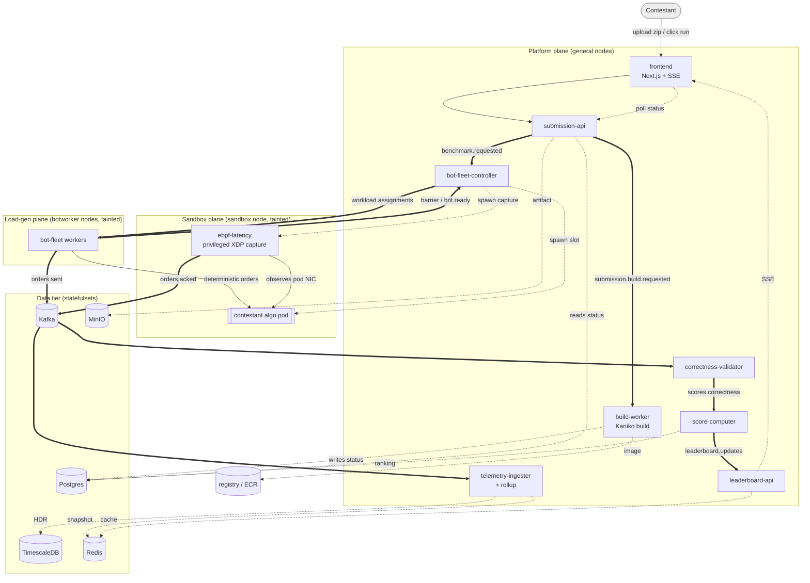

## Map of the system

The diagram below is the high-level data flow. Solid arrows are Kafka topics
(the asynchronous spine); dashed arrows are direct reads/writes to stores or
HTTP/SSE. It is derived from the topic declarations in `ops/kafka/create-topics.sh`
and the producer/consumer wiring in each service — see
[Kafka topology](kafka-topology-partitioning-horizontal-scaling.md#kafka-topology-partitioning-horizontal-scaling) for the exact
partition-level contract.

### Kafka topics at a glance

These are the twelve topics, exactly as declared in
`ops/kafka/create-topics.sh:35-46` (production sizing: replication-factor 3,
`min.insync.replicas=2`, `max.message.bytes=1 MiB`). The high-fan-out data-plane
topics get **24 partitions**; the control-plane topics get **3**. The full
producer/consumer/partition-key contract is in
[the Kafka section](kafka-topology-partitioning-horizontal-scaling.md#kafka-topology-partitioning-horizontal-scaling).

| Topic | Partitions | Retention | Role |
|-------|-----------:|-----------|------|
| `submission.build.requested` | 3 | 7 d | a new upload needs building |
| `submission.status.updated` | 3 | 7 d | build lifecycle: uploaded→building→…→ready/failed |
| `benchmark.requested` | 3 | 7 d | a run was triggered (one event per scenario session) |
| `benchmark.status.updated` | 3 | 1 d | run state machine: deploying→…→running→completed |
| `workload.assignments` | **24** | 1 d | one `WorkloadSpec` shard per bot-fleet worker |
| `barrier` | 3 | 1 d | the synchronized "go" epoch for a session |
| `bot.ready` | 3 | 1 d | per-worker fan-in before the barrier fires |
| `workload.failed` | 3 | 7 d | a worker could not start its assignment |
| `orders.sent` | **24** | 1 d | every order the load-gen emitted (msgpack, keyed by order_id) |
| `orders.acked` | **24** | 1 d | every response the kernel captured (msgpack, keyed by order_id) |
| `scores.correctness` | 3 | 30 d | per-session correctness verdict |
| `leaderboard.updates` | 3 | 7 d | a contestant's rank/metrics changed |

The three 24-partition topics are the heart of the scaling story, but they use
**two different partition keys**. `orders.sent` and `orders.acked` are both
partitioned by `FNV1a(order_id) % 24`, so the *same* order deterministically
lands on the *same* partition in both streams — the **co-partitioning** that lets
the telemetry ingester and the validator each own a slice of partitions and match
sent↔acked locally, with no cross-replica shuffle (the precondition for scaling
them horizontally). `workload.assignments` is instead partitioned by
`worker_index % 24`, which pins one `WorkloadSpec` to one partition to one worker
pod (so the KEDA-scaled load-gen fleet fans out cleanly). Both schemes are
detailed in the next section.

---
