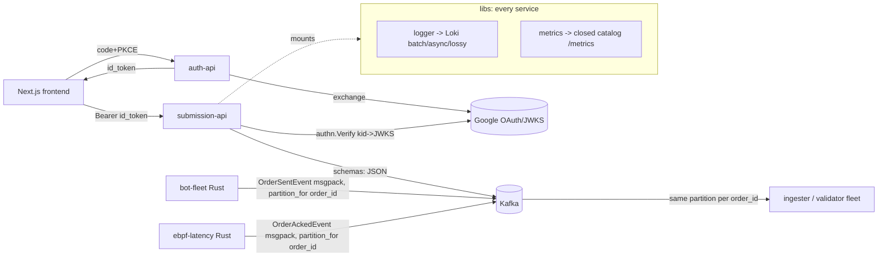

## Platform Foundations: Auth, Shared Libraries & Schemas

> **Why two languages at all:** the platform deliberately splits **Go for the control plane** (APIs, build/sandbox orchestration, the run controller, scoring, leaderboard) from **Rust for the data plane** (load generation, kernel capture, telemetry aggregation). Go wins wherever the work is I/O-bound and off the measured path — productivity, plus the native Kubernetes/Kafka/Postgres ecosystem. Rust wins wherever a GC pause would corrupt the very latency numbers being measured, or where the code runs in the kernel. These foundations — the dual-language schema contract and the mirrored logger/metrics libs — are precisely what let the two halves share one wire format and one operational surface despite being different languages.

These are the small, cross-cutting pieces that every other component leans on: the OAuth/OIDC entry point (`auth-api`), the shared Go and Rust libraries that give every service the same JWT verifier, the same Loki-backed structured logging, and the same Prometheus metric catalog, and — most load-bearing of all — the single dual-language schema package that defines all 12 Kafka topics, all event structs, and the cross-language co-partition hash that makes the hot `orders.*` path horizontally scalable. None of these are on the data-plane hot path themselves; their value is that they are *identical contracts* shared by polyglot services.

### (a) `auth-api` — Google OAuth / OIDC PKCE exchanger

`services/auth-api/main.go` is a ~513-LOC single-file Go HTTP service whose only job is to be the server-side half of a Google OAuth2 Authorization-Code-with-PKCE flow for the Next.js frontend. It holds the OAuth **client secret** (so the SPA never has to) and exchanges authorization codes for tokens.

**Responsibilities & routes.** It exposes five endpoints (`main.go:117-121`): `/health`, `/ready` (both return 200), `POST /token`, `POST /refresh`, `POST /logout`. The flow:

- `POST /token` (`main.go:165`) takes `{code, code_verifier, client_id, redirect_uri, nonce}`, validates the `client_id` matches its own and that `redirect_uri` is in a **fail-closed allowlist** (`redirectAllowed`, `main.go:341-344` — only exact-match URIs from `GOOGLE_ALLOWED_REDIRECT_URIS` are accepted), then POSTs an `authorization_code` grant to Google's token endpoint (`exchange`, `main.go:271`). It decodes the returned `id_token`, optionally checks the `nonce` against the request, sets the Google **refresh token** as an `HttpOnly` cookie, and returns `{access_token, id_token, platform_token, user}`.
- `POST /refresh` (`main.go:224`) reads the refresh-token cookie and runs a `refresh_token` grant.
- `POST /logout` (`main.go:260`) clears the cookie.

**Notable hardening.** Config is validated at boot and the service **refuses to start** without a client ID, client secret, and at least one allowed redirect URI (`loadConfig`, `main.go:393-401`). All upstream/request bodies are read through `io.LimitReader(..., 1<<20)` (1 MiB cap, `main.go:282`, `main.go:449`). Cookies are `HttpOnly`, with `Secure`/`SameSite` driven by env, and use the `__Host-` prefix when secure (`main.go:374-377`). It sets `X-Content-Type-Options: nosniff` and `X-Frame-Options: DENY` on every response (`securityHeaders`, `main.go:474`) and does a 15s graceful drain on SIGTERM/SIGINT (`main.go:151-158`).

**Key subtlety — it does NOT verify the ID token signature.** `parseClaims` (`main.go:320`) only base64url-decodes the JWT payload to read `sub`/`email`/`nonce`; it never checks the signature. This is acceptable here because the token was just received directly from Google over TLS in the code exchange. Signature verification is the job of the *consumer* services (`submission-api`), which independently re-verify any bearer token against Google's JWKS via the shared `libs/go/authn` verifier (see (b)). `auth-api` mints no tokens of its own: `platform_token` is simply the Google `id_token` passed through (`responseFromToken`, `main.go:313`).

**Auth model and its current toggle.** The intended model: the frontend signs in with Google, gets an `id_token`, and presents it as a `Bearer` token to `submission-api`, which verifies it and binds the submission/run to a `contestant_id` (= Google `sub`). **In the current e2e/demo deployment, auth is turned off.** The e2e/demo frontend runs with no login. On the API side this is gated by `AUTH_REQUIRED` (default `true`) in `submission-api/main.go:140`: when set to `false`, the router mounts `OptionalContestant` instead of `RequireContestant`, which **never rejects a request** and derives identity from an *unverified* `sub` claim if a token is present, else from `DEFAULT_CONTESTANT_ID` (`auth.go:66-76`, `submission-api/main.go:149-155`). So in the e2e deployment `auth-api` is effectively dormant and `submission-api` short-circuits verification.

> **Note — auth in the shipped demo.** The code fully supports JWT verification
> (`RequireContestant` + `authn.NewVerifier`, with `auth_middleware_test.go`
> coverage), but the e2e/demo deployment ships with `AUTH_REQUIRED=false`, so the
> running demo derives identity from an unverified token or a default contestant.
> The capability exists and is tested; it is simply toggled off for the benchmark
> flow.

**Kafka:** none — `auth-api` produces to and consumes from no topics.

### (b) `libs/go` and `libs/rust` — the shared service runtime

Every Go service imports `github.com/iicpc/libs/{authn,logger,metrics}`; every Rust service imports the `logger` crate and the `iicpc_schemas_rust` crate. These libraries are what make a fleet of independently-written services behave like one platform.

#### Shared JWKS verifier (`libs/go/authn`)

`authn.Verifier` (`verifier.go`) is the *consumer-side* counterpart to `auth-api`. `NewVerifier(clientID)` builds a `golang-jwt/v5` parser locked to **RS256 only**, with the client ID as required audience, expiry required, and 60s leeway (`verifier.go:63-69`). `Verify` (`verifier.go:75`) parses the token, resolves the signing key by `kid` against a cached JWKS, then independently checks the issuer is `accounts.google.com` and that `sub` is non-empty, returning `sub` as the contestant identity. The JWKS itself is fetched and cached by `jwksCache` (`jwks.go`): a 12-hour TTL (`jwks.go:21`), a 1 MiB body cap, a double-checked-lock single-flight fetch so a cache miss triggers at most one concurrent HTTP refresh (`jwks.go:54-59`), and strict key parsing that rejects non-RSA keys and implausible exponents (`jwks.go:148-167`). Only `submission-api` actually wires this in today (`submission-api/main.go:142`).

#### Loki structured logging (`libs/go/logger`, `libs/rust/logger`)

Both languages ship a near-identical async Loki client, deliberately mirrored down to the constants — Go's `DefaultConfig` (`loki.go:64-77`) and Rust's `Config::default` (`loki.rs:67-81`) both use `QueueSize=10000`, `BatchSize=256`, `BatchWait=500ms`, `HTTPTimeout=5s`, `MaxRetries=3`, and even emit the *same* "BatchSize larger than QueueSize" warning. The design: a background worker drains a bounded channel, batches by count or by a timer tick, and POSTs to `/loki/api/v1/push` with exponential backoff + jitter (`flush`, `loki.go:419`; `run_worker`, `loki.rs:661`). The queue is **lossy by design** — if the channel is full, lines are dropped and counted (`queueDrops`) rather than blocking the caller's hot path (`loki.go:349-356`, `loki.rs:270-280`). Both also use a `sync.Pool` / `thread_local` buffer pool to avoid per-log allocation, and both render the *same* RFC3339-nanosecond UTC timestamp format (the Rust side reimplements the civil-from-days date math and has a unit test asserting it matches Go's slog output, `loki.rs:1022-1043`). On the Go side, logging is wired as an slog handler chain (`NewProductionLogger`, `loki.go:182`): a JSON stdout handler, optionally wrapped by a `LokiHandler`, then a `ContextHandler` that pulls request-scoped attrs out of `context.Context` so per-request fields (request ID, contestant) ride along automatically.

The canonical mount pattern every Go service repeats verbatim at the top of `main`:

```go
logCfg := logger.DefaultConfig()
logCfg.ServiceName = "score-computer"
log, lokiClient := logger.NewProductionLogger(logCfg)
slog.SetDefault(log)
if lokiClient != nil {
    defer lokiClient.Close()  // drains the queue on shutdown
}
```
*(`services/score-computer/main.go:32-38`; `LokiClient` is nil when `LOKI_URL` is unset, so the same code runs locally with stdout-only logging.)*

#### Prometheus metrics (`libs/go/metrics`)

The Go metrics package is unusual and worth calling out: it is a **closed catalog**, not an open registry. All ~70 metrics are declared up front in `projectMetricCatalog` (`metrics.go:270-339`) — every counter/gauge/histogram name, help text, label set, and (for histograms) bucket layout the entire platform is allowed to emit. At runtime `Counter`/`Gauge`/`Histogram` (`metrics.go:100-150`) look the metric up by name; if it was never registered in the catalog, or the kind/labels/buckets don't match, the sample is **silently dropped and an `iicpc_metrics_registry_errors_total` error counter is incremented** (`metric`, `metrics.go:196-221`) rather than registered ad-hoc. This guarantees consistent cardinality and naming (everything is namespaced `iicpc_*`) across all services and makes a typo a no-op instead of a new time series. `HTTPMiddleware` (`http.go:56`) wraps any `http.Handler` to emit `http_requests_total` + `http_request_duration_seconds` labeled by `{service, method, path, status}`, using a `statusRecorder` that also implements `Flush`/`Unwrap` so it stays SSE/streaming-transparent. The shared serving pattern: `metrics.StartServer(addr)` (`metrics.go:160`) spins up a `/metrics` listener (default `:9090`), or services mount `metrics.Handler` directly on their existing router (`submission-api/main.go:137`). Eight Go services use these helpers (`correctness-validator`, `build-worker` worker/spawner, `sandbox-orchestrator`, `score-computer`, `bot-fleet-controller`, `leaderboard-api`, `submission-api`).

> Note: `libs/rust` ships only the `logger` crate — there is no shared Rust metrics library. Rust data-plane services (`telemetry-ingester`, `bot-fleet`, `ebpf-latency`) expose their own `iicpc_telemetry_*` / service-local Prometheus series directly (/ §5.12).

### (c) `schemas/go` + `schemas/rust` — the single Kafka contract, mirrored across languages

This is the keystone of the whole platform: one set of topic-name constants and event structs, written twice (once in Go, once in Rust) and kept byte-compatible on the wire, so a Go producer and a Rust consumer (or vice versa) agree on every field of every message. The Go side is `schemas/go/topics/topics.go` (its own module, `github.com/iicpc/schemas`); the Rust side is `schemas/rust/src/lib.rs` (`iicpc_schemas_rust`).

**Topic constants (the 12-topic catalog).** Both files declare the identical 12 topic-name constants (`topics.go:10-23`, `lib.rs:9-20`) plus `TelemetryPriceScale = 1_000_000_000` (the fixed-point scale for prices). These names are the *only* place topics are spelled out in code; producers/consumers reference the constants, never string literals. The Rust test `topic_constants_match_platform_contract` (`lib.rs:288`) even asserts every name is non-empty lowercase-ASCII. (Partition counts live in `ops/kafka/create-topics.sh` and `k8s/data/kafka/topic-init-job.yaml`, not here — this package owns *names and shapes*, the ops scripts own *partitions*.)

**Two serialization regimes.** The split is deliberate:
- **Control plane → JSON.** `WorkloadSpec`, `BarrierEvent`, `ReadySignal`, `BenchmarkRequested`/`StatusUpdated`, `SubmissionBuildRequested`/`StatusUpdated`, `Scenario`, `CorrectnessScoreEvent`, `LeaderboardUpdateEvent` are JSON-tagged. These are low-volume orchestration messages where human-readability and schema flexibility win. The Rust structs carry matching `serde` field names and `#[serde(rename_all = "UPPERCASE")]` enums so Rust decodes the Go controller's JSON directly — proven by `workload_spec_decodes_go_controller_payload` (`lib.rs:318`), which feeds a literal Go-shaped JSON blob into the Rust `WorkloadSpec`.
- **Hot order path → MessagePack.** The high-volume `orders.sent` / `orders.acked` structs (`OrderSentEvent`, `OrderAckedEvent`, and their `*Batch` wrappers) carry *both* `json:` and `msgpack:` struct tags in Go (`topics.go:195-240`) and are encoded with `rmp_serde::to_vec_named` in Rust. The **named** msgpack form (field-keyed, not positional) is what makes cross-language and rolling-upgrade compatibility possible. The Rust side additionally has zero-copy `OrderAckedEventRef<'a>` / `OrderAckedBatchRef<'a>` borrow-based mirrors (`lib.rs:196-233`) for the eBPF egress producer to serialize without owning the strings.

**Forward-compat via `serde(default)`.** New fields on hot-path structs are added with `#[serde(default)]` (Rust) / a zero-value (Go) so that an old producer's message — missing the new field entirely — still decodes cleanly into the new struct, with the field defaulting to zero. `barrier_epoch_ns` on `OrderSentEvent` is the worked example (`lib.rs:163`), and there are two tests guarding it: `order_sent_event_barrier_epoch_round_trips` (`lib.rs:455`) confirms it survives a msgpack round-trip, and `order_sent_event_decodes_pre_field_message` (`lib.rs:484`) literally encodes an *old* struct lacking the field and decodes it into the new one, asserting the field defaults to 0. This is exactly the rolling-upgrade story: you can deploy a new consumer before the new producer (or vice versa) without a coordinated flag day.

**The cross-language co-partition guarantee — `partition_for`.** This is the genuinely elegant bit. The hot topics `orders.sent` and `orders.acked` are **24 partitions each** (`create-topics.sh`), and a given order is produced to *both* topics by completely different services — `bot-fleet` (Rust) emits `orders.sent`, `ebpf-latency` (Rust) emits `orders.acked`. For a stateless consumer to join the "sent" and "acked" sides of one order locally (no cross-partition shuffle), both producers must independently put that order on the *same partition number*. They do so by hashing the `order_id` with a fixed FNV-1a 64-bit hash:

```rust
pub fn partition_for(order_id: &str, num_partitions: i32) -> i32 {
    if num_partitions <= 1 { return 0; }
    let mut hash: u64 = 0xcbf29ce484222325;          // FNV-1a offset basis
    for byte in order_id.as_bytes() {
        hash ^= u64::from(*byte);
        hash = hash.wrapping_mul(0x100000001b3);     // FNV prime
    }
    (hash % num_partitions as u64) as i32
}
```
*(`schemas/rust/src/lib.rs:26-37` — a hand-rolled, dependency-free FNV-1a so the partition assignment is byte-for-byte reproducible and pinned to the schema, not to any client library's default hasher.)* It is the single function callers across `bot-fleet/src/telemetry.rs:298`, `ebpf-latency/src/main.rs:288`, and the `inject` test tool all route through. Three tests pin its contract: determinism + in-range over 10k ids (`lib.rs:418`), good spread across partitions (`lib.rs:431`), and the single-partition degenerate case (`lib.rs:448`).

> Note on the "Go twin": there is **no Go reimplementation of `partition_for`** — `rg` finds the FNV constants only in the Rust schema, and `schemas/go` contains nothing but `topics.go`. The reason is that the order-id co-partition path is entirely Rust (both `orders.*` producers are Rust). The Go control-plane producer that *does* care about partition placement — `bot-fleet-controller` publishing `workload.assignments` (also 24 partitions) — uses a *different* key: a custom `workerIndexBalancer` that maps `worker_index % numPartitions` (`bot-fleet-controller/internal/controller/producer.go:75-84`), so each worker pod owns a stable partition. `validateWorkerCapacity` (`producer.go:88`) even refuses to start a run if `worker_count > partitions`, because two specs sharing a partition would serialize and miss the barrier. So the platform has *two* co-partition schemes — FNV-1a-by-order-id (Rust, `orders.*`) and modulo-by-worker-index (Go, `workload.assignments`) — and only the former lives in the schema package.

**How this enables horizontal scale.** Because order_id deterministically fixes the partition on both `orders.sent` and `orders.acked`, the `telemetry-ingester`/`correctness-validator` consumer fleet can scale to N replicas where each replica owns a disjoint subset of the 24 partitions and sees a *complete* sent+acked pair for every order it's responsible for — no cross-replica coordination, no global join. Add partitions (and replicas) → linear throughput. The schema package is the contract that makes that safe.

#### Event-struct catalog (brief)

The schema package defines every message body on the bus:

| Struct | Topic | Encoding | Notes |
|---|---|---|---|
| `SubmissionBuildRequested` / `SubmissionStatusUpdated` | `submission.build.requested` / `submission.status.updated` | JSON | build orchestration; status enum `uploaded→building→scanned→sbom_ready→ready/failed` |
| `BenchmarkRequested` / `BenchmarkStatusUpdated` | `benchmark.requested` / `benchmark.status.updated` | JSON | run lifecycle; `RunStatus*` enum `requested→deploying→waiting_ready→barrier_fired→running→completed/failed` |
| `WorkloadSpec` (+ `TaskSpec`) | `workload.assignments` | JSON | one per worker pod; controller sharded the scenario's task list across workers |
| `Scenario` (+ `TaskSpec`) | — (DB/control) | JSON | full task list, `constant`/`spike`/`ramp` |
| `BarrierEvent` | `barrier` | JSON | the synchronized fire epoch |
| `ReadySignal` | `bot.ready` | JSON | fan-in: per-worker connected/ready report |
| `OrderSentEvent` / `OrderSentBatch` | `orders.sent` | **msgpack** | load-gen send-side telemetry, keyed by order_id |
| `OrderAckedEvent` / `OrderAckedBatch` (+ `*Ref`) | `orders.acked` | **msgpack** | eBPF-captured ack-side telemetry, keyed by order_id |
| `CorrectnessScoreEvent` | `scores.correctness` | JSON | validator output |
| `LeaderboardUpdateEvent` | `leaderboard.updates` | JSON | scorer → leaderboard-api |
| (none) | `workload.failed` | — | failure signal topic; name only, no struct here |

(The full topic→partition→consumer-group graph belongs to the other sections; this section owns the structs and the partitioning *function*.)

### Data-flow sketch — how the foundations plug in



### Limitations / scope for improvement

- **Auth is off in the shipped demo.** `AUTH_REQUIRED=false` + `OptionalContestant` means identity is taken from an *unverified* token or a static default (`auth.go:66-76`); `auth-api` is deployed but unused. Re-enabling is a config flip; until then there is no authn/authz in the running benchmark system.
- **`auth-api` does no signature verification of the ID token** (`parseClaims`, `main.go:320`) — safe only because the token comes straight from Google in the exchange; any reuse of that function on an untrusted token would be a vulnerability.
- **`platform_token` is just the Google `id_token` passed through** (`main.go:313`) — there is no platform-minted/short-lived token, so token lifetime and revocation are entirely Google's, and only the verifier's 12h-cached JWKS + expiry checks bound it.
- **Loki logging is intentionally lossy** under backpressure (drops + counts rather than blocking, `loki.go:349-356`); acceptable for a metrics-grade benchmark, but log completeness is not guaranteed during bursts.
- **No shared Rust metrics library** — only `libs/rust/logger` exists; Rust services hand-roll their Prometheus surface, so the closed-catalog discipline the Go side enforces is not enforced for Rust series.
- **`partition_for` has no Go implementation.** Today fine (both `orders.*` producers are Rust), but a future Go producer to `orders.sent`/`orders.acked` would have to port the FNV-1a exactly or break co-partitioning; the contract lives in one language only.
- **The two schema modules can drift.** Go and Rust mirror each other only by convention + the decode-Go-payload tests on the Rust side (`lib.rs:318`, `lib.rs:348`); there is no generated single-source IDL, so a field added in Go but forgotten in Rust would only surface when a decode test or a live message fails.
- **`workload.assignments` is hard-capped by partition count.** `validateWorkerCapacity` (`producer.go:88`) makes `worker_count > 24` a startup error — scaling the bot fleet past 24 workers requires repartitioning the topic.

---
