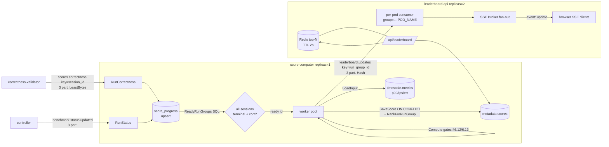

## Score Computer & Leaderboard API (Go)

> **Why Go:** both are SQL-heavy and I/O-bound — bursty batch scoring over TimescaleDB and Postgres, plus SSE fan-out — with no presence on the measured path. Go's concurrency, `pgx`, and `net/http` streaming fit the workload directly, and the scoring math is plain arithmetic over query results rather than a latency-sensitive inner loop.

These two Go services form the **scoring tail** of the IICPC match-bench pipeline. The
`score-computer` turns the per-session correctness verdicts and TimescaleDB latency
telemetry of a completed run-group into a single ranked verdict (peak-sustained-TPS behind
latency/error/correctness gates, with disqualification logic), persists it, and emits a
`leaderboard.updates` event. The `leaderboard-api` consumes those events and serves the live
leaderboard — plus run-detail and per-session HDR charts — to the Next.js frontend over
Server-Sent Events, fronted by a short-TTL Redis cache.

The boundary between them is deliberate: `score-computer` is the **single writer** of the
`scores` table (one replica, idempotent), while `leaderboard-api` is a **fan-out read tier**
(many replicas, each broadcasting to its own SSE clients). They never share in-process state;
the only coupling is the `leaderboard.updates` topic and the shared `scores`/TimescaleDB
tables.

---

### (a) score-computer

#### Role and responsibilities

`score-computer` is an event-driven, idempotent batch scorer. It does not score per event;
it waits until *all* sessions of a run-group are terminal and have correctness results, then
computes the run-group's final metrics exactly once.

Per run-group it produces (`score.Result`, `internal/score/score.go:118`):

- **`peak_sustained_tps`** — the highest wave's offered RPS that passed the latency and
  error-rate gates.
- **`p99_at_peak_ns`** — p99 latency at that peak wave.
- **`spike_recovery_ns`** — how long after a spike the engine took to fall back within 110%
  of its baseline p99.
- **`total_correctness`** — `Σ valid_fills / Σ total_fills` across all sessions.
- **`disqualified` + `disqualification_code`** — DQ verdict.
- **`incomplete_telemetry`** — set when any session's telemetry coverage
  (`matched/sent`) fell below `min_coverage` (0.90), which *suppresses* violation-based DQ.

#### Trigger / readiness model (the "all sessions in" gate)

Two Kafka consumers feed a SQL-backed progress table rather than scoring inline:

- `RunStatus` consumes `benchmark.status.updated`; on a `completed`/`failed` terminal status
  it upserts `terminal_status` into `score_progress` (`internal/store/store.go:165`).
- `RunCorrectness` consumes `scores.correctness`; it upserts the per-session correctness
  counters — `valid_fills`, `total_fills`, `violation_count`, and the telemetry-completeness
  counters `sent_count`/`acked_count`/`matched_count` — keyed by `session_id`
  (`store.go:201`).

Both consumers, after persisting, call `ReadyRunGroups()` which asks Postgres whether the
run-group is now **complete and un-scored** (`store.go:255`):

```sql
SELECT p.run_group_id FROM score_progress p
  JOIN runs r ON r.session_id=p.session_id
  LEFT JOIN scores sc ON sc.run_group_id=p.run_group_id
 WHERE p.run_group_id=$1 AND sc.run_group_id IS NULL
 GROUP BY p.run_group_id
HAVING COUNT(DISTINCT p.session_id) = (SELECT COUNT(DISTINCT session_id) FROM runs WHERE run_group_id=$1)
   AND COUNT(DISTINCT p.session_id) >= 3
   AND BOOL_AND(p.terminal_status IN ('completed','failed'))
   AND BOOL_AND(p.total_fills IS NOT NULL)
```
*(store.go:255 — the readiness join; a run-group fires only when every session is terminal,*
*has correctness in, and ≥3 sessions exist — the constant/spike/ramp triad.)*

Ready ids are pushed onto an in-process buffered channel (`ready`, `main.go:62`) drained by a
pool of `SCORER_CONCURRENCY` (default 4) worker goroutines (`main.go:68`). A `Hash`/key-
agnostic design at the Kafka layer is acceptable precisely because readiness is decided in SQL,
not by partition locality. On boot a recovery scan (`PendingRunGroups`, `store.go:284`) re-enqueues
any run-group that became ready while the service was down — so an offset commit that lands before
a crash can never silently drop a score.

#### The scoring computation (`score.Compute`, score.go:138)

1. **Aggregate correctness** across sessions; `< 0.95` → `correctness_below_threshold`
   (DQ gate). Each session's own ratio is also gated →
   `session_correctness_below_threshold`.
2. **Telemetry-coverage gate.** For each session, `coverage = matched/sent`; if any session
   is below `min_coverage` (0.90) the run is flagged `incomplete_telemetry` and the result
   marked ungateable rather than DQ'd (`score.go:148`). This protects against a half-drained
   telemetry stream falsely failing a correct engine.
3. **Wave schedule reconstruction.** `WaveSchedule` (`score.go:252`) rebuilds the offered-RPS
   profile per 20 s wave from the ramp scenario's `TaskSpec`s by integrating each task's
   `TargetRPS` over its overlap with the wave window.
4. **Peak-sustained-TPS gate.** Walk the schedule in wave order, **skip wave 0**
   (warmup), and gate each wave on the **median of its per-second p99** (`StableP99NS` via
   `medianU64`) — *not* the worst second — plus a *max* error-rate gate. Stop at the first
   failing wave; peak = last passing wave's offered RPS. Break-on-first-failure keeps peak
   monotonic.

```go
case m.MaxErrorRate > cfg.MaxErrorRate:   wr.Reason = "error_rate"
case m.StableP99NS > cfg.MaxP99NS:        wr.Reason = "p99_latency"
default:
    wr.Passed = true
    res.PeakSustainedTPS = wave.OfferedRPS
    res.P99AtPeakNS = m.MaxP99NS
```
*(score.go:207 — the gate is median-p99 (`StableP99NS`) for pass/fail, but the reported*
*`P99AtPeakNS` is the wave's `MaxP99NS`; error-rate stays a max because a sustained error*
*second is a real fault. Defaults: max p99 = 1 ms, max error-rate = 0.01, wave = 20 s.)*

5. **Spike recovery** (`spikeRecoveryNS`, score.go:356): from the `spike` session, find the
   peak-p99 wave; recovery is the ns-distance to the first later wave back within
   `1.10 × baseline`, else "never recovered" (counts to end of run).

The telemetry latency inputs are read from **TimescaleDB** (`loadMetrics`, store.go:382 —
`MAX(p99_ns)`, `AVG(tps_1s)`, `MAX(error_rate)` grouped by `wave_index`); per-second p99
samples feed the median. (Redis here is used only for liveness/`ZADD` helpers, not the gate.)

#### Persist → rank → publish (worker.go:68)

Once computed, the worker does three SQL steps then one Kafka publish:

1. **`SaveScore`** — `INSERT … ON CONFLICT (run_group_id) DO NOTHING` (store.go:411). The full
   `score.Result` is also stored as `score_detail` JSONB. The `RowsAffected==1` return is the
   **idempotency latch**: a second worker (or a redelivery) that loses the insert race returns
   without publishing, so each run-group emits exactly one leaderboard update.
2. **`RankForRunGroup`** — a `ROW_NUMBER OVER (ORDER BY <rankOrderBy>)` window over the
   *entire* `scores` table (store.go:455). The order is `disqualified ASC, peak_sustained_tps
   DESC, p99_at_peak_ns ASC, spike_recovery_ns ASC, total_correctness DESC, run_group_id ASC`
   (DQ-ascending leads, so any DQ'd entry sorts below all qualified ones).
   `idx_scores_sort_v3` (store.go:92) is the covering index for exactly this order.
3. **`MarkPublished`** — writes `rank`, `rank_delta`, `published_at`.
4. **Publish** the `LeaderboardUpdateEvent`.

#### Kafka

| Direction | Topic | Partitions | Partition key | Consumer group | Why |
|-----------|-------|-----------:|---------------|----------------|-----|
| consume | `scores.correctness` | **3** | `session_id` set, but **ignored** — producer uses `LeastBytes` balancer | `score-computer-correctness` (`KAFKA_CORRECTNESS_GROUP`) | Round-robin spread; locality is irrelevant because aggregation happens in SQL keyed by `session_id` (the `score_progress` PK). |
| consume | `benchmark.status.updated` | **3** | n/a | `score-computer` (`KAFKA_STATUS_GROUP`) | Terminal-status trigger; same SQL-readiness model. |
| produce | `leaderboard.updates` | **3** | **`run_group_id`** (FNV via `kafka.Hash{}`, publisher/kafka.go:31/48) | — | All updates for one run-group land on one partition, giving in-order rank progression per run-group for any keyed consumer. |

`scores.correctness` and `leaderboard.updates` are **3 partitions** each
(`ops/kafka/create-topics.sh:45-46`, `k8s/data/kafka/topic-init-job.yaml:58-59`);
only the data-plane topics (`orders.sent`, `orders.acked`, `workload.assignments`)
are 24. The scoring control plane is low-volume (one message per finished
session/run-group), so 3 is intentional.

> **Note — producer key vs. balancer on `scores.correctness`.** The
> correctness-validator sets `Key: ev.SessionID` but uses `Balancer:
> &kafka.LeastBytes{}` (`services/correctness-validator/internal/publisher/kafka.go:33,53`).
> `LeastBytes.Balance` routes by least-loaded partition and ignores the key, so
> the session key is effectively decorative — harmless here because aggregation is
> done in SQL keyed by `session_id`, not by partition locality.

#### Concurrency, state ownership, scaling

- **State ownership:** sole writer of `metadata.scores`; reads (not writes) `metadata.runs`,
  `run_groups`, `submissions`, `scenarios`, and `timescale.metrics`.
- **Concurrency:** two consumer goroutines + `SCORER_CONCURRENCY` worker goroutines fed by a
  channel; scoring of distinct run-groups is independent and parallel-safe.
- **Scaling model: effectively a singleton.** Deployed `replicas: 1`
  (`k8s/benchmark/score-computer/deployment.yaml:14`); **no KEDA/HPA**. Horizontal scale is
  *possible but unused*: the consumer groups would rebalance partitions, and the
  `ON CONFLICT DO NOTHING` latch makes double-scoring safe — but the per-run-group cost is a
  full-table `ROW_NUMBER` rank, and the work is bursty (one batch per finished run-group),
  so a single replica with internal worker concurrency is the chosen unit.
- **Bottleneck:** the global `ROW_NUMBER` rank query scales O(rows) per scored run-group;
  fine at contest scale (hundreds of run-groups), would need an incremental/Redis-ZSET rank if
  the table grew large.

#### Limitations / scope for improvement

- **`rank_delta` is hardcoded to `0`** (worker.go:86) — the schema and event carry it, but it
  is never computed against a previous rank, so the frontend "moved up/down" signal is dead.
- **No DLQ / poison-pill handling beyond decode-skip.** Decode errors are committed and
  skipped (`isDecodeError`, trigger/consumer.go:165); a *processing* error (e.g. DB down) is
  logged but **not committed**, so the message redelivers — correct for transient faults but a
  permanently-unscoreable run-group would loop.
- **`RecordPoolStats` is a no-op** (store.go:490) — pool saturation is invisible.
- **`recompute_run_group_status` / `total_score` are NOT in this service.** Despite the task
  framing, `recompute_run_group_status` lives in `submission-api`
  (`services/submission-api/internal/store/postgres.go:437`) and `total_score` is a *sort alias*
  in leaderboard-api's read store (mapped to `total_correctness`, store.go:501). score-computer's
  closest analogues are the `ReadyRunGroups()` readiness query and the `RankForRunGroup` window.

---

### (b) leaderboard-api

#### Role and responsibilities

`leaderboard-api` is the read/serve tier. It (1) consumes `leaderboard.updates` and pushes
each event to connected SSE clients in real time, and (2) serves REST read endpoints backed by
Postgres + TimescaleDB with a Redis cache in front of the hot leaderboard query.

Endpoints (`main.go:91`): `/api/leaderboard`, `/api/live`, `/api/runs/{run_group_id}`,
`/api/charts/{session_id}`, `/api/health-panel`, and the SSE stream `/api/events`.

#### SSE fan-out (sse/broker.go)

The `Broker` holds a `map[chan []byte]struct{}` of connected clients under a mutex
(broker.go:25). On connect, `ServeHTTP` (broker.go:61):

1. registers a buffered channel (cap 16), bumps the `leaderboard_api_sse_clients` gauge;
2. immediately writes a **`snapshot` event** — the top-100 leaderboard fetched fresh from the
   *uncached* reader (`main.go:60`) — so a new client renders instantly without waiting for the
   next update;
3. loops on the client channel + a 15 s keepalive ticker, flushing each `update` event.

`Broadcast` (broker.go:40) is the elegant load-bearing piece — a **non-blocking fan-out with
slow-client eviction**:

```go
for ch := range b.clients {
    select {
    case ch <- payload:
    default:                         // client can't keep up
        close(ch); delete(b.clients, ch)
        metrics.Counter("leaderboard_api_sse_dropped_clients_total", …, 1)
    }
}
```
*(broker.go:47 — a `default` on the send means one stalled browser tab can never block the*
*Kafka consumer or any other client; it is dropped and counted instead.)*

#### Cache read/write path (read/cache.go)

`CachedReader` wraps the base `Store` with a Redis-backed read-through cache for the *hot*
leaderboard query only:

- **Cacheable iff** unfiltered, default sort (`rank`/empty, `asc`) and no cursor
  (`cacheableLeaderboard`, cache.go:90). Filtered/paged/alternately-sorted queries bypass the
  cache and hit Postgres directly.
- Key is `leaderboard-api:v1:top:<limit>` (cache.go:105). TTL is **2 s** (`main.go:59`).
- On **hit** → increment `leaderboard_api_cache_reads_total{result="hit"}` and return the
  unmarshaled response; on **miss** → `…{result="miss"}`, query Postgres, then
  `Set` and increment `leaderboard_api_cache_writes_total{result="ok"|"error"}` (cache.go:46-66).
- A Redis read error is counted `{result="error"}` and degrades to Postgres — the cache is
  never on the correctness path.

#### Read queries (read/store.go)

- **Leaderboard list** (`Leaderboard`, store.go:111): a `ROW_NUMBER OVER (ORDER BY
  <rankedOrder>)` subquery — the **same canonical order** as score-computer's `rankOrderBy`,
  so rank is consistent across services — wrapped with optional filters (run_group / submission
  / contestant / `team_name ILIKE`) and an opaque base64 offset cursor (`limit+1` fetched to
  detect `next_cursor`). Caps: 500 rows, offset ≤ 100 000. `leaderboardOrderBy` (store.go:482)
  maps user-facing sort aliases (`peak_tps`, `p99`, `spike_recovery`, **`total_score` →
  `total_correctness`**, `team_name`, …) to safe whitelisted columns with per-sort tiebreaks —
  a SQL-injection-safe sort allowlist.
- **Run detail** (`RunDetail`, store.go:240) — the closest analogue to "get_run_group": joins
  the ranked `scores` row for the run-group with all its sessions (`runs ⋈ scenarios`), each
  session's TimescaleDB timeline (`Chart`), and its correctness violations. To keep the payload
  small it calls `keepLastPerWaveHDR` (store.go:294), which **drops the base64 HDR blobs from all
  but the latest metric point per wave** (~100× shrink) while preserving the numeric timeline.
- **Active runs** (`ActiveRuns`, store.go:396) — the "list_run_groups (live)" analogue: every
  run-group with a non-terminal session, grouped into `{run_group, team, sessions[]}`, capped
  at 500.
- **Chart** (`Chart`, store.go:310) — raw per-second TimescaleDB metrics for one session
  including base64-encoded latency/round-trip/slip HDR blobs (cap 20 000 points).
- If the `scores` table doesn't exist yet (fresh contest, `42P01`) the leaderboard returns an
  empty `{source:"frozen"}` instead of erroring (store.go:143).

#### Kafka

| Direction | Topic | Partitions | Partition key | Consumer group | Why |
|-----------|-------|-----------:|---------------|----------------|-----|
| consume | `leaderboard.updates` | **3** | produced keyed by `run_group_id` | **per-pod unique**: `leaderboard-api-sse-<POD_NAME>` (`config.go:45`) | A unique group per replica means **every replica reads every partition** and gets every update — required so all SSE clients, regardless of which pod they're pinned to, see all rank changes. |

This per-pod group id is the single most important scaling design choice: leaderboard-api is a
**broadcast/replicated consumer, not a sharded one**. Partition-sharding would split updates
across pods and starve clients of events for run-groups on other partitions; a unique group
side-steps consumer-group rebalancing entirely. Consumption starts at `kafka.LastOffset`
(consumer.go:41) — replicas only stream *new* updates (the initial state comes from the SSE
snapshot + cache), and offsets are effectively throwaway.

#### Concurrency, state ownership, scaling

- **State ownership:** read-only over `metadata` and `timescale`; owns no tables. Redis is a
  derived cache.
- **Concurrency:** one Kafka consumer goroutine per pod feeding the shared `Broker`; HTTP
  handlers run on chi's goroutine-per-request. Note `WriteTimeout: 0` (main.go:103) is required
  so long-lived SSE responses are not killed.
- **Scaling model: horizontally scalable read tier.** `replicas: 2`
  (`k8s/platform/leaderboard-api/deployment.yaml:14`); no KEDA today, but it is trivially
  scalable — **the unit of horizontal scale is the SSE client fan-out**. Each added replica
  brings its own consumer (per-pod group) and its own client map; total SSE capacity ≈
  replicas × per-pod client cap. The Redis cache (2 s TTL) collapses the read-query load so
  Postgres sees at most ~one top-100 query every 2 s per distinct `limit`, regardless of
  request volume.
- **Bottleneck:** per-replica SSE fan-out is a single mutex-guarded map iterated on every
  broadcast (`Broadcast`, broker.go:45) — O(clients) per event under one lock; at very high
  update rates × many clients this serializes on the broker mutex. The snapshot-on-connect path
  is uncached (`reader.Leaderboard`, main.go:60), so a connection storm bypasses Redis and hits
  Postgres directly.

#### Limitations / scope for improvement

- **Snapshot-on-connect is uncached** — a thundering herd of new SSE clients hits Postgres for
  the top-100 each, unlike the cached `/api/leaderboard` path.
- **No backpressure beyond drop** — a slow client is silently evicted (cap-16 channel +
  `default` send); there is no resume/replay, so a dropped client must reconnect to re-snapshot.
- **No KEDA autoscaling** on either service despite both being scale-ready; replica counts are
  static (1 and 2).
- **Cache is single-key-shape** — only the unfiltered top-N is cached; sorted/filtered/team-name
  views are always uncached Postgres scans.

---

### Data flow (one finished run-group)



---
