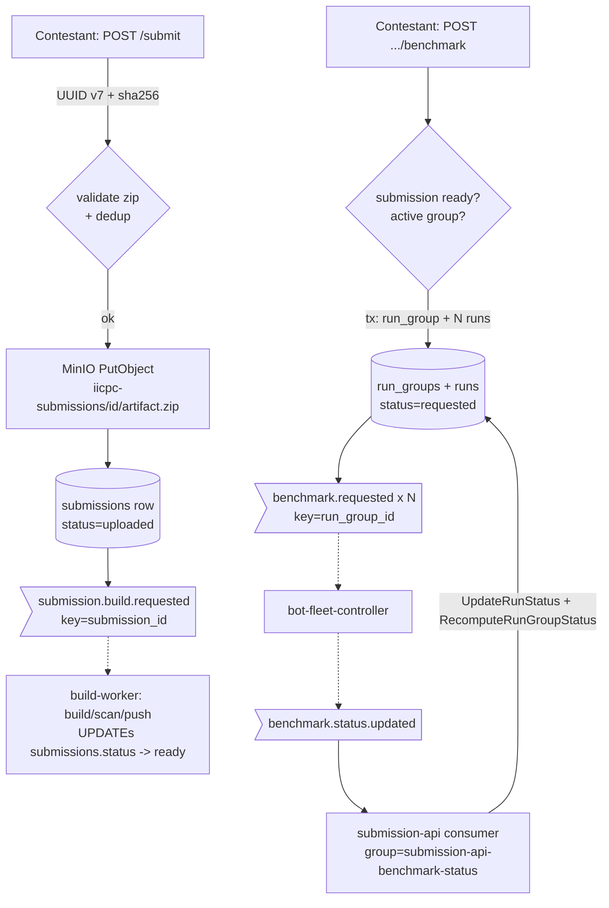

## Submission API (Go)

> **Why Go:** the submission-api is I/O-bound control-plane work (HTTP, Postgres, MinIO, Kafka) that never sits on the measured latency path, so GC pauses are irrelevant here. Go's goroutine-per-request model and the mature `chi`/`pgx`/`kafka-go`/`minio` ecosystem make it the productive, low-ceremony choice for a request validator/router.

The Submission API (`services/submission-api`, Go, ~4.8k LOC including tests) is the platform's **HTTP front door**. Every contestant interaction that mutates the system enters here: uploading an algorithm artifact, triggering a benchmark ("run"), and polling submission / run-group / run status. It owns the `submissions`, `run_groups`, `runs`, and `scenarios` tables in Postgres, the `submissions` bucket in MinIO, and is the sole producer of the two "request" topics (`submission.build.requested`, `benchmark.requested`) that kick off the build and benchmark pipelines. It is a thin, mostly-stateless request validator/router in front of shared Postgres + MinIO + Kafka.

### Responsibilities and request surface

Routing is `go-chi`. The router wires global middleware (request-id, real-IP, structured request logging, Prometheus HTTP middleware, panic recovery) and three unauthenticated endpoints — `GET /health`, `GET /ready` (Postgres ping), `GET /metrics` — followed by an authenticated group (`main.go:135-167`):

- `POST /submit` — multipart artifact upload (handler `Submit`).
- `GET /submissions/{submission_id}` — submission status/metadata (handler `GetSubmission`).
- `POST /submissions/{submission_id}/benchmark` and the alias `POST /benchmarks/{submission_id}` — mint a run-group (handler `StartBenchmark`).
- `GET /run-groups`, `GET /run-groups/{run_group_id}`, `GET /runs/{session_id}` — read APIs (handlers `ListRunGroups`, `GetRunGroup`, `GetRun`).

**Auth.** When `AUTH_REQUIRED=true` (default) every authenticated route is gated by `RequireContestant`, which extracts a bearer token, verifies it as a Google OIDC ID token via `libs/authn`, and puts the `sub` claim into request context as the contestant id (`handler/auth.go:44-61`). When `AUTH_REQUIRED=false` (dev/e2e), `OptionalContestant` never rejects: it reads an **unverified** `sub` claim from the token if present, else falls back to `DEFAULT_CONTESTANT_ID` (`auth.go:66-76`, `main.go:148-156`). The contestant id is the ownership key on every row; all read handlers 404 (not 403) when `row.ContestantID != caller` to avoid leaking existence.

### Artifact upload, validation, and sha256 dedup

`POST /submit` (`handler/submit.go:50`) caps the body at `MaxZipBytes + 4096` (100 MB + slack), parses the multipart form, then runs `validator.ValidateSubmissionZip` over the uploaded zip **before** touching any store. Validation (`validator/zip.go:45`) is strict and self-contained:

- Magic-byte check (`PK\x03\x04`), then a real `archive/zip` parse.
- Requires exactly one `benchmark.yaml`/`.yml` at the zip root, a `src/` directory, and exactly one build manifest (`CMakeLists.txt` | `Cargo.toml` | `go.mod`); duplicate root entries or multiple manifests are rejected. Root config files are read through a 1 MB `LimitReader` to bound decompression.
- `benchmark.yaml` is parsed (`gopkg.in/yaml.v3`) into `BenchmarkConfig{protocol, language, build{type,target}, port, team_name}`. Protocol ∈ {FIX, REST, WS}, language ∈ {cpp, rust, go}, port ∈ [1024, 65535], build target matches `^[A-Za-z0-9_.-]{1,64}$`.
- Cross-checks the manifest against the language: cpp⇒`add_executable(<target>)` in CMakeLists (regex), rust⇒a `[[bin]] name=<target>` entry in Cargo.toml (TOML parse), go⇒presence of `go.mod`. This guarantees the declared build target actually exists before a build worker is ever dispatched.

After validation, the handler mints a **UUID v7** submission id, computes the artifact **sha256** (streamed via `io.Copy(sha256.New(), file)`), and does dedup: `FindBySHA256` (`postgres.go:601`, `SELECT submission_id FROM submissions WHERE sha256=$1`). On a hit it resolves ownership (`claimOrResolveOwner`) and returns `409 duplicate submission` (with the existing id if the caller owns it), incrementing `submission_duplicate_total`. The `sha256` column has a `UNIQUE` constraint, so even if two uploads race past the pre-check, the `INSERT` returns Postgres `23505` → `ErrDuplicateSubmission` and the handler re-resolves to the existing row (`submit.go:169-204`). dedup is content-addressed, so re-uploading an identical zip never rebuilds.

Only after dedup passes does it write to MinIO, then Postgres, then Kafka — in that order:

```go
objectPath := fmt.Sprintf("%s/%s/%s", submissionsObjectPrefix, submissionID, artifactObjectName)
// → "iicpc-submissions/{submission_id}/artifact.zip"
_, err := s.client.PutObject(ctx, s.bucket, objectPath, r, size,
    minio.PutObjectOptions{ContentType: "application/zip", UserMetadata: map[string]string{"sha256": sha256hex}})
```
*`store/minio.go:81-88` — the object key is content-addressed by submission id; sha256 is stamped as user metadata for downstream integrity checks. The bucket is `submissions` (env `MINIO_BUCKET`) and the object path within it is `iicpc-submissions/{id}/artifact.zip`.*

A successful submit inserts a `submissions` row with `status="uploaded"`, publishes `submission.build.requested`, and returns `201` with `{submission_id, status, sha256, language, protocol, port, team_name, created_at}`. A Kafka publish failure is logged at WARN but does **not** fail the request (`submit.go:219`) — the row is durably "uploaded" and could in principle be re-driven, though there is no reconcile loop today (see Limitations). There is also a known **orphaned-artifact gap**: if the Postgres insert fails after the MinIO upload succeeds, the object is left behind and only logged, not GC'd (`submit.go:172, 201`).

### Submission lifecycle (uploaded → … → ready/failed)

The submission status enum is `uploaded | building | scanned | sbom_ready | ready | failed` (`topics.go:42-49`). The submission-api **writes only the initial `uploaded`** state. All subsequent transitions are written **directly to the shared `submissions` table by the build-worker** (`services/build-worker/internal/store/postgres.go` `UPDATE submissions`), which consumes `submission.build.requested` and drives build→scan→push. The submission-api never updates submission status and never consumes `submission.status.updated`; it only surfaces the current status to the frontend via `GET /submissions/{id}` (`handler/submission.go:33`), which the frontend **polls**. The only Kafka consumer registered in `main.go` is the `benchmark.status.updated` consumer (`main.go:117-120`).

### Minting a run: run_group + per-scenario sessions

When a contestant clicks "run", `StartBenchmark` (`handler/benchmark.go:62`) gates: the submission must exist, be owned by the caller (claiming it if unowned via `claimOrResolveOwner`), be in `ready` status, and have a non-empty `image_ref`. It then reads the seeded `scenarios` table (`ListScenarios`) and **expands one click into a run_group with N child runs — one per scenario** (constant, spike, ramp by default). Each gets a fresh **UUID v7** session id; the run_group also gets a UUID v7.

Idempotency is enforced at two layers. First a fast-path `FindActiveRunGroup` (`postgres.go:218`, `WHERE submission_id=$1 AND status NOT IN ('completed','failed')`) returns the existing group with `200` if a benchmark is already in flight (incrementing `active_run_group_conflicts_total`). Second, the authoritative guard is a **partial unique index** `idx_run_groups_one_active_per_submission ON run_groups(submission_id) WHERE status NOT IN ('completed','failed')` (`postgres.go:113-115`): the parent group + all children are inserted in one transaction (`InsertRunGroupWithChildren`, `postgres.go:376`), and if a concurrent click wins the race the second `INSERT` hits `23505` → `ErrActiveRunGroupExists`, the handler re-queries and returns the winner's group (`benchmark.go:168-180`). This lifts the "at most one active benchmark per submission" invariant from the old per-`runs` index up to the parent, because a group legitimately has N children sharing `submission_id`.

After the transaction commits, it publishes one `benchmark.requested` message **per child session** (`benchmark.go:186-202`); a publish failure here *does* fail the request (`500`) since the rows already exist and the run would otherwise stall. Response is `202 Accepted` with the group and its child runs (status `requested`).



### Run-status fan-in: the one consumer

The single consumer (`consumer/kafka.go`) reads `benchmark.status.updated` (group `submission-api-benchmark-status`, overridable via `KAFKA_BENCHMARK_STATUS_GROUP`). For each message it validates the status against the `RunStatus*` enum (`requested|deploying|waiting_ready|barrier_fired|running|completed|failed`), then `UpdateRunStatus(session_id, status, message)`. That UPDATE is **terminal-safe**: `WHERE session_id=$1 AND status NOT IN ('completed','failed')` (`postgres.go:471-475`), so a late/duplicate message can never resurrect a finished run. It then calls `RecomputeRunGroupStatus` (`postgres.go:424`), which aggregates the child runs into the parent status (`completed` when all children completed, `failed` when all terminal and ≥1 failed, `requested` when all still requested, else `running`). The consumer uses manual offset commits (`CommitInterval:0`); decode errors, invalid statuses, and unknown-run updates are logged and committed (skipped) so a poison message can't block the partition, while store errors are *not* committed and will be retried.

### State ownership and key data structures

| Store | Owns | Key tables/objects |
|---|---|---|
| Postgres (`pgxpool`) | submissions, scenarios, run_groups, runs | created idempotently at startup via `createTableSQL` (`postgres.go:23-129`) with `ADD COLUMN IF NOT EXISTS` migrations |
| MinIO | artifact zips | `iicpc-submissions/{id}/artifact.zip` in bucket `submissions` |

Key tables: `submissions(submission_id PK, contestant_id, sha256 UNIQUE, language, protocol, port, team_name, artifact_path, image_ref, status, created_at)`; `scenarios(scenario_id PK, name UNIQUE, duration_ns, task_specs JSONB, sort_order)`; `run_groups(run_group_id PK, submission_id, contestant_id, status)`; `runs(session_id PK, submission_id, contestant_id, run_group_id, scenario_id, status, message)`. A second partial unique index `idx_runs_unique_scenario_per_group(run_group_id, scenario_id)` defends against duplicate child rows on a benchmark re-publish.

Owned queries (each instrumented via `recordDB` → `db_query_total`/`db_query_duration_seconds`): `insert_submission`, `find_submission_by_sha256`, `get_submission_by_id`, `claim_submission_contestant`, `insert_run_group_with_children`, `find_active_run_group`, `get_run_group`, `list_run_groups`, `get_run`, `list_runs_by_group`, `update_run_status`, `recompute_run_group_status`, `list_scenarios`, `seed_scenarios`. `list_run_groups` filters by contestant, optional `submission_id[]`, and caps `limit` to 200 (default 100). `list_runs_by_group` LEFT JOINs `scenarios` and orders by `sort_order, name` so the frontend renders constant→spike→ramp in execution order.

### Scenario seeding

On startup, the service builds the constant/spike/ramp scenarios in code (`scenarios/builder.go`, parameterised by `*_RPS` / `*_DURATION_S` env vars) and upserts them via `SeedScenarios` (`postgres.go:538`). Each scenario's `task_specs` is the full list of `TaskSpec`s (one tokio task = one TCP connection = one constant-rate sender), computed from a market mix (60% HFT @1000rps, 25% retail @5rps, 15% institutional @300rps). With `RESEED_SCENARIOS=false` (prod default) seeding is `ON CONFLICT (name) DO NOTHING`; with `true` it overwrites duration/task_specs/sort_order. The controller later shards each scenario's task list across worker pods.

### Kafka topics

**Produces `submission.build.requested`** — 3 partitions (`ops/kafka/create-topics.sh:35`). **Partition key = `submission_id`** (`publisher/kafka.go:135`), via kafka-go's `kafka.Hash{}` balancer with `RequiredAcks=RequireOne`. Keying by submission id means all events for one submission land on one partition (per-submission ordering for the build pipeline) while distinct submissions spread across partitions, letting build-workers scale by adding consumers up to the partition count.

**Produces `benchmark.requested`** — 3 partitions (`ops/kafka/create-topics.sh:37`). **Partition key = `run_group_id`** (falling back to `session_id` if empty; `publisher/kafka.go:178-183`), `kafka.Hash{}` balancer, `RequiredAcks=RequireAll` (stronger durability since this fans out a full run). Keying by run_group co-locates all N sibling sessions of one click on one partition, so the bot-fleet-controller processes a run-group's sessions in order on a single consumer while different run-groups parallelise across partitions/controller instances.

**Consumes `benchmark.status.updated`** — 3 partitions (`ops/kafka/create-topics.sh:38`), **consumer group `submission-api-benchmark-status`**. Produced by the bot-fleet-controller keyed so that a session's updates are ordered; the group lets the (currently 2) replicas split partitions, so status fan-in scales horizontally with partition count.

(The order-id co-partition `partition_for` FNV-1a hash in `schemas/rust/src/lib.rs:26` governs the high-volume `orders.sent`/`orders.acked`/`workload.assignments` topics — 24 partitions each — which submission-api does **not** touch.)

### Metrics

`submissions_accepted_total{language,protocol}`, `submission_duplicate_total`, `submission_validation_failures_total{reason}`, `submission_upload_bytes` (histogram), `benchmark_requests_total{result}`, `active_run_group_conflicts_total`, `run_groups_created_total`, `run_group_children_created_total{scenario_name}`, `benchmark_publish_failures_total{topic}`, `run_status_updates_total{status}`, plus shared infra metrics: `db_query_total`/`db_query_duration_seconds{operation}`, `pgxpool_*` gauges (pool stats sampled every 15s, `main.go:76-87`), `kafka_messages_produced_total` / `kafka_messages_consumed_total` / `kafka_consumer_commit_total`, `minio_operation_duration_seconds`. (The brief's `submission_status_transition_total` is emitted by build-worker, not here.)

### Concurrency, failure handling, and scaling model

**Concurrency:** one goroutine per HTTP request (chi/net-http), one background pool-stats ticker, and one consumer goroutine running the `benchmark.status.updated` fetch/commit loop. Graceful shutdown drains the HTTP server with a 10s timeout on SIGTERM/SIGINT (`main.go:185-193`).

**Scaling:** the HTTP path is **stateless** and horizontally scalable — all durable state is in shared Postgres/MinIO/Kafka. Deployed at **`replicas: 2`** (`k8s/platform/submission-api/deployment.yaml:14`), **not KEDA-autoscaled** (it's a low-QPS control-plane service; KEDA is reserved for the bot-worker fleet). The unit of horizontal scale is "add replicas, up to the consumer-group partition count of `benchmark.status.updated` (3)." The bottleneck is **Postgres**, not the service: the upload path is bounded by streaming the artifact to MinIO and a sha256 pass, and the run-mint path is one short transaction.

### Limitations / scope for improvement

- **Seed-on-every-replica + reseed race.** Every replica runs `SeedScenarios` on startup; with `ON CONFLICT DO NOTHING` this is benign, but with `RESEED_SCENARIOS=true` two starting replicas can race to overwrite scenario `task_specs`/`sort_order` (`postgres.go:538-572`). Seeding belongs in an init job, not the request service.
- **`RecomputeRunGroupStatus` read-modify-write race.** It aggregates children then UPDATEs without `SELECT … FOR UPDATE` or a CAS; two replicas processing sibling `benchmark.status.updated` messages concurrently can interleave (last-writer-wins). It is eventually consistent because every message recomputes, but a transient stale parent status is possible (`postgres.go:424-464`).
- **Orphaned MinIO artifacts.** A Postgres insert failure after a successful MinIO upload only logs "orphaned minio artifact"; there is no cleanup/GC (`submit.go:172, 201`).
- **Build-request publish is best-effort.** A Kafka failure on `submission.build.requested` is WARN-logged and swallowed (`submit.go:219`); the submission sits at `uploaded` with no reconcile loop to re-drive the build.
- **Status surface is polling-only.** submission-api exposes no SSE/event-stream — the frontend long-polls `GET /submissions/{id}` and `GET /run-groups/{id}` (SSE lives in the leaderboard service).
- **Scenario set is implicitly fixed at 3.** Run-group expansion is `len(scenarios)` so it's data-driven, but the partial-unique-index idempotency and the frontend's three-histogram layout assume the constant/spike/ramp triple; adding scenarios is not exercised end-to-end.

---
