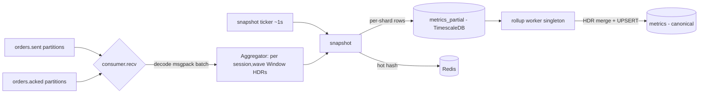
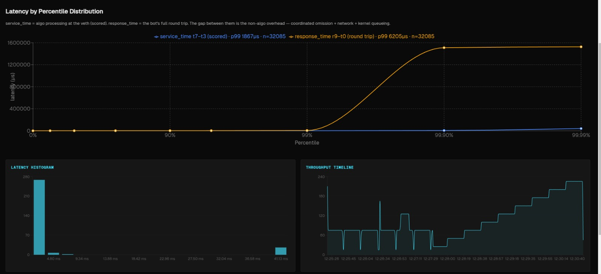

## Telemetry Ingester & Rollup (Rust)

> **Why Rust:** the ingester decodes the MessagePack firehose and records into HDR histograms at the full order rate. Zero-GC plus tight control over per-event allocation keep a single replica CPU-efficient and its memory bounded by *in-flight* (not total) orders, and the HDR crate's native, lossless histogram merge is exactly what makes the two-stage shard→rollup design produce percentiles identical to a single global histogram.

The telemetry tier turns two raw Kafka streams — `orders.sent` (what the load generator fired) and `orders.acked` (what eBPF saw egress the contestant pod) — into per-`(session, wave)` HDR-histogram latency distributions and live counters, then persists them to TimescaleDB and Redis for the leaderboard. It is a **two-stage, horizontally-scalable** design: N stateless *ingester* replicas each own a subset of the 24 co-partitioned partitions and write per-shard partial rows; a single *rollup* worker losslessly merges those partials into the canonical metric rows via native HDR addition. The whole tier lives in `services/telemetry-ingester` (~2.2k LOC of library code; two binaries `telemetry-ingester` and `telemetry-rollup`).

### Responsibilities & module map

- `src/main.rs` — ingester entrypoint: start Loki + Prometheus, then `ingester::run(Config::from_env())`.
- `src/bin/rollup.rs` — rollup entrypoint: `rollup::run(timescale_url, interval)`.
- `src/ingester.rs` — the consume/snapshot loop (`tokio::select!` over Kafka recv + a snapshot ticker + Ctrl-C).
- `src/aggregate.rs` — the heart: the `Aggregator`, per-`(session, wave)` `Window`s, HDR histograms, sent↔acked matching, wave bucketing, eviction, and the `Snapshot` emitted each tick.
- `src/join.rs` — `FirstResponseTracker`: order-id dedup ("first response is the scored sample") with idle eviction.
- `src/store.rs` — TimescaleDB pool, schema bootstrap (`metrics`, `metrics_partial`, hypertables, continuous aggregate), and per-shard `INSERT INTO metrics_partial`.
- `src/rollup.rs` — stage-2 merge: read changed `(session, wave)` partials, carry-forward per-shard cumulative HDR blobs, sum per-bucket counters, UPSERT into `metrics`.
- `src/redis_sink.rs` — hot per-`(contestant, session, wave)` hash for the live dashboard.
- `src/metrics.rs` — hand-rolled Prometheus `/metrics` exporter.

### Data model: what is measured per event

Each `OrderSentEvent` carries `target_send_ts_ns` (t0, when it *should* fire), `send_ts_ns` (t1, when it actually fired), `recv_done_ts_ns` (r9, client-observed full response), a `timed_out` flag, and `barrier_epoch_ns` (`schemas/rust/src/lib.rs:145-164`). Each `OrderAckedEvent` carries kernel timestamps `t3_xdp_ingress_ns`, `t7_xdp_egress_ns`, `pod_service_time_ns` (t7−t3), `exec_type`, and `fill_qty` (`schemas/rust/src/lib.rs:178-194`). From these the aggregator builds four HDR histograms per window (`aggregate.rs:56-67`):

- **`service_time`** = `pod_service_time_ns` (algo-internal time, the latency the contestant owns), from acked.
- **`response_time`** = `r9 − t0` (full client round trip), from sent.
- **`schedule_slip`** = `t1 − t0` (loadgen back-pressure / pacer slip), from sent.
- **`fill_latency`** = in-memory only (tracked, never serialized).

All histograms use identical bounds — `1 ns … 60 s, 3 significant figures` (`aggregate.rs:99-102`, `HDR_MAX_NS=60_000_000_000`, `HDR_SIGFIG=3`) — which is what makes them mergeable across shards (every blob shares the same bucket layout, so HDR `add()` never fails on range; `rollup.rs:49-58`).

### Co-partitioning: why each replica sees both streams for its orders

This is the linchpin of horizontal scalability. Both `orders.sent` and `orders.acked` are **24 partitions** (`ops/kafka/create-topics.sh:43-44`, `k8s/data/kafka/topic-init-job.yaml:56-57`). Crucially, the producers do **not** rely on Kafka's default key-hash — they compute the partition explicitly with `partition_for(order_id, 24)`, an **FNV-1a 64-bit** hash (`schemas/rust/src/lib.rs:26-37`), and pin the record to that partition:

```rust
// schemas/rust/src/lib.rs:26 — the co-partition contract (FNV-1a 64-bit)
pub fn partition_for(order_id: &str, num_partitions: i32) -> i32 {
    if num_partitions <= 1 { return 0; }
    let mut hash: u64 = 0xcbf29ce484222325;
    for byte in order_id.as_bytes() {
        hash ^= u64::from(*byte);
        hash = hash.wrapping_mul(0x100000001b3);
    }
    (hash % num_partitions as u64) as i32
}
```

The bot-fleet sent-producer groups events with `partition_for(&event.order_id, num_partitions)` and sends each chunk to that explicit `.partition` (`services/bot-fleet/src/telemetry.rs:298`, `services/bot-fleet/src/kafka.rs:281-284`); the eBPF acked-producer does the identical `batch_by_partition` keyed on `partition_for(&e.order_id, ...)` (`services/ebpf-latency/src/main.rs:286-288`). Both order producers are Rust, so they share the one `partition_for` implementation — there is no Go twin (the only Go consumer, the correctness-validator, reads all partitions directly rather than recomputing). **Consequence:** for any given `order_id`, its sent event and its acked event always land on the *same partition number* in their respective topics. Kafka's consumer-group rebalance assigns whole partitions to consumers, so a replica that owns partition *p* of `orders.sent` is the same replica that owns partition *p* of `orders.acked` — it therefore sees **both halves of every order it is responsible for, with zero cross-replica coordination**. The sent↔acked join is a purely local in-memory `HashMap` lookup.

#### Kafka contract summary

| Topic | Partitions | Partition key | Why | Consumer group |
|---|---|---|---|---|
| `orders.sent` (consume) | 24 | `partition_for(order_id)` (FNV-1a, producer-set) | Co-locate an order's sent+acked on the same partition number so one replica owns both | `telemetry-ingester` |
| `orders.acked` (consume) | 24 | `partition_for(order_id)` (FNV-1a, producer-set) | Same hash as `orders.sent` ⇒ matched join is partition-local | `telemetry-ingester` |

It **produces no Kafka topics**; its outputs are TimescaleDB rows and Redis hashes. The consumer is configured `enable.auto.commit=true`, `auto.offset.reset=latest`, `session.timeout.ms=10000`, `max.poll.interval.ms=300000` (`kafka.rs:13-28`) — telemetry is intentionally loss-tolerant (a dropped event is just an HDR gap), so `latest`/auto-commit is acceptable and avoids replaying old data on restart.

**Scaling unit:** one ingester replica per *N* of the 24 partitions. With `replicas=2` each owns 12 partitions; the ceiling is **24 replicas** (one partition each) — beyond that, replicas sit idle since there are no more partitions to assign. The rollup count is independent (and is a singleton, see below).

### Ingester control/data flow

The run loop (`ingester.rs:48-72`) is a single-threaded `tokio::select!`:



- **Consume:** each Kafka message is an msgpack `OrderSentBatch`/`OrderAckedBatch` (`ingester.rs:76-104`); per event it calls `agg.observe_sent` / `agg.observe_acked`. Decode failures bump `decode_errors{topic}` and are dropped, not retried.
- **Snapshot:** every `SNAPSHOT_INTERVAL_MS` (default 1000) `flush` runs `agg.snapshot(now, interval)`, writes the resulting `Snapshot`s to TimescaleDB then Redis, and publishes gauges/counters (`ingester.rs:108-137`).

**Concurrency model:** the `Aggregator` is **not** shared — it is owned by the single select loop, so all state mutation is serial and lock-free. The Tokio runtime is multi-thread, but the aggregation hot path is effectively single-threaded per replica; parallelism comes from running multiple replicas across partitions, not from threads within one replica. The DB pool is `deadpool_postgres` size 8 (`store.rs:104-108`); Redis uses one `MultiplexedConnection`.

### Sent↔acked matching & at-least-once dedup

Telemetry is at-least-once (a streaming order can emit several acked events — partial fills, then a final fill), so the same `order_id` may be acked multiple times. The `FirstResponseTracker` (`join.rs`) records **service_time exactly once per order**, on the *first* acked seen:

```rust
// aggregate.rs:239 — only the first response is scored; later fills don't re-count
if self.first_response.observe(&e.order_id, e.t7_xdp_egress_ns) {
    record(&mut w.service_time, e.pod_service_time_ns);
    self.finalized += 1;
    w.responded += 1;
    if is_reject(&e.exec_type) { w.rejected += 1; } else { w.accepted += 1; }
}
```

`observe` returns `true` only the first time an `order_id` is seen, refreshing a last-activity timestamp otherwise (`join.rs:25-36`). `fill_latency` is still recorded on every qualifying fill (`aggregate.rs:249-252`). This is the dedup guard that test `late_streaming_fill_not_rescored` (H11) protects: a trailing fill of an already-scored order must not be counted as a new response.

### Barrier-derived wave bucketing (stable, control-plane-independent)

A "wave" is a `wave_ns` slice (default **20 s**, `DEFAULT_WAVE_NS`) of a session's life. `wave_index = floor((t − session_start) / wave_ns)` (`aggregate.rs:165-174`). The subtlety: `session_start` must be identical across all replicas regardless of which event each one happens to see first, or two shards would bucket the same order into different waves and the rollup would merge mismatched populations. Two mechanisms guarantee stability:

1. **Barrier epoch override:** when `barrier_epoch_ns > 0` on a sent event, it is written directly as the session start (`aggregate.rs:179-182`). The control plane computes `barrier_epoch_ns` once (after all bots signal ready, +500ms gap) and stamps every order, so all shards derive identical wave boundaries — *decoupled from the scenario/ramp schedule and from Kafka delivery order*.
2. **Earliest-wins fallback:** absent a barrier, `wave_of` lowers `session_start` if a later-arriving event has an earlier timestamp (`aggregate.rs:170-172`), converging all shards to the same origin. Test `barrier_epoch_makes_wave_index_consumer_independent` (`aggregate.rs:416-436`) asserts two independent aggregators compute the same wave from out-of-order input.

### The snapshot: cumulative percentiles, per-interval rates, three blobs

`snapshot` (`aggregate.rs:258-320`) walks every active window and emits a `Snapshot` per window that has both a non-empty `service_time` histogram and a known `contestant_id`. The deliberate split:

- **Percentiles** (`p50/p90/p99/p999`, `rt_p50/p90/p99`) are read from histograms that are **never reset** — so they reflect the wave's whole life (cumulative distribution).
- **`tps_1s` / `error_rate` / `offered` / `errors`** come from integer counters that are **zeroed every snapshot** (`aggregate.rs:301-306`) — so they reflect just this interval.

Each snapshot serializes **three HDR blobs** with `V2DeflateSerializer` (`aggregate.rs:296-298, 343-347`): `hdr_encoded`=service_time, `rt_hdr_encoded`=response_time, `slip_hdr_encoded`=schedule_slip. This is the **coordinated-omission decomposition**: to see CO offline you need algo-time, full round-trip, and back-pressure as separate curves. Because each blob is cumulative-per-wave, the downstream merge contract is **last-blob-per-wave then HDR-add across waves** — never sum all rows, which would double-count the cumulative prefix (the same discipline is mirrored in the JS frontend `hdr.ts` and the Python plotter).



*The decomposition rendered for a real run: the flat blue curve is the scored algo service time; the rising yellow tail is the full round trip. The gap between them is non-algo overhead — coordinated omission + network + kernel queueing.*

### Tail-censoring fix: `service p99 ≤ response p99`

A subtle correctness bug the code fixes: when the load generator abandons an order at its 5 s `RESPONSE_TIMEOUT`, `observe_sent` excludes it from `response_time` (`aggregate.rs:209` requires `!e.timed_out`). But the pod can still egress a late response, so eBPF emits an acked with a huge `pod_service_time`. Recording *that* into `service_time` while `response_time` omits it would make the two histograms cover different populations — and `service p99` could then exceed `response p99`, which is impossible per order. The fix: a `timed_out_orders` map marks abandoned order-ids on the sent side (`aggregate.rs:198-205`) and `observe_acked` early-returns for any marked order (`aggregate.rs:226-229`), keeping both histograms over the same "answered-in-time" population. The marker map is bounded by `TIMED_OUT_IDLE_NS = 15 s` (`aggregate.rs:27`) — deliberately short: under overload the map grows as `timeout_rate × window`, so a long window (e.g. the 60 s HDR ceiling) would OOM the ingester before the 5 s join buffer does. Tests `timed_out_order_excluded_from_service_time`, `ack_before_completed_sent_still_records_service`, and `timed_out_markers_are_evicted` (`aggregate.rs:561-616`) pin this behavior, including the assertion `s.p99_ns <= s.rt_p99_ns`.

### State ownership & eviction (memory safety)

The `Aggregator` owns five maps, all bounded by idle eviction in `snapshot` (`aggregate.rs:309-318`):
- `windows: (session,wave) → Window` — evicted after `WINDOW_IDLE_NS = 30 s` idle.
- `session_start`, `session_contestant` — pruned to sessions with a live window (test `session_state_pruned_after_window_eviction`, M29).
- `FirstResponseTracker.seen` — evicted after `FIRST_RESP_IDLE_NS = 5 s` idle; the eviction count is exported as `records_evicted` (in-flight orders that never got a scored sample).
- `timed_out_orders` — evicted after `TIMED_OUT_IDLE_NS = 15 s`.

These bounds keep a single replica's memory proportional to *in-flight* orders, not total run volume.

### Stage 2: the rollup (native HDR merge into canonical `metrics`)

Each replica writes to `metrics_partial` tagged with its `shard` id (`INGESTER_SHARD`, defaulting to pod name via `HOSTNAME`; `config.rs:39-43`, `store.rs:80-83`). The `telemetry-rollup` singleton (`bin/rollup.rs`) periodically (default 1 s) merges these into the canonical `metrics` table on a sealed-bucket watermark:

- `run()` (`rollup.rs:315-334`) advances a `watermark_ns`; it only rolls up buckets older than `ROLLUP_LAG_NS = 3 s` (so every shard's partial for that second has landed). The watermark advances **only after a successful DB write**, so a failed tick is retried.
- `roll_window` finds `DISTINCT (session_id, wave_index)` touched in the window, reloads each wave's **full** partial history ordered by 1-second bucket, and calls `roll_wave_buckets`.
- `roll_wave_buckets` (`rollup.rs:124-156`) implements **last-observation-carried-forward per shard**: per 1-second bucket it sums the per-interval counters (`tps`, `offered`, `errors`) across shards, but keeps each shard's *latest cumulative* HDR blob in a `BTreeMap<shard, blobs>` — so a shard that stopped flushing earlier still contributes its final cumulative tail to later buckets (test `roll_wave_buckets_carries_forward_a_shard_that_finished_earlier`).
- The merge itself is **lossless native HDR addition** — decode each shard's V2-deflate blob and `add()` into one accumulator, then read true merged percentiles:

```rust
// rollup.rs:63 — lossless cross-shard HDR merge → exact merged percentiles
fn merge_one<'a>(blobs: impl Iterator<Item = &'a [u8]>) -> Histogram<u64> {
    let mut acc = new_hist();
    for blob in blobs { decode_into(&mut acc, blob); }  // HDR add(), skips empty/garbage
    acc
}
```

- The result is UPSERTed into `metrics` keyed on `(time, session_id, wave_index)` (`UPSERT_METRICS`, `rollup.rs:169-178`) — idempotent across rollup restarts. Test `merge_partials_equals_combined_histogram` proves the merged sketch's percentiles equal a histogram built from all raw samples (no fidelity loss vs. a single-node aggregator), and `merge_partials_single_shard_is_identity` proves the 1-shard path is a no-op merge.

### Storage layer & self-provisioning

`store.rs` bootstraps on startup (`init_schema`): the base `metrics`/`metrics_partial` tables are **fatal on failure**, while every TimescaleDB step is **best-effort** (logged + continue) so the service runs against plain Postgres without TimescaleDB. The TimescaleDB extras (`TIMESCALE_SETUP`, `store.rs:64-75`): a 1-hour-chunk hypertable on `metrics`, and a `metrics_10s` **continuous aggregate** (`avg(p99_ns)`, `max(tps_1s)`, `avg(error_rate)` per 10 s × contestant, refreshed every 10 s) giving the leaderboard pre-computed rollups without scanning raw rows. Redis stores a hot hash per window keyed `contestant:{contestant_id}:{session_id}:{wave_index}` (`redis_sink.rs:60-65`) for the live SSE dashboard.

### Observability

`/metrics` on `:9090` (hand-rolled HTTP server, `metrics.rs:130-148`). Key gauges/counters: `iicpc_telemetry_events_consumed{topic}`, `decode_errors{topic}`, `consume_errors` (the **drop/ingest counters**), `records_finalized` (real recorded-latency throughput — orders that got a service_time sample, *not* snapshot row count), `records_evicted` (in-flight orders dropped without a scored sample — a join-buffer-overflow signal), `join_buffer_size` (in-flight tracked orders), and TimescaleDB/Redis write + error counters with a write-duration histogram. Consumer **lag** is observed externally via Kafka group metrics on group `telemetry-ingester` (the service does not export lag itself).

### Scaling model, autoscaling & bottlenecks

- **Ingester:** stateless-per-partition / sharded. State is per-`(session,wave)` and fully reconstructable from the stream, so a replica can die and another picks up its partitions on rebalance. Horizontal scale unit = Kafka partition; ceiling = 24 replicas. Deployed `replicas: 2`, RollingUpdate, 1–2 CPU / 0.5–1 Gi (`k8s/benchmark/telemetry-ingester/deployment.yaml:13-76`).
- **Rollup:** **singleton** (`replicas: 1`, Recreate, `deployment.yaml:84-137`). It is not partitioned; a second rollup would race on the same `metrics_partial` rows. Idempotent UPSERTs make it safe to crash-restart, but not to scale out.
- **KEDA:** **none for this tier.** There is a KEDA `ScaledObject` for bot-fleet but no autoscaler for telemetry-ingester or rollup — both are fixed-replica Deployments. Scaling out is a manual `replicas` bump (≤24 for the ingester).
- **Bottlenecks:** (1) the ingester aggregation hot path is single-threaded per replica — at very high event rates one replica is CPU-bound on msgpack decode + HDR record, which is exactly why partition-sharding exists. (2) The rollup is a single process doing a per-tick full-history reload + HDR decode per touched wave; many concurrent waves/shards make it the throughput limiter and the reason for the 3 s seal lag. (3) The DB pool (8 ingester / 4 rollup) caps write concurrency.

### Limitations / scope for improvement

- **Rollup cannot scale horizontally** (singleton by construction; no partitioning of `metrics_partial`); it is also the only place that produces canonical `metrics`, so it is a single point of throughput limitation under many-shard fan-in.
- **No KEDA / HPA** on either deployment — capacity is provisioned, not autoscaled; an undersized replica count silently drops telemetry (loss-tolerant by design, visible only via `records_evicted` / consumer lag).
- **Auto-commit + `latest` offset** means a replica restart loses any unprocessed backlog rather than replaying it — acceptable for loss-tolerant telemetry but means brief gaps on rebalance.
- **`TIMED_OUT_IDLE_NS = 15 s` is a hardcoded OOM-safety cap**: a rare ack later than 15 s slips back into `service_time` (the comment acknowledges this; its `pod_service_time` is already >15 s so it barely perturbs p99).
- **`metrics_partial` retention** is never trimmed by the service (relies on TimescaleDB chunk policies set elsewhere); the rollup reloads a wave's *entire* partial history on each touch, so long-lived waves grow the per-tick reload cost.
- **`fill_latency` is tracked but never serialized** (`aggregate.rs:251`), so fill-latency percentiles are not persisted despite the histogram being maintained.

---
