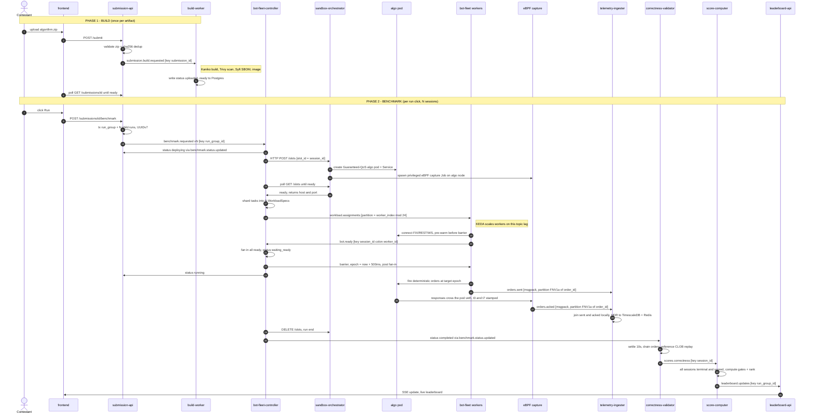

## The benchmark run lifecycle

This page traces a single submission from upload to leaderboard, naming the
exact topics, keys, consumer groups, and HTTP calls at each hop. Everything here
is the synthesis of the per-service sections that follow — read this first for
the shape, then dive into a service section for the internals. Two facts make the
whole flow legible:

- **The control plane is JSON over Kafka; the hot order path is MessagePack.**
  Orchestration messages (`benchmark.requested`, `workload.assignments`,
  `barrier`, status updates, scores) are low-volume JSON. The two firehose topics
  (`orders.sent`, `orders.acked`) are MessagePack batches.
- **Every service is triggered, never called, on the hot path.** A stage reacts
  to a Kafka event (or, in two places, a direct HTTP call: submission-api↔client
  and controller→sandbox-orchestrator) and emits the next event. There is no
  synchronous request chain through the data plane.

### The two phases

A submission goes through **build** (once per uploaded artifact) and then, on
each "run" click, a **benchmark** (which fans out into one *session* per scenario
— `constant`, `spike`, `ramp` — grouped under one *run-group*).

### Step-by-step (the contract at each hop)

**Build phase**

1. **Upload.** `POST /submit` → submission-api validates the zip
   (`benchmark.yaml` + `src/` + one build manifest, declared build-target must
   exist), computes the artifact sha256 and content-dedups, streams it to MinIO
   (`iicpc-submissions/{id}/artifact.zip`), inserts a `submissions` row at
   `status=uploaded`, and produces **`submission.build.requested`** keyed by
   `submission_id`.
2. **Build.** build-worker (group `build-worker-spawner`) consumes it and runs an
   ephemeral-Job pipeline: precheck (download + zip-slip guard) → generate a
   hardened Dockerfile → **Kaniko** build → **Trivy** scan + **Syft** SBOM (in
   parallel) → promote (a Harbor staging→prod crane copy; a no-op on single-
   registry ECR) → write the final `image_ref`. Each transition is written
   **directly to the `submissions` table** (monotonic rank guard, `failed` is
   terminal) and *also* emitted on `submission.status.updated` (an audit stream
   with no consumer today). The frontend polls `GET /submissions/{id}` and sees
   `uploaded → building → scanned → sbom_ready → ready`.

**Benchmark phase**

3. **Run trigger.** `POST /submissions/{id}/benchmark` gates on
   `status=ready` + a non-empty `image_ref`, enforces "one active run-group per
   submission" via a partial unique index, then in one transaction inserts a
   `run_group` plus **one child `run()` per scenario** (constant/spike/ramp) — each
   with a fresh UUIDv7 `session_id` — and produces **`benchmark.requested`** per
   session, keyed by `run_group_id`.
4. **Deploy the sandbox.** bot-fleet-controller (group `bot-fleet-controller`)
   consumes one `benchmark.requested`, sets `status=deploying`, and makes a
   **synchronous HTTP `POST /slots`** to sandbox-orchestrator with
   `slot_id = session_id`. The orchestrator creates a Guaranteed-QoS, integer-
   cpuset algo pod + a stable Service, and lazily spawns the **privileged eBPF
   capture Job pinned to the algo pod's node**. The controller polls
   `GET /slots/{id}` until `ready`, then reads the algo's `host:port`.
5. **Shard & assign.** The controller computes
   `worker_count = ceil(total_tasks / MAX_TASKS_PER_WORKER)`, round-robin shards
   the scenario's task list, and publishes one `WorkloadSpec` per worker to
   **`workload.assignments`** at the *explicit* partition `worker_index % 24` (a
   custom balancer, not key-hash) — the 1-spec→1-partition→1-pod contract. It
   refuses the run if `worker_count > 24`.
6. **Workers ready.** KEDA scales bot-fleet on `workload.assignments` lag; each
   pod (group `bot-fleet`, roundrobin assignor) takes one partition = one spec,
   opens its FIX/REST/WS connections (**pre-warmed before the barrier** so connect
   cost never pollutes the measurement), and publishes **`bot.ready`** keyed
   `session_id:worker_id`.
7. **Barrier.** The controller (group `bot-fleet-controller-ready`) fans in
   `bot.ready` until all workers report (or the 30 s `ReadyDeadline`), then
   computes a **fresh** go-time `epoch = now + 500ms` *after* fan-in and publishes
   **`barrier`** keyed by `session_id`. All workers, blocked in
   `wait_for_barrier`, release simultaneously at that epoch.
8. **Fire (the firehose).** Workers run three concurrent loops per connection —
   the catch-up **pacer** (write), the **ClOrdID matcher** (read), and the
   **watchdog** (timeout accounting) — streaming every offered order to
   **`orders.sent`** (MessagePack, partition `FNV1a(order_id) % 24`). The eBPF
   capture stamps `t3` (XDP ingress) and `t7` (tc egress) on the algo pod's veth
   and emits **`orders.acked`** (MessagePack, *same* `FNV1a(order_id)` partition).
9. **Aggregate (live).** telemetry-ingester (group `telemetry-ingester`, N
   replicas across the 24 partitions) sees both legs of every order it owns
   (co-partitioning), joins them locally, builds per-`(session, wave)` HDR
   histograms, and writes per-shard partials; the singleton `telemetry-rollup`
   merges the shards (native HDR add) into the canonical `metrics` table +
   Redis hot hash for the live dashboard.
10. **Teardown.** After `scenario.DurationNs + gap` the controller deletes the
    slot and emits a terminal **`benchmark.status.updated`**. submission-api
    (group `submission-api-benchmark-status`) consumes it to advance the run /
    run-group status in Postgres.
11. **Score correctness.** correctness-validator (group `correctness-validator`)
    is triggered by the `completed` status: after a 10 s settle it drains the
    session's `orders.sent` + `orders.acked` (UUIDv7-bounded offsets, one reader
    per partition, k-way merged by time), replays the sent stream through a
    reference price-time-priority order book, diffs the contestant's fills, and
    produces **`scores.correctness`** keyed by `session_id`.
12. **Rank.** score-computer (groups `score-computer` + `score-computer-
    correctness`) tracks per-session progress in SQL; once *all* sessions of a
    run-group are terminal and scored it computes the gated metrics
    (peak-sustained-TPS behind median-p99/error gates, spike-recovery, total
    correctness, DQ), claims the score with `INSERT … ON CONFLICT DO NOTHING`
    (the exactly-once latch), ranks the whole table, and produces
    **`leaderboard.updates`** keyed by `run_group_id`.
13. **Display.** leaderboard-api (a **per-pod** consumer group so every replica
    sees every update) pushes the update to connected SSE clients; the frontend's
    `useLeaderboard` merges it into the live table. Run detail is polled over REST
    until all sessions are terminal.

### Idempotency & failure handling across the chain

Because every hop is at-least-once Kafka, each stage is built to tolerate
redelivery:

- **submission-api:** sha256 dedup + a partial-unique-index "one active run-group
  per submission"; a losing race re-resolves to the winner.
- **controller:** terminal-status precheck + duplicate-session guard; on crash,
  `RecoverInFlightRuns` fails out any non-terminal `runs` before consumers start
  (it is a singleton holding run state in memory).
- **validator:** a Postgres `ON CONFLICT` claim makes concurrent workers safe; a
  validation timeout writes a *recoverable* `timed_out` placeholder that a later
  redelivery re-runs.
- **score-computer:** `SaveScore … ON CONFLICT DO NOTHING` guarantees exactly one
  `leaderboard.updates` per run-group even under redelivery or multiple replicas;
  a boot-time `PendingRunGroups` scan re-enqueues anything that became ready
  during downtime.

The one gap worth flagging: a worker that aborts mid-run publishes
`workload.failed`, but **the controller does not consume that topic** — active
worker failures surface only indirectly (missing `bot.ready` → `ReadyDeadline`,
or the run simply timing out). See the controller section.

---
